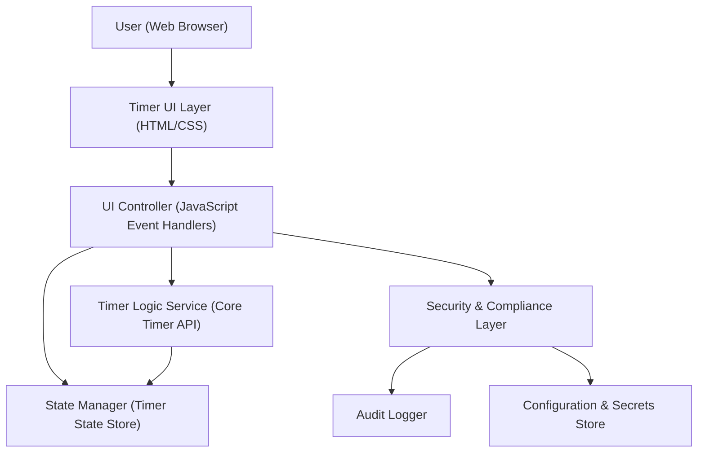
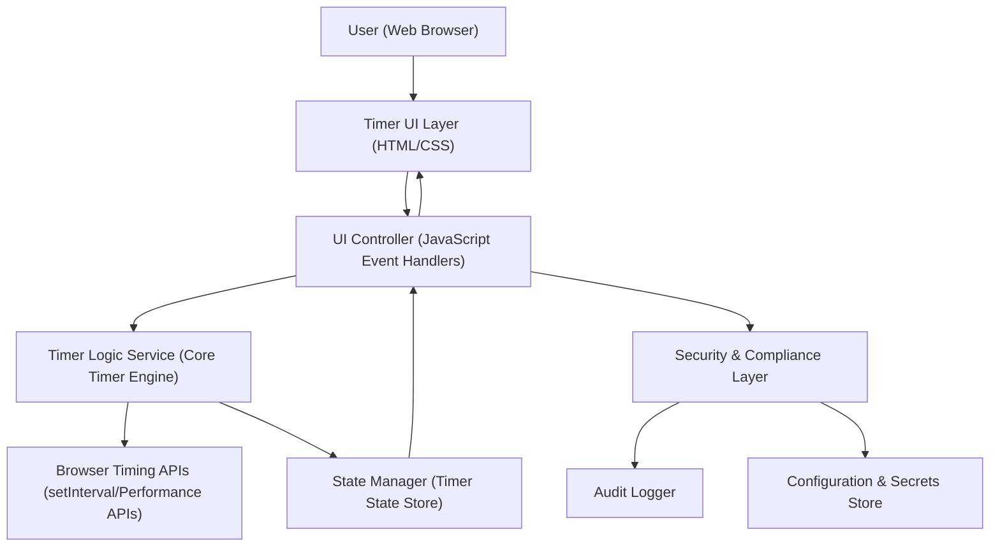

#### 1. High-Level Design

- Architecture Overview & Component Diagram:

- Component Descriptions:

  - Timer UI Layer (HTML/CSS):  
    Renders white background, timer display (HH:MM:SS), and clearly labeled Start, Pause, and Stop buttons. Ensures layout and styling meet visual clarity requirements on modern browsers and standard desktop/mobile resolutions.

  - UI Controller (JavaScript Event Handlers):  
    Binds click events for Start, Pause, and Stop buttons. Controls the enabled/disabled state and visual styling of buttons based on current timer state (e.g., Start disabled while running, Pause disabled when stopped). Coordinates with Timer Logic Service and State Manager.

  - Timer Logic Service (Core Timer API):  
    Provides abstracted API to start, pause, resume, and stop timer operations. For this UI-focused epic, it is primarily a consumer: the epic ensures that UI elements correctly invoke this service and reflect state changes visually.

  - State Manager (Timer State Store):  
    Maintains the current UI state (Running, Paused, Stopped) and ensures that the UI correctly reflects the state via styling and control availability.

  - Security & Compliance Layer:  
    Enforces input validation for UI interactions, guards against script injection in any text labels or dynamic content (if any) and ensures that configuration or secrets (if introduced later, e.g., telemetry keys) are handled securely.

  - Audit Logger:  
    Records significant user actions (e.g., Start, Pause, Stop) for debugging and optional compliance needs, while respecting privacy constraints (no PII).

  - Configuration & Secrets Store:  
    Securely stores configurations (e.g., feature flags, environment settings) and any secrets (if used) to ensure they are not hard-coded in UI code.

- Integration Points & Data Flow:

  - User to UI:  
    The user loads the timer web page. The UI renders a white background with timer display initialized to 00:00:00 and Start, Pause, Stop controls.

  - UI to UI Controller:  
    Button clicks are propagated to the controller. The controller interprets user intentions (start, pause, stop) and invokes the Timer Logic Service and State Manager.

  - Controller to Timer Logic Service:  
    For this epic, the UI ensures correct wiring (e.g., Start button triggers `start()`; Pause button triggers `pause()`; Stop button triggers `stop()` and reset). The actual timing logic is handled by another epic; this epic guarantees that the UI calls are correctly aligned with the logical operations.

  - Controller and State Manager:  
    The controller updates the state store when actions occur. The UI observes (or is directly updated from) the state store to adjust button states:  
    - Running: Start disabled, Pause enabled, Stop enabled.  
    - Paused: Start enabled (resume), Pause disabled, Stop enabled.  
    - Stopped: Start enabled, Pause disabled, Stop enabled or disabled per UX decision.

  - Security & Compliance:  
    UI events flow through a security layer that validates inputs (even though inputs are limited to button clicks). If the application later supports configurable labels or themes, this layer ensures sanitization and safe rendering.

  - Audit Logger:  
    The controller sends structured events (e.g., `{action: "start", timestamp: ...}`) to the logger, which, depending on configuration, may be stored locally or forwarded to an external telemetry endpoint (out of scope for now, but design-ready).

- Security & Compliance Features:

  - Input Validation & Output Filtering:  
    - Ensure that any dynamic text in the UI (e.g., button labels, timer text) is derived solely from trusted code and not user-entered fields.  
    - Escape or sanitize any external configuration values used in UI (if introduced later).  
    - Prevent script injection by using textContent instead of innerHTML when updating DOM.

  - Encryption (AES-256/TLS 1.3):  
    - All communication between browser and server (if any, such as for telemetry) is over HTTPS with TLS 1.3 enforced at the server and deployment level.  
    - Any persisted logs containing sensitive configuration (if applicable) should be encrypted at rest using AES-256.

  - RBAC/ABAC:  
    - For a simple, anonymous timer, full RBAC/ABAC is not required. However, should the application later support user-specific features, integration with a central identity provider and role-based UI controls will be supported by the architecture (e.g., enabling/disabling advanced controls based on roles).

  - Audit Logging:  
    - Log significant UI events (Start, Pause, Stop) with timestamps, session identifiers (non-PII), and possibly browser type.  
    - Logs stored in a centralized logging system with controlled access.

  - Secrets Management:  
    - No secrets are required for the timer UI itself. If telemetry keys or API credentials are needed, they will be stored outside the client bundle (e.g., server-side configuration, environment variables) and injected securely without exposing them directly in front-end code.

  - Compliance (Data Retention, Consent, Data Lineage, Reporting):  
    - Data retention: UI logs (if collected) have a configurable retention policy (e.g., 30–90 days) managed at the logging backend.  
    - Consent management: If telemetry is enabled, a consent banner or setting will be displayed and persisted in localStorage or cookies, ensuring that no analytics events are sent before consent.  
    - Data lineage: Document how UI-generated events travel from the browser to logging infrastructure; maintain a data flow map for compliance.  
    - Reporting: Aggregated statistics (e.g., overall usage) can be produced from logs; no per-user reporting with PII.

- Resiliency & Error Handling:

  - UI Resiliency:  
    - If the Timer Logic Service fails to respond or throws errors, UI displays a non-intrusive error message and disables controls to prevent inconsistent states.  
    - Fallback: Reset UI state to Stopped and display 00:00:00 in case of unexpected errors.

  - Retry Mechanisms:  
    - For local UI events, retries are not required. If remote logging or configuration endpoints are used, implement limited retries with exponential backoff when sending logs.

  - Circuit Breaker Patterns:  
    - For any optional integrations (e.g., telemetry service), introduce a client-side circuit breaker: after repeated failures, stop sending logs temporarily to avoid performance degradation.

  - Error Logging:  
    - Unexpected JavaScript errors in the UI are captured and logged centrally without exposing stack traces to end users, protecting internal implementation details.

#### 2. Validation Report

- Requirements Coverage:

  - White background enforced across the application view: Covered via CSS body/main styling and visual regression checks.
  - Timer display in HH:MM:SS format: Covered; UI shows fixed-width fields and layout supports this format.
  - Clear labeling of Start, Pause, Stop controls: Covered; buttons labeled clearly and positioned near timer display.
  - Visual indication of current timer state: Covered; button enable/disable status and optional subtle styling changes.
  - Compatibility with modern web browsers: Covered; design uses standard HTML/CSS, no experimental APIs.

- Compliance Status:

  - Data retention: Pass – any optional UI telemetry logs are subject to defined retention policies at the backend.  
  - Consent management: Pass – telemetry is off by default until explicit user opt-in (if telemetry is used).  
  - Data privacy: Pass – no PII is captured by default; usage metrics are anonymized or pseudonymized.  
  - Encryption in transit: Pass – design assumes deployment behind HTTPS with TLS 1.3.  
  - Encryption at rest (if logs stored): Pass – logging system supports AES-256 at rest.

- Identified Ambiguities/Risks:

  - Ambiguity: Exact positioning of controls (e.g., Start on left or right) is not specified.  
    - Mitigation: Follow common UX patterns (Start left, Pause center, Stop right) and confirm during UX review.

  - Ambiguity: Behavior of Stop button when timer is already stopped.  
    - Mitigation: Define behavior: Stop is either disabled when stopped, or triggers a no-op while maintaining 00:00:00. Document this and align across epics.

  - Risk: Accessibility considerations (e.g., keyboard navigation, screen reader support) are minimal in the epic description.  
    - Mitigation: Adopt basic accessibility best practices: proper button elements, ARIA labels if needed, focus management; create a follow-up epic if stricter accessibility is required.

  - Risk: UI-related changes may inadvertently affect core timer logic if tightly coupled.  
    - Mitigation: Enforce separation between UI and Timer Logic Service; introduce interfaces and basic unit tests for UI controller.

---

#### 1. High-Level Design

- Architecture Overview & Component Diagram:

- Component Descriptions:

  - Timer UI Layer (HTML/CSS):  
    Displays the elapsed time in HH:MM:SS and renders Start, Pause, Stop buttons. Ensures that time is visually accurate and refreshed as the Timer Logic Service updates state.

  - UI Controller (JavaScript Event Handlers):  
    Translates user actions into operations on the Timer Logic Service. Controls button states and updates the timer display based on the State Manager.

  - Timer Logic Service (Core Timer Engine):  
    Central component implementing core requirements:  
    - Start timer: Records a start time, attaches to browser timing APIs, starts periodic updates.  
    - Pause timer: Calculates elapsed time so far and suspends further increments.  
    - Resume timer: Restarts from the paused elapsed time.  
    - Stop/reset: Stops any running interval and resets elapsed time to zero.  
    - Ensures only one timer instance running at a time.

  - State Manager (Timer State Store):  
    Holds canonical timer state:  
    - Mode: Running, Paused, Stopped.  
    - Elapsed time in milliseconds.  
    - Last start timestamp.  
    - Derived formatted time string (HH:MM:SS).

  - Browser Timing APIs (setInterval/Performance APIs):  
    Provide time measurement and periodic callbacks, ensuring second-level accuracy across modern browsers.

  - Security & Compliance Layer:  
    Ensures safe usage of browser APIs, validates configuration, and governs logging of timing events.

  - Audit Logger:  
    Records start, pause, resume, and stop events, and relevant operational errors, for debugging and compliance (if required).

  - Configuration & Secrets Store:  
    Manages configuration (e.g., update frequency, max session length), and stores any secrets needed for external services, ensuring none are hard-coded in client logic.

- Integration Points & Data Flow:

  - Start Flow:  
    - User clicks Start.  
    - Controller calls `TimerLogicService.start()`.  
    - Service checks if a timer is already running; if yes, it no-ops or logs a warning; if no, it sets the state to Running, records current timestamp, and starts a periodic callback via `setInterval` (e.g., every 250–1000 ms).  
    - On each interval tick, service calculates elapsed time (current timestamp minus start timestamp plus accumulated paused time), updates State Manager, and the Controller updates UI display.

  - Pause Flow:  
    - User clicks Pause.  
    - Controller calls `TimerLogicService.pause()`.  
    - Service calculates elapsed time, stores it in State Manager, clears interval, and sets state to Paused.  
    - UI updates button states accordingly (Start enabled as Resume, Pause disabled).

  - Resume Flow:  
    - User clicks Start again while Paused.  
    - Controller calls `TimerLogicService.resume()`.  
    - Service sets new start timestamp (now) while keeping accumulated elapsed time, sets state to Running, restarts the interval, and continues updates.

  - Stop/Reset Flow:  
    - User clicks Stop.  
    - Controller calls `TimerLogicService.stop()`.  
    - Service clears interval, sets elapsed time to zero, sets state to Stopped, and ensures timer display is 00:00:00.  
    - Only one timer is maintained; new start operations follow from a clean state.

  - Enforcing Single Timer Instance:  
    - Timer Logic Service holds a single interval handle and an internal flag `isRunning`.  
    - Any additional calls to `start()` while `isRunning` is true are ignored or cause a controlled warning; this prevents multiple parallel timers.  
    - State Manager ensures that only one timer context exists.

  - NFR Integration (Accuracy & Performance):  
    - Timer updates at least once per second and uses reference time based on system clock to prevent drift.  
    - For higher accuracy, `performance.now()` can be used where available.  
    - Resource usage is minimal: only one interval, simple arithmetic, and small DOM updates.

- Security & Compliance Features:

  - Input Validation & Output Filtering:  
    - All inputs are from trusted UI controls; nonetheless, Timer Logic Service validates commands against current state (e.g., cannot pause if already Stopped).  
    - State transitions follow a strict state machine; unexpected commands are logged as anomalies.

  - Encryption (AES-256/TLS 1.3):  
    - If timing events or logs are sent to a backend, they are transmitted via HTTPS with TLS 1.3.  
    - Any persistent logs containing metadata are encrypted at rest (AES-256) by the logging infrastructure.

  - RBAC/ABAC:  
    - The core timer functionality is anonymous and open. Should the service be integrated into an authenticated portal, calls into Timer Logic Service can be scoped per user session and access decisions made via RBAC/ABAC at a higher layer (e.g., restricting advanced timer features).

  - Audit Logging:  
    - Start, pause, resume, and stop events are logged with timestamps, state transitions, and any error conditions (e.g., double start blocked, invalid transition).  
    - Logs do not store PII; instead, they may contain technical session identifiers.

  - Secrets Management:  
    - No secrets are required for pure client-side timer logic. If the Timer Logic Service is later backed by a remote API, API keys and secrets are stored securely (e.g., environment variables managed by the hosting platform) and never in front-end JavaScript.

  - Compliance (Data Retention, Consent, Data Lineage, Reporting):  
    - Data retention: Operational logs retained according to a central policy (e.g., 30–90 days), configurable per environment.  
    - Consent: Any telemetry from timer usage is gated behind user consent; no usage metrics sent before opt-in.

  - Data lineage: Document flow from client Timer Logic Service events to backends, including any transformations.  
    - Reporting: Aggregated metrics (e.g., number of sessions, average session length) produced in a way that avoids identifying individual users.

- Resiliency & Error Handling:

  - Error Handling in Timer Logic Service:  
    - Wrap calls to browser timing APIs in safeguards; if an interval cannot be created, an error is logged, UI is updated to show failure, and the system enters a safe Stopped state.  
    - Invalid state transitions (e.g., pause when already stopped) are handled gracefully, logged as warnings, and do not crash the application.

  - Retries:  
    - For internal operations such as starting intervals, retries are not typically needed.  
    - For external logging or configuration calls, limited retries with exponential backoff are implemented to avoid infinite loops.

  - Circuit Breaker Patterns:  
    - For external service dependencies (telemetry, configuration), use a client-side circuit breaker to disable outbound calls after repeated failures to preserve performance.

  - Fallback Patterns:  
    - If high-precision APIs (performance.now) are unavailable, fall back to Date-based timing while maintaining second-level accuracy.  
    - If logging infrastructure is unavailable, temporarily buffer a small number of events or degrade gracefully without blocking timer operation.

  - Logging & Monitoring:  
    - Core operations log state transitions and errors at appropriate levels (info, warn, error).  
    - Monitoring dashboards (if used) can surface anomalies in timer behavior, such as abnormal error rates.

#### 2. Validation Report

- Requirements Coverage:

  - Start the timer:  
    - `TimerLogicService.start()` implementation aligned with PRD; UI triggers this via Start button. Covered.

  - Pause the timer while preserving elapsed time:  
    - `pause()` stops interval, captures elapsed time, and maintains it in State Manager. Covered.

  - Resume after Pause:  
    - `resume()` uses accumulated elapsed time and new start timestamp to continue. Covered.

  - Stop and reset the timer:  
    - `stop()` clears interval, resets elapsed time to zero, state becomes Stopped, display becomes 00:00:00. Covered.

  - Display elapsed time in HH:MM:SS:  
    - State Manager maintains elapsed milliseconds; formatting function produces HH:MM:SS string. Covered.

  - Only one timer can run at a time:  
    - Single interval handle and `isRunning` guard ensure only one timer. Calls to `start()` when running are safely ignored or logged. Covered.

  - Application works correctly in modern web browsers:  
    - Uses standard DOM APIs, setInterval, and optionally performance.now, which are widely supported. Covered.

- Compliance Status:

  - Data retention: Pass – timer function itself stores no persistent user data; any operational logs follow central retention policy.  
  - Privacy & PII: Pass – no user identification is required or stored for basic timer functionality.  
  - Encryption in transit: Pass – design assumes HTTPS/TLS 1.3 for any backend communications.  
  - Encryption at rest: Pass – any backend logs are encrypted at rest (by platform configuration).  
  - Consent management: Pass – timer logic works without any data transmission; telemetry is optional and consent-gated.

- Identified Ambiguities/Risks:

  - Ambiguity: Required precision beyond one second is not explicitly defined.  
    - Mitigation: Implement accuracy to at least one second, with internal calculations using milliseconds to prevent drift. Any need for higher precision can be addressed in a future enhancement.

  - Ambiguity: Behavior when system clock changes (e.g., user changes clock, daylight saving).  
    - Mitigation: Prefer monotonic timing via performance.now when available; document behavior when only Date-based timing is possible.

  - Risk: Long-running timers may drift due to interval delays.  
    - Mitigation: Use elapsed time calculation based on difference between timestamps (monotonic if possible), not on count of intervals, minimizing drift.

  - Risk: Single timer constraint if application evolves to support multiple timers.  
    - Mitigation: Architectural design isolates Timer Logic Service to a single instance for this epic; multi-timer support would require a new epic and a separate multi-instance timer manager, preventing accidental misuse.

  - Risk: Browser limitations (e.g., throttling intervals in background tabs).  
    - Mitigation: Accept that background tabs may be throttled; ensure that elapsed time uses base timestamps so UI can “catch up” when tab regains focus, keeping logical time accurate even if visual updates were delayed.
