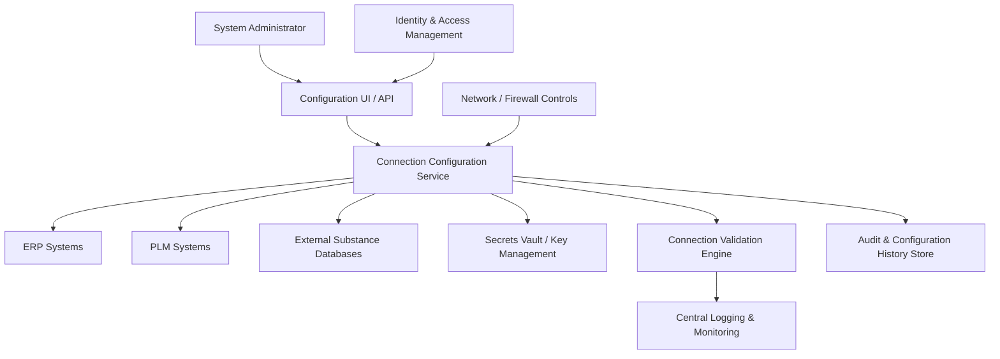

#### 1. High-Level Design

- Architecture Overview & Component Diagram:

- Component Descriptions:
  - Configuration UI / API: Secure interface for creating and managing connection definitions to ERP, PLM, and external databases.
  - Connection Configuration Service: Backend service validating configuration, persing metadata, and coordinating tests.
  - Connection Validation Engine: Executes connectivity tests (TLS, certificates, credentials) and produces detailed results.
  - Secrets Vault / Key Management: Stores credentials, connection strings, certificates, and keys in encrypted form.
  - Identity & Access Management: Ensures only authorized roles can manage connections.
  - Audit & Configuration History Store: Records all changes to connection configurations and validation results.

- Integration Points & Data Flow:
  - Connection Setup:
    - Admin submits connection details via CFGUI; IAM authenticates and authorizes.
    - CFGSRV stores non-sensitive metadata and pushes secrets to the vault; only encrypted references are kept in configuration store.
  - Validation:
    - VALCN attempts a TLS 1.3 connection with provided host and credentials, validates certificates, and logs results.
  - ETL Integration:
    - Extraction Services retrieve connection definitions and credentials at runtime via secure calls to CFGSRV and Secrets Vault.

- Security & Compliance Features:
  - TLS Enforcement:
    - All defined connections must use TLS/SSL; non-encrypted options are blocked or require documented risk acceptance not allowed by default.
  - Credential Security:
    - AES-256 encryption for all stored secrets; keys held in HSM where possible.
  - RBAC:
    - Only System Administrators and specifically authorized roles can create/modify connections; approvals can be required for changes.
  - Audit Logging:
    - Each connection creation, update, deletion, and validation is logged with details and justification.

- Resiliency & Error Handling:
  - Connection Validation:
    - Clear error codes and messages allow admins to diagnose network vs. credential vs. certificate problems.
  - Monitoring:
    - Recurrent verification checks can run to ensure connections remain valid and notify when certificates near expiry.

#### 2. Validation Report

- Requirements Coverage:
  - Secure configuration of ERP, PLM, and external databases:
    - Covered via standardized connection objects and validation routines.
  - TLS/SSL enforcement and certificate validation:
    - Covered through VALCN enforcing TLS 1.3 and checking certificate chains.
  - Encrypted credential storage:
    - Covered via Secrets Vault and AES-256 encryption.
  - Audit logging of configuration changes:
    - Covered by Audit & Configuration History Store.

- Compliance Status:
  - Security:
    - Pass: Strong encryption, RBAC, and audit.
  - Regulatory frameworks (FDA 21 CFR Part 11, GxP, GDPR, ISO 27001):
    - Pass: Design aligns with secure system access, logging, and change control requirements.

- Identified Ambiguities/Risks:
  - Risk: Manual misconfiguration (wrong host, port).
    - Mitigation:
      - Validation templates and pre-defined profiles for common systems.
  - Ambiguity: Handling non-standard or legacy systems lacking modern TLS.
    - Mitigation:
      - Explicit exception handling process with regulatory risk assessment and documented compensating controls; default is to block.
