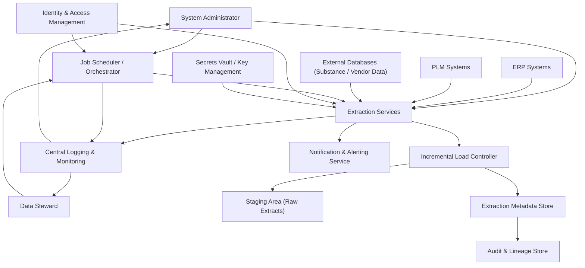

#### 1. High-Level Design

- Architecture Overview & Component Diagram:

- Component Descriptions:
  - Job Scheduler / Orchestrator: Manages extraction job definitions, schedules (e.g., nightly), and triggers execution.
  - Extraction Services: Implement connectors to ERP, PLM, and external systems, handling pagination, throttling, and error handling.
  - Incremental Load Controller: Determines deltas (new/changed records) since last successful run based on timestamps, version counters, or change data capture markers.
  - Staging Area: Central repository for raw extracted restricted substances data, partitioned by system, date, and batch.
  - Extraction Metadata Store: Keeps job-level metadata: last run time, record counts, source latency, and status.
  - Audit & Lineage Store: Logs extraction events, deltas, and references for traceability and compliance.
  - Central Logging & Monitoring: Collects logs and metrics; used for dashboards and alerts.
  - Identity & Access Management: Controls who can create/modify schedules and extraction configurations.
  - Secrets Vault / Key Management: Stores database credentials, API keys, and certificates used by Extraction Services.
  - Notification & Alerting Service: Sends emails and in-system alerts when jobs fail or retry limits are exceeded.

- Integration Points & Data Flow:
  - Job Configuration:
    - Administrators configure extraction jobs via secure UI or API; definitions stored in metadata store, secured by IAM and RBAC.
  - Execution:
    - Scheduler triggers Extraction Services at defined times; services retrieve credentials from Secrets Vault and connect to source systems via TLS 1.3.
  - Incremental Logic:
    - Incremental Load Controller compares last successful run timestamp and source data timestamps or uses change markers to compute deltas.
    - Newly extracted records are written to Staging with associated batch IDs; extraction metadata is updated.
  - Metrics and Audit:
    - For each job run, Extraction Services write detailed metrics (record counts, duration, errors) into Extraction Metadata Store and Audit & Lineage Store.
  - Notifications:
    - On failures or retries exhausted, NOTIF sends alerts to Data Stewards and Admins with job IDs, sources, and error details.

- Security & Compliance Features:
  - Secure Connections:
    - All connections to ERP/PLM/external DBs use TLS 1.3; certificates are validated against trusted CAs.
  - Credential Management:
    - Credentials stored only in the Secrets Vault, encrypted with AES-256; Extraction Services obtain short-lived tokens or credentials at runtime only.
  - RBAC/ABAC:
    - Only authorized roles can create or modify extraction jobs; separation of duties ensures configuration changes are distinct from execution roles.
    - ABAC can restrict extraction jobs to specific regulatory regions or business units.
  - Audit Logging:
    - Each extraction run is logged with:
      - Job ID, schedule, initiator (user or system).
      - Source system and connection identifier.
      - Number of records extracted and filtered.
      - Error counts and retry details.
    - These logs are immutable and stored in the Audit & Lineage Store for long-term retention.
  - Compliance Mapping:
    - GxP and EUMDR:
      - Extraction timestamps use UTC and are recorded for each job and batch.
      - Data lineage from source to staging supports regulatory inspections.
    - GDPR:
      - Logs include only necessary technical context; if any personal data is involved, access is restricted via IAM and ABAC, and data minimization applies.
    - FDA 21 CFR Part 11:
      - Electronic records (logs, metadata) are secured, time-stamped, and traceable.

- Resiliency & Error Handling:
  - Retry Patterns:
    - For transient issues (e.g., network timeouts), extraction attempts are retried with exponential backoff; retries and final status are recorded.
  - Circuit Breakers:
    - Used per source system to prevent overload and cascading failures; if failure thresholds are met, the circuit opens and jobs are paused for that source, with notifications sent.
  - Partial Failure Handling:
    - If a subset of sources fails, successful extractions are still persisted with clear labeling; failure reports detail which sources were not updated.
  - Monitoring:
    - Central dashboards show job status, durations, and anomalies; thresholds trigger alerts to ensure extraction jobs remain within batch windows.
  - Recovery:
    - Jobs can be safely re-run for specific windows using batch IDs without duplicating data, due to incremental logic and idempotent staging operations.

#### 2. Validation Report

- Requirements Coverage:
  - Scheduled extraction of restricted substances data:
    - Covered through Job Scheduler and Extraction Services, supporting cron-like schedules and ad-hoc runs.
  - Incremental extraction based on last successful run:
    - Covered by Incremental Load Controller using last successful run metadata and source timestamps/change markers.
  - Logging of extraction metrics:
    - Covered by Extraction Metadata Store, Central Logging, and Audit & Lineage Store.
  - Error detection and retry logic:
    - Covered by resilience patterns (exponential backoff, configurable retry limits).
  - Status tracking for extraction jobs:
    - Covered via status fields per job run (success, failure, retry exhausted) stored centrally and exposed via dashboards.
  - Delta logs for audit:
    - Covered by recording deltas and batch identifiers in Audit & Lineage Store.

- Compliance Status:
  - Data Retention:
    - Pass: Extraction metadata and audit logs are retained for regulatory minimums.
  - Traceability:
    - Pass: Each staging dataset is linked back to source system and extraction run.
  - Security:
    - Pass: Source connections use TLS 1.3; secrets are managed securely; access to extraction config and logs is RBAC-controlled.
  - Performance:
    - Pass (design-level): Architecture supports completion within batch windows by enabling scaling of Extraction Services and monitoring for overruns.

- Identified Ambiguities/Risks:
  - Ambiguity: Different source systems may use different timestamp semantics (e.g., local vs. UTC).
    - Mitigation:
      - Normalize to UTC in extraction logic and enforce consistent timestamp handling per source.
  - Risk: Source schema changes without notice.
    - Mitigation:
      - Schema change detection and alerts.
      - Contracts and governance with upstream system owners.
  - Risk: Overlapping extractions or manual reruns causing duplicates.
    - Mitigation:
      - Idempotent staging writes keyed by source primary keys and extraction window.
      - explicit re-run flags and validation.
