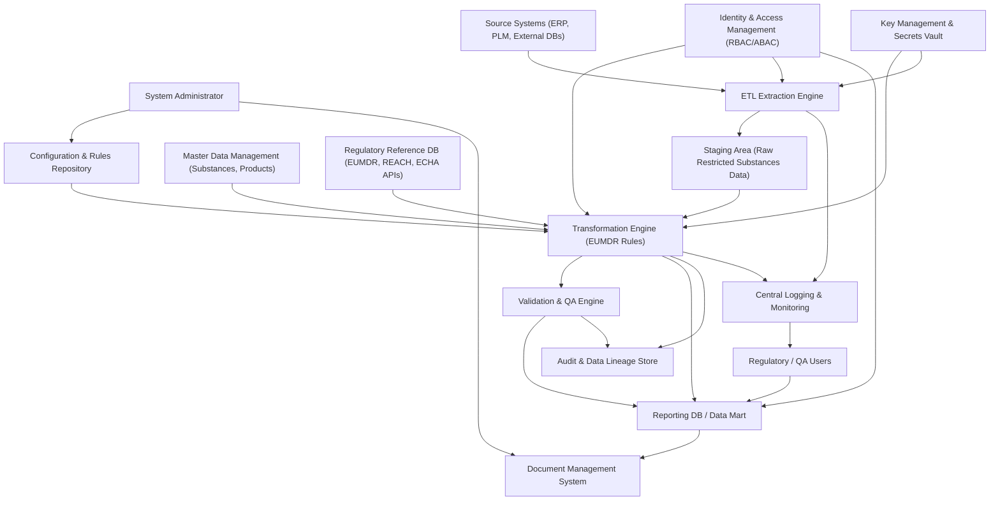

#### 1. High-Level Design

- Architecture Overview & Component Diagram:

- Component Descriptions:
  - Source Systems (ERP, PLM, External DBs): Provide raw product, substance, concentration, and classification data.
  - ETL Extraction Engine: Pulls restricted substances-related fields into a controlled staging area with incremental logic and metrics.
  - Staging Area: Holds raw extracted data with minimal transformation, used as the immutable input baseline for transformations.
  - Transformation Engine (EUMDR Rules): Applies deterministic mapping from source fields to EUMDR-required structures, performs unit conversion, classification mapping, SVHC status derivation, and logs all transformations.
  - Master Data Management (MDM): Provides authoritative reference data for substances, products, CAS numbers, and internal code mappings to regulatory identifiers.
  - Regulatory Reference DB (EUMDR, REACH, ECHA APIs): Stores and/or fetches regulatory rules, thresholds, and substance lists (e.g., SVHC candidate list) for transformation logic.
  - Validation & QA Engine: Runs structural and business validations after transformation to ensure completeness and correctness (though detailed validation is Epic QE-3553).
  - Audit & Data Lineage Store: Holds immutable, tamper-evident logs of each transformation run, including rule versions, before/after values, and lineage from source to target.
  - Key Management & Secrets Vault: Manages encryption keys and stores credentials, used by ETL and transformation services.
  - Reporting DB / Data Mart: Stores transformed, EUMDR-compliant data for downstream reporting and regulatory submissions.
  - Central Logging & Monitoring: Aggregates logs, metrics, and alerts for ETL and transformation operations.
  - Identity & Access Management (IAM): Provides RBAC/ABAC controls for who can configure, execute, and view transformations.
  - Document Management System (DMS): Stores transformation specifications, rule documentation, and validation evidence for audits.
  - Configuration & Rules Repository: Version-controlled store for transformation mappings, unit conversions, and classification rules.

- Integration Points & Data Flow:
  - Extraction to Transformation:
    - ETL Extraction Engine reads from ERP/PLM/external databases over TLS 1.3, writes raw restricted substances data into the staging area with extraction metadata (timestamp, source, batch ID).
  - Transformation Pipeline:
    - The Transformation Engine reads from staging using batch IDs, applies:
      - Field mapping to EUMDR schema (e.g., CAS number, concentration, classification).
      - Unit conversion and standardization (e.g., mg/kg, ppm to a normalized unit).
      - Mapping of internal substance codes to CAS and regulatory identifiers via MDM.
      - SVHC status derivation using Regulatory Reference DB / ECHA APIs.
    - For each record, it records transformation steps and rule versions into the Audit & Data Lineage Store.
  - Regulatory References:
    - Regulatory Reference DB is updated periodically (from EUMDR, REACH, ECHA sources) via secure integrations; the Transformation Engine queries this DB at runtime or uses cached snapshots.
  - Validation and Load:
    - Post-transformation, the Validation & QA Engine checks mandatory fields and structure; only validated records are loaded into the Reporting DB.
  - Documentation:
    - Transformation specifications and rule changes are stored in the Configuration & Rules Repository and linked to documents in the DMS.

- Security & Compliance Features:
  - Transport Security:
    - All data movement between components (source systems, ETL, transformation, reporting, reference services) is over TLS 1.3 with strong cipher suites.
    - Mutual TLS is used for calls to external regulatory APIs (e.g., ECHA).
  - Data Protection & Encryption (AES-256):
    - At-rest encryption with AES-256 for staging, audit logs, reporting DB, and configuration repositories.
    - Sensitive fields (e.g., credentials, API tokens) stored in a secrets vault with AES-256 and hardware-backed key storage where available.
  - RBAC/ABAC:
    - IAM enforces role-based access control:
      - System Administrator: configure sources, rules; cannot change production data.
      - Data Steward: monitor transformation runs, handle exceptions.
      - Regulatory/QA: view transformed data and reports; read-only access to rules.
      - Auditors: read-only access to audit trails and documentation.
    - Attribute-based policies (ABAC) restrict access based on region, data domain (e.g., EU-only data), and purpose (regulatory vs. analytics).
  - Audit Logging:
    - Each transformation job logs:
      - Who triggered it (user or service account).
      - Rule version set used.
      - Source batch IDs and target dataset IDs.
      - Record counts and transformation success/failure counts.
    - Per-record lineage:
      - Source system and primary keys.
      - Applied transformations (field-level changes, conversion factors).
      - Timestamps for each processing stage.
  - Compliance Mapping:
    - EUMDR Regulation (EU) 2017/745:
      - Ensures required fields (e.g., substances of concern, concentration, classification) are present and correctly mapped.
      - Provides traceability from final reported values back to source data and transformation logic.
    - REACH (EC) 1907/2006:
      - Maintains alignment with substance registration and classification rules via Regulatory Reference DB.
    - GxP / ALCOA+:
      - Transformation logs ensure data is attributable, contemporaneous, original (raw data preserved), accurate, and enduring.
    - FDA 21 CFR Part 11:
      - Electronic records for transformations and configuration changes are time-stamped, attributable, and protected against tampering.
    - ISO 13485:
      - Transformation processes and configurations are documented and controlled under QMS procedures.

- Resiliency & Error Handling:
  - Circuit Breakers:
    - Applied on external dependencies (e.g., ECHA APIs, MDM services). If external services are unavailable or failing, the circuit breaker opens and:
      - Transformation jobs fail fast with clear error codes.
      - No partial or inconsistent classification is applied.
  - Retry Mechanisms:
    - Transient failures (e.g., network hiccups, DB timeouts) trigger limited retries with exponential backoff.
    - Retries are logged, including final failure state if retries are exhausted.
  - Idempotent Processing:
    - Transformation jobs keyed by batch ID and rule version ensure that reruns produce the same output and do not duplicate records.
  - Fallback Patterns:
    - If regulatory references are temporarily unavailable:
      - Transformation can either:
        - Fail the job (default for regulated environments), or
        - Use last-known-good snapshot with clear tagging that a cached reference was used.
  - Monitoring & Alerts:
    - Central Logging & Monitoring raises alerts for:
      - Increased transformation failure rates.
      - Unexpected spikes in missing mandatory fields.
      - Rule version mismatches between environments (e.g., test vs. production).
  - Graceful Degradation:
    - Non-critical derived attributes (e.g., optional classifications) can be deferred, but core EUMDR fields must be present; otherwise, records are quarantined rather than partially loaded.

#### 2. Validation Report

- Requirements Coverage:
  - Mapping of extracted fields to EUMDR-required data elements:
    - Covered by Transformation Engine with explicit mapping tables from source fields (ERP/PLM/external DB) to EUMDR schema (CAS number, substance name, concentration, classification, SVHC status).
  - Detection and flagging of missing mandatory fields:
    - Covered via integration between Transformation Engine and Validation & QA Engine; records missing mandatory fields are flagged and stored in a quarantine area with error codes.
  - Unit conversion and standardization:
    - Covered by standardized conversion library within the Transformation Engine; conversion factors logged to the Audit & Data Lineage Store.
  - Preservation of original values in metadata:
    - Covered by storing original values and units in staging and in metadata columns in the Reporting DB, with links in lineage logs.
  - Mapping of internal codes to regulatory identifiers:
    - Covered by integration with MDM and Regulatory Reference DB; transformation rules map internal IDs to CAS and regulatory classifications.
  - Determination of SVHC status:
    - Covered via Regulatory Reference DB and ECHA APIs; Transformation Engine calculates SVHC status per current candidate list and logs reference list versions.
  - Version control and traceability of transformation rules:
    - Covered by Configuration & Rules Repository with rule version IDs attached to each job run and stored in audit logs.
  - Alignment with EUMDR, REACH, and related regulations:
    - Covered by embedding regulatory requirements into the Regulatory Reference DB and enforcing them at transformation time.

- Compliance Status:
  - EUMDR Data Retention:
    - Pass: Audit logs, transformed datasets, and associated metadata are retained at least for the regulatory minimum (e.g., 10+ years) in encrypted, tamper-evident storage.
  - Data Lineage and Traceability:
    - Pass: Full lineage from final EUMDR-compliant records back to source systems and transformation rules is preserved and queryable.
  - Data Integrity (ALCOA+ / GxP):
    - Pass: System maintains original data, records transformation steps, and ensures that changes are attributable and time-stamped.
  - Security (TLS 1.3, AES-256, RBAC/ABAC):
    - Pass: All critical data in motion and at rest is protected; access to transformation configuration and outputs is controlled and logged.
  - Privacy & Consent (where applicable):
    - Pass: System design assumes no direct personal data in restricted substance data; if product-level data could be linked to customers, IAM/ABAC policies ensure appropriate restriction and logging.
  - Compliance Reporting:
    - Pass: Transformation metadata and logs can be exported or reported for regulatory inspections and internal audits.

- Identified Ambiguities/Risks:
  - Ambiguity: Frequency and method of updating regulatory reference data (e.g., SVHC list updates from ECHA).
    - Mitigation:
      - Define a controlled process (e.g., monthly scheduled update with documented verification).
      - Log regulatory list versions and effective dates in the Regulatory Reference DB and Audit Store.
  - Risk: Inconsistent mappings between multiple source systems (ERP vs. PLM) for the same substance or product.
    - Mitigation:
      - Enforce single MDM “source of truth” for substances and products.
      - Implement cross-source consistency checks (in coordination with QE-3553 validation epic).
      - Maintain reconciliation reports and governance policies for resolving conflicts.
  - Ambiguity: Handling of legacy data that does not fully meet EUMDR requirements (missing fields or outdated classifications).
    - Mitigation:
      - Design a “legacy compliance gap” category; tag such records clearly.
      - Define manual remediation workflows for data stewards and regulatory teams.
      - Only allow EUMDR-compliant records into the primary Reporting DB; legacy records remain in a separate, controlled repository.
  - Risk: Over-reliance on external APIs (ECHA) during transformation leading to failures if services are down.
    - Mitigation:
      - Use cached regulatory snapshots with explicit validity periods.
      - Implement circuit breakers, retries, and clearly documented failure modes.
      - Require re-validation when new regulatory snapshots are applied.
  - Risk: Misalignment between transformation rules across environments (DEV/TEST/PROD) leading to inconsistent outputs.
    - Mitigation:
      - Centralized rules repository with promotion workflow (DEV → TEST → PROD) and approvals.
      - Automated configuration drift detection and alerting.
      - Signed and versioned rule packages with checksum verification before use.
