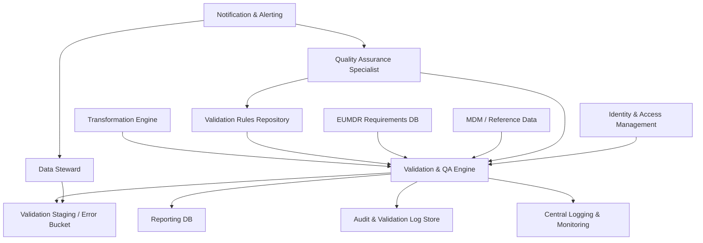

#### 1. High-Level Design

- Architecture Overview & Component Diagram:

- Component Descriptions:
  - Validation & QA Engine: Executes mandatory field checks, business validations, and consistency checks on transformed data.
  - Validation Rules Repository: Stores parameterized validation rules, thresholds, and configurations with versioning.
  - EUMDR Requirements DB: Encodes regulatory requirements for mandatory fields and thresholds.
  - Validation Staging / Error Bucket: Holds records that fail validation with associated error codes.
  - Audit & Validation Log Store: Logs each validation run, rule versions, counts of passed/failed records, and detailed issues.

- Integration Points & Data Flow:
  - Input:
    - Validation & QA Engine receives transformed data batches from Transformation Engine.
  - Rules and Requirements:
    - Validation rules are aligned with EUMDR requirements; QA updates rules under change control, with validation and approvals.
  - Output:
    - Passing records flow to Reporting DB.
    - Failing records are stored in Validation Staging with detailed errors for remediation.
  - Notifications:
    - Critical validation failures generate notifications to QA and Data Stewards with actionable information.

- Security & Compliance Features:
  - RBAC:
    - Only QA and authorized Regulatory roles can change validation rules.
  - Audit:
    - All validations and rule changes are logged, with justification, to meet ALCOA+ and GxP expectations.

- Resiliency & Error Handling:
  - Rule Version Control:
    - Validate that correct rule versions are used; mismatches raise errors before validation runs.
  - Monitoring:
    - Sudden spikes in failures trigger alerts, allowing timely intervention.

#### 2. Validation Report

- Requirements Coverage:
  - Mandatory field validation:
    - Covered via Validation & QA Engine and EUMDR Requirements DB.
  - Business rule validation:
    - Covered via configurable validation rules and integration with regulatory reference data.
  - Cross-source consistency checks:
    - Covered via MDM integration and reconciliation logic.
  - Reporting and notifications:
    - Covered via validation reports, error buckets, and notification channels.

- Compliance Status:
  - GxP and ALCOA+:
    - Pass: Validation logs are attributable, complete, and enduring.
  - EUMDR:
    - Pass: Validation ensures only compliant and complete data progresses to reporting.

- Identified Ambiguities/Risks:
  - Ambiguity: Priority of rules when multiple rules conflict.
    - Mitigation:
      - Governance defines precedence hierarchies and conflict resolution strategies.
  - Risk: Overly strict rules causing false positives.
    - Mitigation:
      - QA performs test runs and impact analysis before promoting rules to production.
