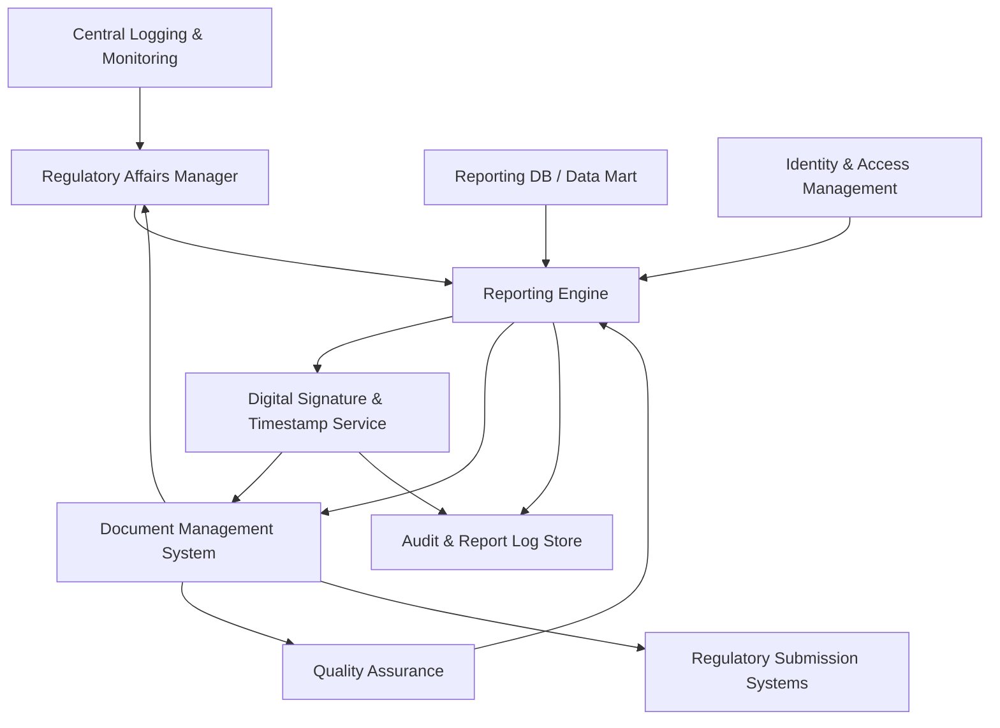

#### 1. High-Level Design

- Architecture Overview & Component Diagram:

- Component Descriptions:
  - Reporting Engine: Generates EUMDR-compliant reports (XML, PDF) from Reporting DB.
  - Digital Signature & Timestamp Service: Applies compliant electronic signatures and time stamps.
  - Document Management System: Stores generated reports with retention and access control policies.
  - Regulatory Submission Systems: Downstream systems used to submit reports to authorities.

- Integration Points & Data Flow:
  - Report Request:
    - Regulatory users request reports via Reporting Engine, specifying product, date range, and type.
  - Report Generation:
    - Reporting Engine pulls data from RPTDB, constructs required sections, formats output, and sends reports to SIGN for digital signing.
  - Storage & Access:
    - Signed reports are stored in DMS with metadata and retention tags.
  - Submission:
    - Reports may be exported to or integrated with Submission Systems for actual regulatory filing.

- Security & Compliance Features:
  - AES-256 Encryption:
    - Reports at rest are stored in encrypted repositories; access controlled via IAM.
  - TLS 1.3:
    - Access to reporting UI and APIs is over TLS 1.3; secure integration with submission channels.
  - RBAC/ABAC:
    - Only authorized Regulatory and QA roles can generate or access specific reports, with scope limitations based on product, region, or business unit.
  - Audit Logging:
    - Every report generation, signature application, access, and export is logged in Audit & Report Log Store.
  - Compliance Mapping:
    - EUMDR Article 32 and other reporting provisions:
      - Reports contain required content, are retained for regulatory timelines, and are retrievable for inspections.
    - FDA 21 CFR Part 11:
      - Digital signatures and timestamps are compliant; signature meaning and intent captured.

- Resiliency & Error Handling:
  - Report Generation Errors:
    - Failures due to missing data or template issues result in descriptive error messages and logged events; partial reports are not released.
  - Signature Service Availability:
    - If SIGN is unavailable, report generation queues requests; circuit breaker prevents repeated calls, and alerts are raised.
  - Data Consistency:
    - Reporting Engine ensures it uses consistent snapshot timestamps from RPTDB; if data is mid-update, it can wait for a stable state or use snapshotting.

#### 2. Validation Report

- Requirements Coverage:
  - Standard report generation with mandatory sections:
    - Covered by Reporting Engine templates aligned to EUMDR requirements.
  - Digital signature and timestamp:
    - Covered via SIGN service integrated into report pipeline.
  - Report retention and retrieval:
    - Covered via DMS policies and search capabilities.
  - Audit logging of report generation and access:
    - Covered by Audit & Report Log Store.

- Compliance Status:
  - Retention and Documentation:
    - Pass: Reports and metadata retained for required durations and protected from modification.
  - Electronic Records & Signatures:
    - Pass: Digital signature process is compliant with FDA 21 CFR Part 11 and relevant EU guidance.

- Identified Ambiguities/Risks:
  - Ambiguity: Handling superseded reports vs. original submissions.
    - Mitigation:
      - Versioning and clear labels (original, corrected, superseded), all retained.
  - Risk: Performance impact for batch reporting.
    - Mitigation:
      - Batch-friendly architecture, queued workloads, and performance testing.
