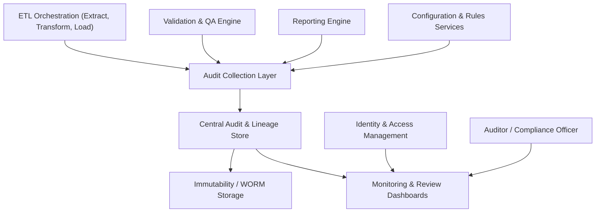

#### 1. High-Level Design

- Architecture Overview & Component Diagram:

- Component Descriptions:
  - Audit Collection Layer: Standardized logging adapters for ETL, validation, reporting, and configuration changes.
  - Central Audit & Lineage Store: Single store for all audit events, with schema supporting data lineage and regulatory queries.
  - Immutability / WORM Storage: Ensures audit logs cannot be altered or deleted within retention period.

- Integration Points & Data Flow:
  - Event Collection:
    - ETL, Validation, Reporting, and Config services emit structured events; AUDCOL normalizes and forwards them to AUDSTORE.
  - Lineage:
    - Events reference IDs (source record keys, batch IDs, rule versions) enabling full lineage reconstruction.

- Security & Compliance Features:
  - Immutability:
    - WORM (Write Once Read Many) policies applied to audit data; only append operations allowed.
  - RBAC:
    - Access limited to Compliance, Auditors, and authorized roles; read-only for most, with no delete.
  - Encryption:
    - AES-256 protection for audit storage; TLS 1.3 for access.

- Resiliency & Error Handling:
  - Backpressure and Buffering:
    - If AUDSTORE is slow, AUDCOL buffers events up to safe limits; ETL and other services are designed not to lose events.
  - Monitoring:
    - Health checks ensure audit pipeline is functioning; failures trigger high-priority alerts.

#### 2. Validation Report

- Requirements Coverage:
  - Audit logging across ETL lifecycle:
    - Covered via integration of ETL, validation, reporting, and configuration services into AUDCOL and AUDSTORE.
  - Data access and change management:
    - Covered via IAM integration and logging of user actions.
  - Immutability and retention:
    - Covered via WORM storage policies and retention configuration.

- Compliance Status:
  - EUMDR, FDA 21 CFR Part 11, GxP:
    - Pass: Audit design meets formal requirements for audit trails, traceability, and data integrity.

- Identified Ambiguities/Risks:
  - Risk: Volume of audit data impacting cost and performance.
    - Mitigation:
      - Tiered storage, archival policies, and efficient indexing strategies.
