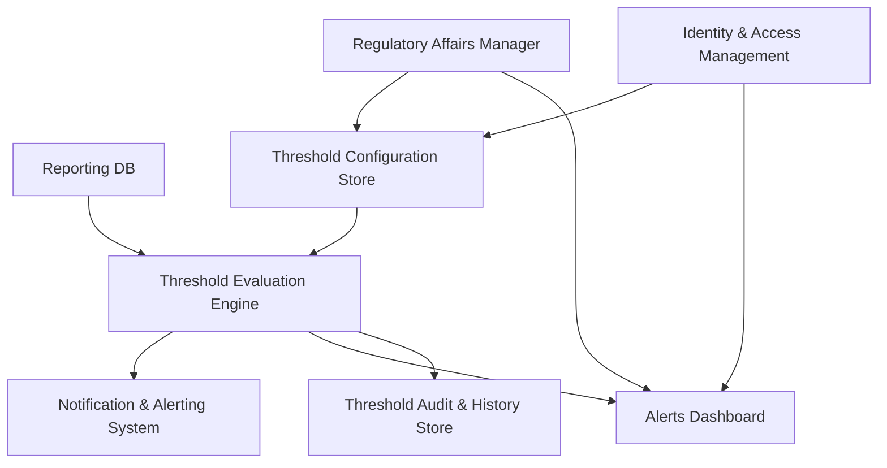

#### 1. High-Level Design

- Architecture Overview & Component Diagram:

- Component Descriptions:
  - Threshold Evaluation Engine: Continuously or periodically checks concentrations against configured thresholds.
  - Threshold Configuration Store: Holds threshold definitions, warning/critical levels, and escalation configurations.
  - Alerts Dashboard: Displays active alerts and status to users.

- Integration Points & Data Flow:
  - Input:
    - Uses validated, transformed data from RPTDB.
  - Processing:
    - Evaluates records against thresholds; generates alerts with severity levels.
  - Output:
    - NOTIF sends emails/system alerts; DASH shows status; AUD stores alert history.

- Security & Compliance Features:
  - RBAC:
    - Only authorized Regulatory roles can configure thresholds.
  - Audit:
    - All threshold changes and alerts are logged; provides evidence for risk management activities.
  - Encryption:
    - Alerts and configurations stored in encrypted databases.

- Resiliency & Error Handling:
  - Alert Flood Protection:
    - Rate-limiting and deduplication to avoid excessive alerts during large issues.
  - Monitoring:
    - Failures in evaluation trigger alerts; system ensures that evaluation failures themselves are visible.

#### 2. Validation Report

- Requirements Coverage:
  - Threshold configuration and validation:
    - Covered via Threshold Configuration Store and validation logic.
  - Warning and critical levels:
    - Covered through rule parameters and evaluation engine.
  - Alerts, dashboards, escalation:
    - Covered by NOTIF and DASH components.

- Compliance Status:
  - EUMDR and ISO 14971:
    - Pass: Alerts support proactive risk management, documented, and auditable.

- Identified Ambiguities/Risks:
  - Ambiguity: Differing threshold expectations across markets.
    - Mitigation:
      - Support region-specific threshold sets controlled by ABAC policies.
