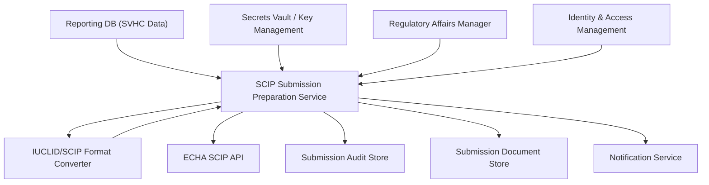

#### 1. High-Level Design

- Architecture Overview & Component Diagram:

- Component Descriptions:
  - SCIP Submission Preparation Service: Prepares submission packages, validates them, and orchestrates submission.
  - IUCLID/SCIP Format Converter: Converts internal data into ECHA-compliant IUCLID/SCIP structures.
  - ECHA SCIP API: External API used for submissions.

- Integration Points & Data Flow:
  - Preparation:
    - Service pulls validated SVHC data, generates IUCLID files, runs technical validation.
  - Submission:
    - Authenticates with SCIPAPI using credentials from Secrets Vault, submits data, and receives reference numbers and status.
  - Storage:
    - Submission artifacts stored in DMS and logged in AUD.

- Security & Compliance Features:
  - TLS 1.3:
    - All SCIPAPI interactions use TLS 1.3, with certificate validation and possibly mutual TLS.
  - AES-256:
    - Submission packages stored encrypted; credentials in Secrets Vault.
  - RBAC:
    - Only authorized Regulatory roles can initiate submissions; approvals can be enforced via IAM workflows.
  - Audit Logging:
    - Full submission history including payload references, statuses, and feedback from ECHA is logged.

- Resiliency & Error Handling:
  - Circuit Breakers:
    - If SCIPAPI is unavailable or returning errors, circuit breakers prevent repeated failures; submissions are queued for retry.
  - Detailed Error Handling:
    - Technical validation failures produce detailed error lists for RA teams; resubmissions are tracked as new attempts linked to original.

#### 2. Validation Report

- Requirements Coverage:
  - Preparation of IUCLID-compatible submission files:
    - Covered via IUCLID/SCIP Format Converter and preparation service.
  - Secure, authenticated submissions:
    - Covered via SCIPAPI integration over TLS, with credentials from Secrets Vault and strong authentication.
  - Submission tracking and history:
    - Covered by Submission Audit Store and DMS.

- Compliance Status:
  - EU Waste Framework Directive and SCIP requirements:
    - Pass: System automates and validates submissions in line with ECHA technical specs, ensures history and reference numbers are retained.

- Identified Ambiguities/Risks:
  - Risk: Changes in ECHA technical specifications.
    - Mitigation:
      - Regular updates and regression tests for IUCLID/SCIP converters; configurable mapping.
