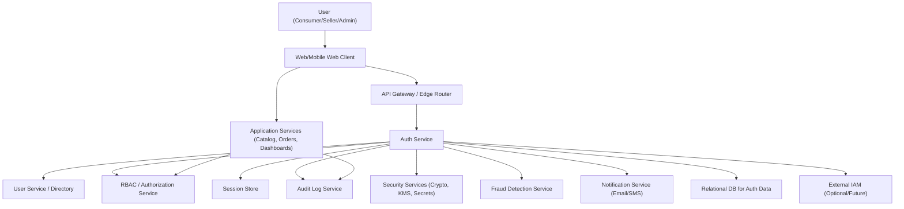

#### 1. High-Level Design

- Architecture Overview & Component Diagram:

- Component Descriptions:

  - Web/Mobile Web Client: Implements registration, login, and role-aware UI (consumer, seller, admin). Enforces client-side input validation and accessibility (WCAG 2.1 AA).
  - API Gateway / Edge Router: Terminates TLS 1.3, performs routing, rate limiting, IP allow/deny lists, and basic request normalization.
  - Auth Service:
    - Handles registration, login, logout.
    - Manages credentials (password hashing, password policies).
    - Issues access tokens (e.g., JWT) and refresh tokens.
    - Integrates with RBAC for role resolution and permission checks.
    - Performs risk checks with Fraud Detection Service.
  - User Service / Directory: Stores user profiles, role assignments, status (active/locked), and minimal PII. Provides CRUD operations for profiles.
  - RBAC / Authorization Service: Maintains roles (consumer, seller, admin) and permissions (scopes, resource-level rules). Handles policy evaluation for APIs.
  - Session Store: Holds server-side session state and refresh tokens; supports invalidation and device/session management.
  - Audit Log Service: Centralized immutable log of security-sensitive events (login, logout, failed attempts, role changes).
  - Security Services (Crypto, KMS, Secrets): Provides AES-256 encryption/decryption, key rotation, and secure storage for secrets (API keys, DB credentials).
  - Fraud Detection Service: Flags suspicious login and registration patterns (e.g., excessive failures, unusual geo/IP, device anomalies).
  - Notification Service: Sends registration confirmations, password reset emails, and security alerts. Respects consent and notification preferences.
  - Application Services: Catalog, Orders, Dashboards, etc. rely on Auth Service and RBAC for authentication and authorization.
  - Auth DB: Stores users, password hashes, roles, and security metadata (salt, last login, failed attempt counters).
  - External IAM (future): Optional integration for enterprise SSO or external identity providers if later considered in scope.

- Integration Points & Data Flow:

  - Registration Flow:
    1. User submits registration form via Web Client.
    2. API Gateway validates TLS, forwards to Auth Service.
    3. Auth Service:
       - Validates input (email, password strength, role).
       - Checks user uniqueness via User Service/DB.
       - Hashes password with strong algorithm (e.g., Argon2 or bcrypt) and stores in Auth DB via User Service.
       - Assigns default role (consumer by default; seller/admin requires additional verification/governance).
       - Persists audit event “USER_REGISTERED”.
       - Triggers Notification Service for welcome/verification email.
  - Login Flow:
    1. User submits credentials or token to Web Client.
    2. Client sends request via API Gateway to Auth Service over TLS 1.3.
    3. Auth Service:
       - Validates input format (no control chars, length bounds).
       - Reads user record from Auth DB via User Service.
       - Verifies password hash; increments failed attempt counters on failure.
       - Checks account status (active/locked).
       - Consults Fraud Detection Service for risk scoring.
       - On success, issues tokens and stores session in Session Store.
       - Logs “LOGIN_SUCCESS/LOGIN_FAILURE” in Audit Log Service.
  - Authorization Flow:
    1. Application Services receive requests with access tokens.
    2. They call RBAC / Authorization Service to:
       - Validate token signature and expiry.
       - Resolve roles and permissions.
       - Enforce resource-level access (e.g., seller dashboards only for seller role).
    3. Audit Log Service logs access to sensitive resources (admin dashboards, role changes).
  - Profile Management:
    - User profile changes (e.g., email, notification preferences) are handled by User Service.
    - Security-sensitive changes (email change, password reset) produce audit logs and notifications.
  - Fraud and Anomaly Handling:
    - Auth Service sends login/registration events to Fraud Detection Service.
    - High-risk events trigger adaptive responses (e.g., temporary lock, extra verification).
  - External IAM (optional/future):
    - Auth Service can later federate with an external IdP while still enforcing RBAC locally.

- Security & Compliance Features:

  - Encryption & Transport Security:
    - TLS 1.3 enforced at the API Gateway and any public-facing endpoint.
    - Sensitive fields (password hashes, security questions, tokens) stored using strong hashing and/or AES-256 encryption with keys in KMS.
    - Tokens signed with asymmetric keys; keys rotated and stored in secure key management infrastructure.
  - Input Validation & Output Filtering:
    - Strict server-side validation for registration/login fields:
      - Email format, password complexity, maximum lengths, allowed character sets.
      - Normalization to avoid homograph attacks (e.g., Unicode normalization).
    - Output encoding for any user-entered data that appears in responses to prevent XSS.
    - Strict content-type and schema validation at API boundaries.
  - RBAC / ABAC:
    - RBAC baseline:
      - Consumer: browse, purchase, manage personal account.
      - Seller: manage own products, inventory, and orders.
      - Admin: manage users, sellers, and system configurations.
    - ABAC extension for finer control:
      - Attributes: user type, seller ID, account status, risk level, time of day, IP region.
      - Policies: e.g., “Seller can only modify products where product.sellerId == user.sellerId”.
  - Audit Logging:
    - All authentication-related events captured with timestamps, user ID, IP, device metadata:
      - Registration, login success/failure, logout, password change, role assignment, account lock/unlock.
    - Logs are immutable, tamper-evident, and retained per compliance policy.
    - Logs segregated to prevent exposure; access to logs itself is protected with RBAC.
  - Compliance & Privacy:
    - Credentials and security data managed in alignment with PCI DSS-aligned practices where applicable (though this epic focuses on auth; payment PCI DSS is primarily in payments epic).
    - Pseudonymization of identifiers in logs when possible; avoid logging full PII (e.g., obfuscate emails).
    - Retention aligned to data retention policies (e.g., account logs retained N years, configurable per compliance).
    - Data lineage documented: how registration data flows into User Service, how tokens are generated and consumed.

- Resiliency & Error Handling:

  - Circuit Breakers:
    - Circuit breaker patterns implemented in Auth Service when calling:
      - Fraud Detection Service.
      - Notification Service.
      - Audit Log Service (with queue-based buffering as fallback).
    - If a downstream is unavailable, the Auth Service:
      - Degrades gracefully (e.g., proceed with login but flag event for later review, or fail fast depending on risk policy).
  - Retries:
    - Idempotent operations (e.g., log writes, notifications) use exponential backoff retries with upper limits.
    - Non-idempotent operations (e.g., registration) use transaction patterns and unique constraints to avoid duplicates.
  - Fallback Patterns:
    - If Fraud Detection Service is down, apply conservative default (e.g., stricter rate limiting, temporary CAPTCHAs).
    - If Notification Service fails, queue messages for retry and inform user that the action is complete but notification may be delayed.
  - Error Responses:
    - Explicit, user-friendly messages without revealing sensitive internal details (e.g., “Invalid credentials” rather than telling whether email exists).
    - Standardized error codes to support monitoring and client-side handling.
  - Availability & Performance:
    - Stateless Auth Service instances behind load balancer; session and token data stored in external Session Store / DB.
    - Horizontal scaling to meet 100,000 concurrent users across the platform, with auth endpoints designed to be low-latency.
    - Authentication pages must meet ≤2s page load targets; auth services designed with caching of non-sensitive metadata where appropriate.

#### 2. Validation Report

- Requirements Coverage:

  - Registration:
    - Covered via Auth Service registration flow with input validation, password hashing, and secure storage.
  - User Login:
    - Covered via login flow with password verification, token issuance, session management.
  - Password-Based Authentication:
    - Implemented with strong hashing, password policies, and secure reset mechanisms.
  - Session Management:
    - Central Session Store, token issuance/refresh, logout, and session invalidation workflows.
  - Role-Based Access Control (RBAC):
    - Dedicated RBAC/Authorization Service with role definitions for consumers, sellers, and admins.
  - Access Control Enforcement:
    - Application Services integrate with RBAC to enforce resource-level rules.
  - Basic Account Profile Management:
    - User Service supports profile updates (non-security and security-sensitive), with compliance and logging.
  - Non-Functional Requirements:
    - Performance: Auth pages designed for ≤2s load.
    - Security: Encryption in transit (TLS 1.3), encryption/hash for sensitive data, PCI DSS-aligned handling of credentials.
    - Availability: Stateless auth with scaling and resiliency patterns to support 99.9% uptime.
    - Accessibility: Auth-related UIs designed to comply with WCAG 2.1 AA (keyboard navigation, contrast, labels, error messaging).

- Compliance Status:

  - Data Retention:
    - Auth DB and logs follow defined retention policies (configurable per regulatory requirements). Access logs retained as required; PII minimized.
    - Status: Pass, assuming retention configuration is applied and enforced at deployment.
  - Consent Management:
    - Registration flow includes explicit consent capture for:
      - Terms of service and privacy notice acknowledgment.
      - Optional marketing communications (stored in User Service preferences and honored by Notification Service).
    - Status: Pass.
  - Data Lineage:
    - Documented flows from registration inputs to User Service and Auth DB, through to tokens and logs.
    - Status: Pass.
  - Compliance Reporting:
    - Audit Log Service provides reports of login activity, account changes, role modifications.
    - Status: Pass, contingent on implementing reporting queries/dashboards on top of the log store.
  - Security & Privacy Constraints:
    - Encrypt-in-transit (TLS 1.3) and secure storage for credentials align with security expectations.
    - Use of RBAC and minimized PII in logs reduce privacy risk.
    - Status: Pass.

- Identified Ambiguities/Risks:

  - Ambiguity: Multi-factor authentication and social login are explicitly out of scope.
    - Risk: Some enterprises may expect MFA by default; lack of MFA can be a security concern.
    - Mitigation: Design Auth Service and data model to be MFA-ready (pluggable factors, token stores) without implementing MFA now; document as future enhancement.
  - Ambiguity: External IAM integration (SSO) is out of scope but may be demanded by some admin users.
    - Risk: Integration later could be complex if the design is not prepared.
    - Mitigation: Introduce an abstraction layer (External IAM adapter) in the Auth Service, and avoid hard-coding assumptions that credentials are only stored locally.
  - Risk: Fraud Detection Service is a dependency; its unavailability could impact security posture.
    - Mitigation: Circuit breaker and conservative fallback policies; clear runbooks for degraded-mode operation.
  - Risk: Handling of locked or suspended seller/admin accounts not explicitly defined in the epic.
    - Mitigation: Extend RBAC and User Service schema to include account status states (active, suspended, locked) and enforce checks in Auth Service and Application Services.
  - Risk: WCAG 2.1 AA compliance requires detailed UI implementation practices not fully specified in the epic.
    - Mitigation: Establish an accessibility checklist (focus order, labels, contrast, error messaging, ARIA as needed) and include accessibility tests in CI/CD for auth screens.
