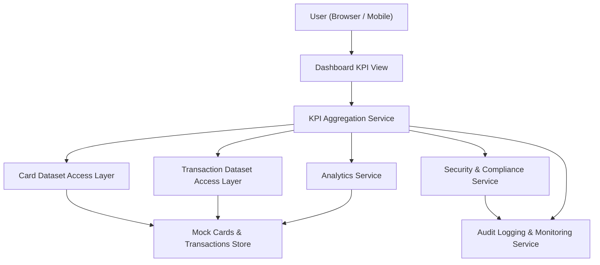

#### 1. High-Level Design

- Architecture Overview & Component Diagram:

- Component Descriptions:
  - Dashboard KPI View: Main dashboard showing monthly spend, limits, outstanding amount, utilization, and transaction counts.
  - KPI Aggregation Service: Aggregates data from card and transaction datasets into KPI metrics.
  - Card Dataset Access Layer: Supplies card data including limits and balances.
  - Transaction Dataset Access Layer: Supplies transactions for monthly spend and counts.
  - Analytics Service: Supports derived metrics and trends.
  - Security & Compliance Service: Ensures KPI outputs do not expose sensitive details.
  - Audit Logging & Monitoring Service: Logs dashboard loads and KPI performance.
  - Mock Cards & Transactions Store: Holds all mock data for KPIs.

- Integration Points & Data Flow:
  - Upon dashboard load, UI requests KPIs from KPI Aggregation Service.
  - Service aggregates across mock card and transaction datasets.
  - Security & Compliance ensures masking and validates metrics.
  - Audit Logging records KPI retrieval and load times.

- Security & Compliance Features:
  - TLS 1.3 for all interactions.
  - Masking of card numbers and any sensitive identifiers.
  - RBAC so that only authorized roles can access dashboard KPIs.
  - No real bank integrations; all data is mock.

- Resiliency & Error Handling:
  - KPI computations cached for efficiency.
  - Circuit breakers on underlying data services to avoid cascading failures.
  - Fallback to partial KPI sets or informative error messages if some data sources fail.
