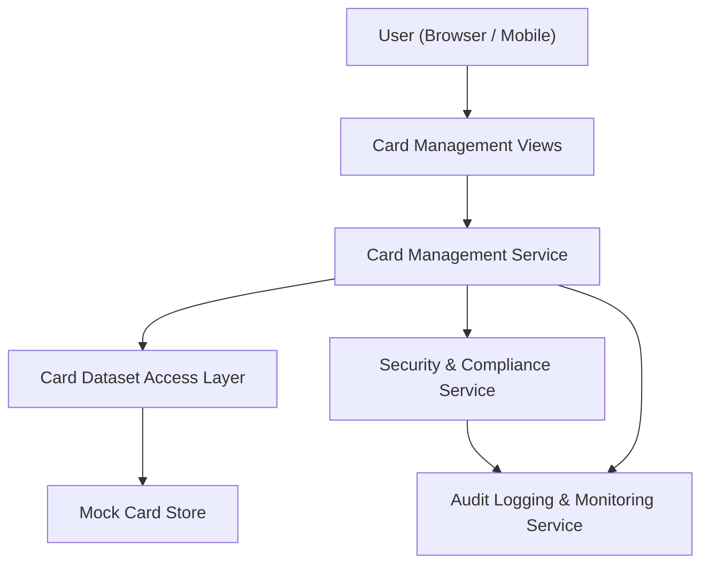

#### 1. High-Level Design

- Architecture Overview & Component Diagram:

- Component Descriptions:
  - Card Management Views: UI components displaying card lists and details.
  - Card Management Service: Aggregates card data, computes totals, and provides filters.
  - Card Dataset Access Layer: Accesses card data and limits from Mock Card Store.
  - Security & Compliance Service: Enforces masking and access control.
  - Audit Logging & Monitoring Service: Logs card-related viewing activity.
  - Mock Card Store: Holds multiple mock card records.

- Integration Points & Data Flow:
  - Users can browse multiple cards via the Card Management Views.
  - Card Management Service retrieves card details and computes aggregates.
  - Security and logging services ensure compliance and traceability.

- Security & Compliance Features:
  - TLS 1.3 and AES-256 (for any stored card configurations).
  - Masking of card numbers and other sensitive identifiers.
  - RBAC so that only authorized roles can see card details, even in mock environments.

- Resiliency & Error Handling:
  - Circuit breaker over Card Dataset Access Layer.
  - Fallback UI if card data is unavailable.
  - Logged errors and metrics for monitoring.
