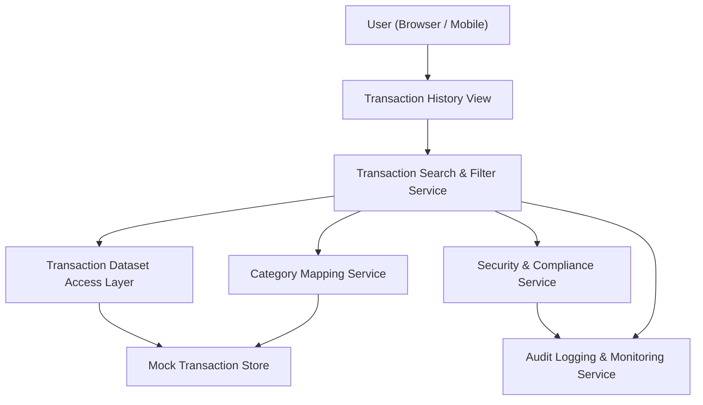

#### 1. High-Level Design

- Architecture Overview & Component Diagram:

- Component Descriptions:
  - Transaction History View: UI table showing transaction details.
  - Transaction Search & Filter Service: Applies search, filters, and sorting.
  - Transaction Dataset Access Layer: Reads transaction data.
  - Category Mapping Service: Adds category info.
  - Security & Compliance Service: Ensures masking and security.
  - Audit Logging & Monitoring Service: Logs searches and filter operations.
  - Mock Transaction Store: Stores mock transactions.

- Integration Points & Data Flow:
  - Users search and filter transactions via the Transaction History View.
  - Transaction Search & Filter Service retrieves data via Dataset Access Layer and Category Mapping Service.
  - Security & Compliance verifies outputs and masks sensitive fields.
  - Audit Logging captures search patterns and performance metrics.

- Security & Compliance Features:
  - Input validation for search terms and filters.
  - Masking of card numbers.
  - TLS 1.3 for all interactions.
  - RBAC and ABAC controlling access to transaction history views.

- Resiliency & Error Handling:
  - Pagination and lazy loading to handle large datasets.
  - Circuit breakers and retries for dataset access.
  - Clear error states for failures, with logs.
