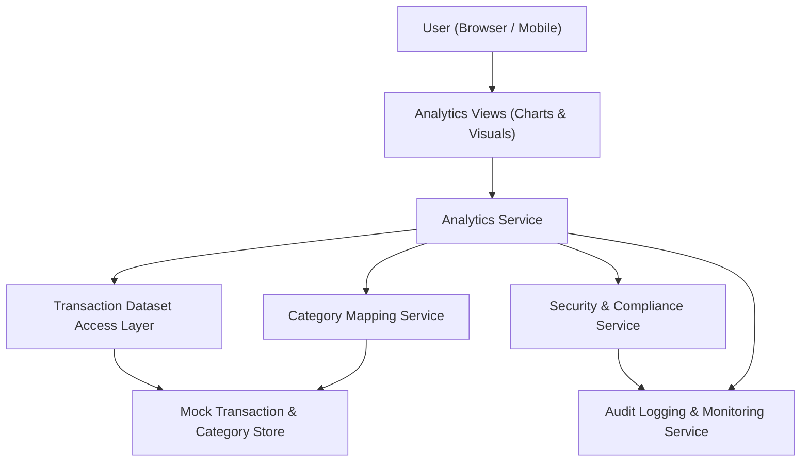

#### 1. High-Level Design

- Architecture Overview & Component Diagram:

- Component Descriptions:
  - Analytics Views: UI charts and visualizations for category-wise, monthly, and card-wise spending.
  - Analytics Service: Performs aggregations and computations.
  - Transaction Dataset Access Layer: Supplies mock transaction data.
  - Category Mapping Service: Maps transactions into predefined categories.
  - Security & Compliance Service: Ensures analytics views do not expose card details.
  - Audit Logging & Monitoring Service: Logs analytics usage and chart performance.
  - Mock Transaction & Category Store: Contains transactions and category definitions.

- Integration Points & Data Flow:
  - Users access Analytics views from dashboard or navigation.
  - Analytics Service retrieves transactions and category mappings.
  - Applies aggregations into categories and across months and cards.
  - Security and logging wrappers ensure compliance and observability.

- Security & Compliance Features:
  - TLS 1.3 within all user interactions.
  - AES-256 for stored category definitions if persisted.
  - Masking of card numbers and avoidance of any direct identifiers in charts.
  - RBAC for viewing advanced analytics.

- Resiliency & Error Handling:
  - Analytics Service uses caching to protect against repeated heavy computation.
  - Circuit breakers and fallback modes (e.g., simplified charts) in case of failures.
  - Error messages logged and displayed in analytics UI if charts fail to render.
