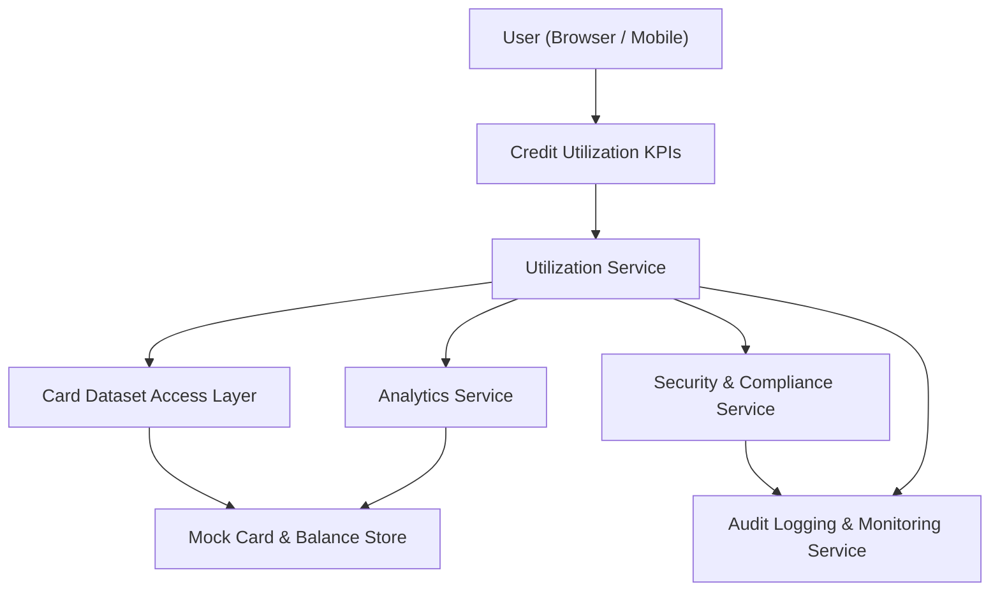

#### 1. High-Level Design

- Architecture Overview & Component Diagram:

- Component Descriptions:
  - Credit Utilization KPIs: UI KPIs showing overall and per-card utilization.
  - Utilization Service: Computes utilization percentages from credit limits and outstanding balances.
  - Card Dataset Access Layer: Accesses mock card data and balances.
  - Analytics Service: Places utilization in context of other metrics.
  - Security & Compliance Service: Masks sensitive fields.
  - Audit Logging & Monitoring Service: Logs utilization calculations and KPI loads.
  - Mock Card & Balance Store: Holds mock card limits and outstanding amounts.

- Integration Points & Data Flow:
  - Utilization Service retrieves limits and balances from Card Dataset Access Layer.
  - Calculates overall and per-card utilization percentages.
  - Results are fed into UI KPIs and Analytics views.
  - Security service ensures no raw card numbers are displayed.

- Security & Compliance Features:
  - Transport security via TLS 1.3.
  - Masking of card identifiers in all outputs.
  - RBAC controls for access to card-level utilization data.
  - Audit logs for utilization data calculations and accesses.

- Resiliency & Error Handling:
  - Default behavior if card data is unavailable: show “data unavailable” with fallback messaging.
  - Retry and circuit breaker patterns around Card Dataset Access Layer.
