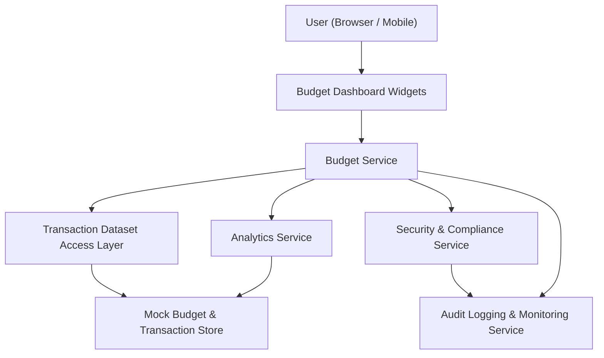

#### 1. High-Level Design

- Architecture Overview & Component Diagram:

- Component Descriptions:
  - Budget Dashboard Widgets: UI elements showing budget vs actual spending, progress indicators.
  - Budget Service: Calculates budget utilization from mock budgets and actual spend.
  - Analytics Service: Aggregates spending by month and category.
  - Transaction Dataset Access Layer: Provides spending data from mock transactions.
  - Security & Compliance Service: Ensures that no unnecessary identifiers are exposed.
  - Audit Logging & Monitoring Service: Logs budget view usage and calculation performance.
  - Mock Budget & Transaction Store: Stores budget definitions and mock transaction data.

- Integration Points & Data Flow:
  - Users view budget widgets on the dashboard.
  - Budget Service retrieves budgets and actual spending via Analytics Service and Dataset Access Layer.
  - Outputs include budget vs actual and progress indicators, which are rendered in UI.
  - Security and logging components ensure compliance and observability.

- Security & Compliance Features:
  - TLS 1.3 for all user interactions.
  - AES-256 for any stored budget configurations.
  - RBAC enforcing which roles can view or modify budgets.
  - No personal identifiers; budgets are generic to mock users.

- Resiliency & Error Handling:
  - If Analytics or Dataset services fail, the budget widgets show default or “data unavailable” states.
  - Circuit breakers for Budget Service dependencies.
  - Retry logic for transient read errors.
