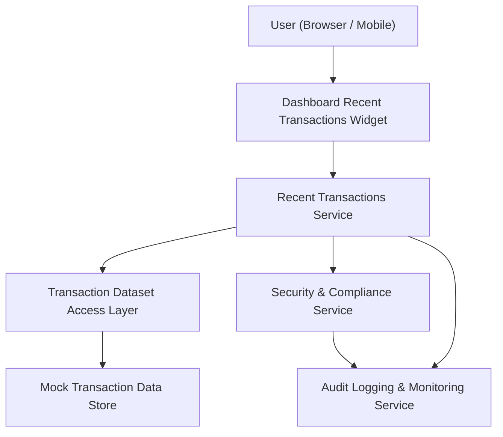

#### 1. High-Level Design

- Architecture Overview & Component Diagram:

- Component Descriptions:
  - Dashboard Recent Transactions Widget: UI component showing latest transactions with key fields.
  - Recent Transactions Service: Retrieves and sorts recent transactions by date.
  - Transaction Dataset Access Layer: Encapsulates access to mock transaction dataset.
  - Security & Compliance Service: Applies masking and validates output.
  - Audit Logging & Monitoring Service: Logs widget loads and performance metrics.
  - Mock Transaction Data Store: Contains mock transaction records.

- Integration Points & Data Flow:
  - User opens dashboard; Recent Transactions widget requests data via Recent Transactions Service.
  - Service queries Transaction Dataset Access Layer for latest transactions.
  - Security & Compliance Service enforces masking and verifies that no sensitive details are returned.
  - Audit Logging records widget load and performance metrics.

- Security & Compliance Features:
  - AES-256/TLS 1.3 for transport security.
  - Masking of card numbers and sensitive fields in all recent transaction outputs.
  - RBAC ensuring only authorized users can access the dashboard.

- Resiliency & Error Handling:
  - If dataset access fails, the widget shows a clear error state while other dashboard sections remain functional.
  - Circuit breaker around Transaction Dataset Access Layer.
  - Logging for failed attempts and error responses for monitoring.
