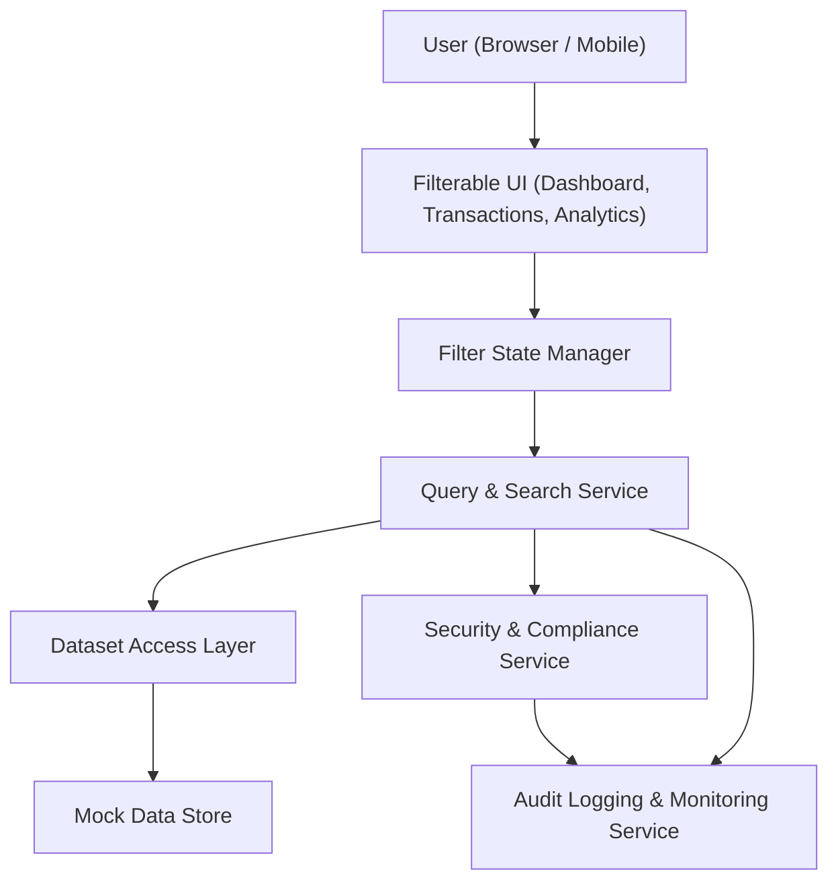

#### 1. High-Level Design

- Architecture Overview & Component Diagram:

- Component Descriptions:
  - Filterable UI: Common filter controls across dashboard widgets, transaction lists, and charts.
  - Filter State Manager: Central state management for filters (merchant, category, card, bank, date range).
  - Query & Search Service: Builds and executes queries on mock datasets based on filter state.
  - Dataset Access Layer: Provides unified access to transaction and card datasets from Mock Data Store.
  - Security & Compliance Service: Validates filter inputs and enforces masking and data minimization.
  - Audit Logging & Monitoring Service: Logs filter usage and query performance.
  - Mock Data Store: Holds mock transaction and card datasets.

- Integration Points & Data Flow:
  - Users manipulate filters and search fields via Filterable UI.
  - Filter State Manager publishes filter changes to the Query & Search Service.
  - Query & Search Service retrieves data via Dataset Access Layer and applies filtering and sorting logic.
  - Filtered results are returned to UI components (widgets, tables, charts).
  - Security & Compliance Service validates filter inputs and masks sensitive fields.
  - Audit Logging logs filter usage and identifies patterns or possible misuse.

- Security & Compliance Features:
  - AES-256/TLS 1.3:
    - Filter requests and responses are secured end-to-end via TLS 1.3.
  - Input Validation:
    - Rejects suspicious filter inputs (e.g., overly long strings, injection patterns).
    - Ensures date ranges and categories are within allowed values.
  - RBAC/ABAC:
    - Only users with Viewer role can use filters; Admins additionally can manage filter presets internally.
    - ABAC might disable certain filters in constrained environments.
  - Audit Logging:
    - Captures what filters are used and how often, with timestamps and anonymized user IDs.

- Resiliency & Error Handling:
  - Query timeouts and circuit breakers around Query & Search Service to prevent long-running filters.
  - Retries for read operations on the Mock Data Store.
  - UI-level fallback to default views if filters cannot be applied.
  - Structured error messages displayed if filters fail or invalid inputs are detected.
