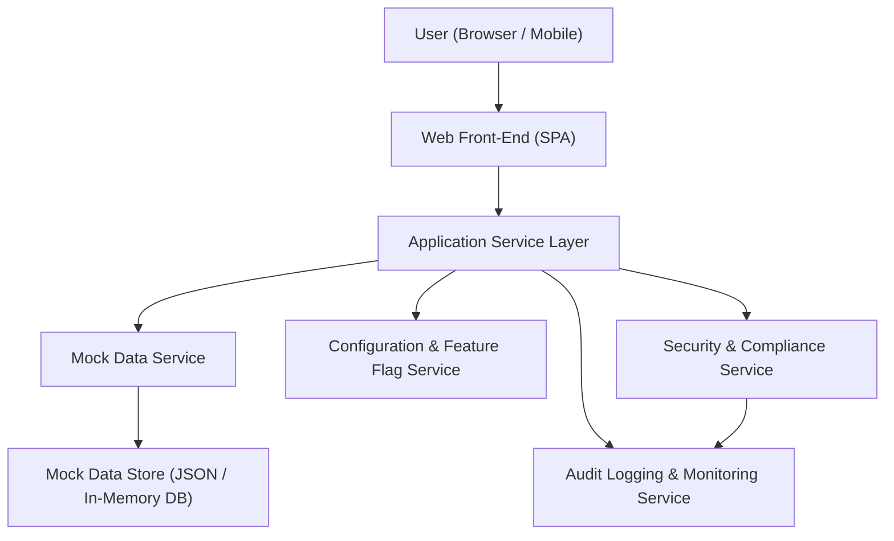

#### 1. High-Level Design

- Architecture Overview & Component Diagram:

- Component Descriptions:
  - User (Browser / Mobile): End users accessing the dashboard via desktop, tablet, or mobile browsers.
  - Web Front-End (SPA): Responsive single-page application built with a modern frontend framework supporting adaptive layouts and device breakpoints.
  - Application Service Layer: Orchestrates data retrieval from mock data services, applies UX rules, and manages view models for the UI.
  - Mock Data Service: Provides mock datasets for credit cards and transactions, ensuring no real financial data is used.
  - Configuration & Feature Flag Service: Manages layout variants, breakpoints, and gradual rollout of UX improvements.
  - Security & Compliance Service: Enforces masking, access control, and data-handling policies over mock data.
  - Audit Logging & Monitoring Service: Captures user actions, mock data access, and configuration changes for traceability.
  - Mock Data Store (JSON / In-Memory DB): Stores three credit card profiles and 50–100 transactions over multiple months.

- Integration Points & Data Flow:
  - Users interact with the responsive Web Front-End, which detects device type and applies layout rules.
  - The Application Service Layer calls the Mock Data Service to load mock credit card and transaction datasets.
  - Mock Data Service reads from the Mock Data Store and returns sanitized, non-sensitive data structures.
  - Configuration & Feature Flag Service provides layout configurations (grid breakpoints, widget visibility) to the Application Service Layer.
  - Security & Compliance Service enforces masking and validates that no real card identifiers or bank integrations are used.
  - Audit Logging & Monitoring Service records dashboard load events, mock data access, and key UX interactions.

- Security & Compliance Features:
  - AES-256/TLS 1.3:
    - All browser-to-server communication is secured with TLS 1.3.
    - Any persisted mock configuration data is encrypted at rest with AES-256 where persistence is required.
  - RBAC/ABAC:
    - RBAC: At least two roles: Viewer (read-only access to dashboard) and Admin (can change mock datasets and UX configurations).
    - ABAC: Attributes like environment (demo, test) and device type (mobile, desktop) govern access to specific layouts or mock scenarios.
  - Audit Logging:
    - Logs user sessions, dashboard load events, and any modifications to mock datasets or configuration.
  - Compliance Mapping:
    - Ensures no real financial data is generated, collected, or stored.
    - Validates that mock datasets are irreversibly synthetic and cannot be mapped to real individuals.

- Resiliency & Error Handling:
  - Circuit breakers around Mock Data Service and Configuration Service calls to prevent cascading failures.
  - Retries with exponential backoff for transient network errors when loading mock configurations.
  - Graceful degradation: if configuration cannot be loaded, fallback to default responsive layout; if mock data service fails, show a consistent error state with no data.
  - Structured error responses surfaced to the UI and logged by the Audit Logging & Monitoring Service.
