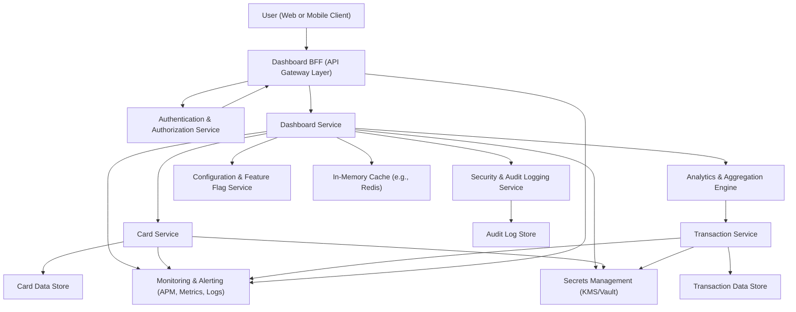
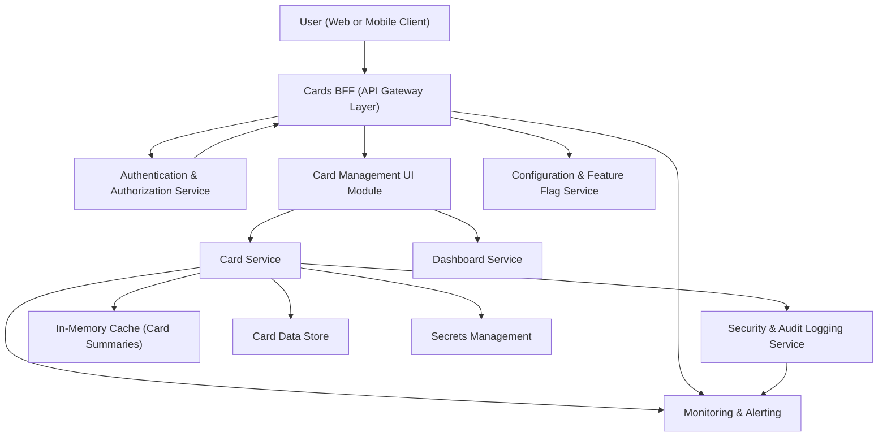
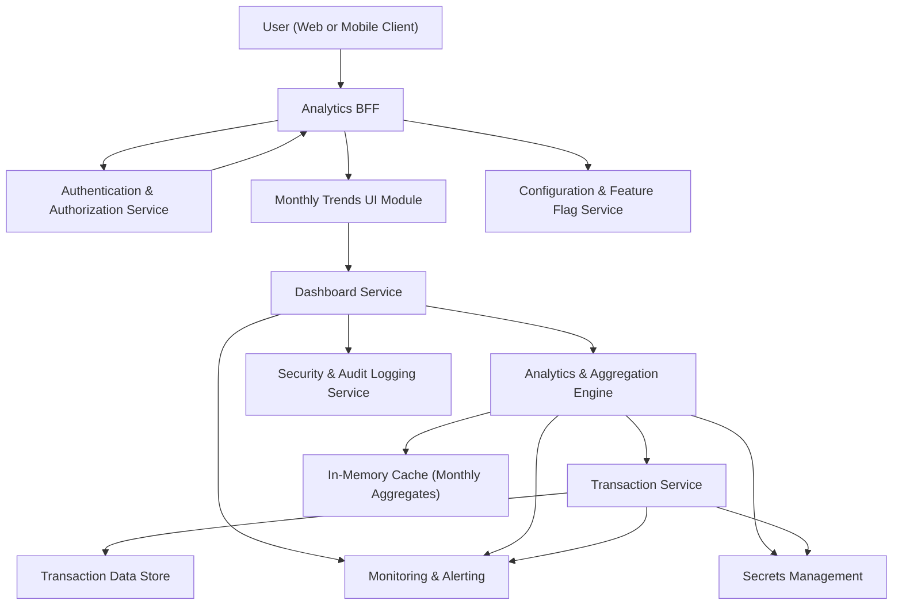
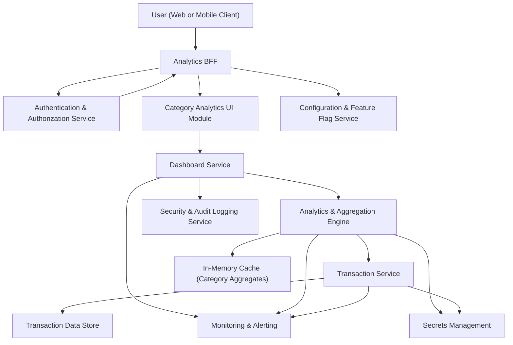
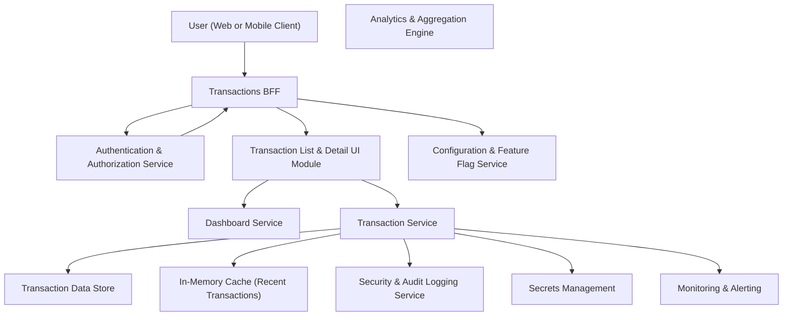

### Epic: QE-3623 - davCreditcard-Dashboard KPIs and Overview

#### 1. High-Level Design

- Architecture Overview & Component Diagram:

- Component Descriptions:
  - User (Web or Mobile Client): Responsive UI that renders dashboard KPIs (monthly spend, total credit limit, available credit, outstanding amount, and card summary).
  - Dashboard BFF (API Gateway Layer): Single entry point for UI; handles REST/GraphQL APIs, TLS termination, request validation, throttling, and routing to backend services.
  - Authentication & Authorization Service: Provides user authentication (OIDC/OAuth2), issues JWTs, enforces RBAC/ABAC policies for dashboard and card data.
  - Dashboard Service: Orchestrates calls to Card Service and Analytics Engine, computes derived KPIs, applies user-level filters (date range, card selection), and returns a unified DTO to the client.
  - Card Service: Manages card metadata (masked identifiers, credit limit, available credit, outstanding balance); reads from card data store (mock/internal per scope).
  - Transaction Service: Manages transaction dataset (mock or synthetic per requirements); supports aggregations for monthly spend (used via AGG).
  - Analytics & Aggregation Engine: Performs KPI computations (e.g., monthly spend across cards) based on transaction data; supports pre-aggregation for performance.
  - Security & Audit Logging Service: Centralized audit trail of user access to dashboards and KPIs; records who viewed what, when, and from where.
  - Configuration & Feature Flag Service: Controls enablement of features (e.g., certain KPIs, experimental layouts) and NFR tuning parameters (cache TTLs, rate limits).
  - In-Memory Cache: Stores frequently requested KPI aggregates and card summaries to meet responsiveness requirements.
  - Card Data Store: Structured store (e.g., relational DB or document DB) for card metadata and balances; contains no full PANs; stores only masked identifiers and non-sensitive data.
  - Transaction Data Store: Holds transaction records used for monthly spend calculations; can be mock data; designed for performant aggregations.
  - Audit Log Store: Write-optimized store for immutable audit records (e.g., append-only logs, WORM-compliant if required).
  - Monitoring & Alerting: Aggregates metrics, traces, and logs for availability and performance monitoring; supports dashboards and alerts.
  - Secrets Management: Centralized secrets storage for DB credentials, tokens, encryption keys; supports key rotation (AES-256 keys, TLS private keys).

- Integration Points & Data Flow:
  1. User logs in via client; BFF redirects to Authentication & Authorization Service (OIDC).
  2. Upon successful authentication, client stores access token (short-lived); all subsequent calls to BFF include token over TLS 1.3.
  3. For dashboard load:
     - Client calls `GET /dashboard/kpis?from=YYYY-MM&to=YYYY-MM`.
     - BFF validates the token and routes to Dashboard Service.
  4. Dashboard Service:
     - Retrieves card metadata and balances from Card Service (`GET /cards`, `GET /cards/summary`).
     - Requests monthly spend and aggregated KPIs from Analytics Engine (which uses Transaction Service).
     - Reads cached aggregates from In-Memory Cache; if cache miss, calls downstream services, stores result with TTL.
  5. Card Service reads from Card Data Store (mock or internal) to provide:
     - Total credit limit (sum over cards).
     - Outstanding balance per card and total.
     - Available credit per card and total.
  6. Analytics & Aggregation Engine:
     - Queries Transaction Service / Transaction Data Store for transaction sums grouped by month and card.
     - Produces monthly spend aggregated across cards and per card, reused by other epics.
  7. Dashboard Service:
     - Composes response: KPIs (monthly spend, total limit, available credit, outstanding amount) plus card summaries.
     - Emits audit events ("Dashboard viewed", user ID, timestamp, filter criteria) to Security & Audit Logging Service.
  8. Security & Audit Logging Service persists audit logs to Audit Log Store and exposes them for compliance reporting.
  9. Monitoring & Alerting collects metrics such as response times, error rates, cache hit rate, and surfaces alerts.

- Security & Compliance Features:
  - Transport & Encryption:
    - All client-to-BFF and service-to-service calls use TLS 1.2+ with preferred TLS 1.3.
    - Sensitive fields at rest (if any PII is stored, such as user identifiers) are encrypted with AES-256 using keys from Secrets Management.
    - Card identifiers stored in masked form (e.g., last 4 digits only) with full PANs explicitly out of scope and not persisted.
  - Input Validation & Output Filtering:
    - BFF validates request parameters (date range, card IDs) using strict schemas; rejects invalid or overly broad ranges.
    - Output DTOs are whitelisted; only non-sensitive fields (masked card labels, high-level KPIs) are included.
    - All responses are sanitized to prevent injection attacks; no user-provided HTML is rendered.
  - Authentication & Authorization:
    - RBAC: Roles like `VIEWER`, `ADMIN`, `AUDITOR`. `VIEWER` can see only their own data; `ADMIN` has operational access; `AUDITOR` can access aggregated logs and KPIs in anonymized format.
    - ABAC: Policies consider attributes such as tenant ID, region, data classification, and device trust (e.g., allow only from certain IP ranges for certain roles).
    - Token-based access using signed JWTs with short expiry, audience/resource checks, and revocation lists.
  - Audit Logging:
    - Every dashboard view and KPI fetch is logged with user ID, session ID, filters (time range, card selection), and outcome (success/failure).
    - Logs are immutable and retained per defined retention policy (e.g., 1–7 years depending on regulatory requirements).
    - Logs are redacted to avoid storing sensitive card details; only masked identifiers and user IDs are stored.
  - Compliance:
    - Data Retention: Card and transaction data retention periods are defined (e.g., 2–7 years) and implemented via lifecycle policies and scheduled purging.
    - Consent Management: Integration point to a Consent Service that records user consent for data usage and analytics; dashboard access is blocked if consent is withdrawn.
    - Data Lineage: KPI computations are traceable: each KPI field references underlying aggregation jobs, source tables/collections, and versioned code modules.
    - Compliance Reporting: Aggregated, anonymized usage and access logs are made available to compliance teams via reporting APIs and dashboards.

- Resiliency & Error Handling:
  - Circuit Breakers:
    - Dashboard Service uses circuit breakers around Card Service, Analytics Engine, and Transaction Service.
    - When downstream services are unhealthy, the breaker opens; dashboard returns partial data (e.g., last known KPIs) with a warning flag.
  - Retry Mechanisms:
    - Idempotent read operations (e.g., fetching metrics) use exponential backoff retry with jitter for transient network failures.
    - Limits are enforced to avoid overload; retries are not used for non-idempotent operations (if added later).
  - Fallback Patterns:
    - Cached data fallback: If fresh data cannot be retrieved, last-known-good KPI snapshot from Cache is returned with metadata (`asOfTimestamp`).
    - Graceful degradation of UI: The client hides certain charts or shows “data temporarily unavailable” while still showing core KPIs.
  - Error Handling:
    - Structured error responses (error code, message, correlation ID) with no sensitive details.
    - Server-side logs link correlation IDs to detailed stack traces stored in secure log sinks.
  - Observability:
    - Metrics: p95 latency, error rates per endpoint, cache hit ratios, and circuit breaker states.
    - Tracing: End-to-end distributed tracing spans correlate BFF calls with backend services.

#### 2. Validation Report

- Requirements Coverage:
  - Dashboard landing view:
    - Covered by Dashboard Service and Dashboard BFF providing a consolidated `/dashboard/kpis` endpoint.
  - Monthly spend KPI:
    - Implemented by Analytics & Aggregation Engine using Transaction Data Store across all cards.
  - Total credit limit KPI:
    - Calculated by Card Service summing `credit_limit` across all cards for the user.
  - Available credit KPI:
    - Derived from `credit_limit - outstanding_amount` per card, aggregated across all cards.
  - Outstanding amount KPI:
    - Card Service provides outstanding balance per card; Dashboard Service aggregates total outstanding amount.
  - Responsive layout:
    - Addressed at client layer using responsive frameworks; APIs designed to provide layout-independent data models.
  - Summary of all cards:
    - Card Service returns list of cards with masked identifiers, per-card limits and balances, and summary data.

- Compliance Status:
  - Data Retention:
    - Transaction and card data retention specified and enforced via lifecycle management. Compliance: Pass (subject to adoption of defined retention configuration).
  - Privacy & Security:
    - No real bank integration; data is mock or internal.
    - Card details are masked; no PAN or CVV stored or displayed.
    - All traffic encrypted with TLS; at-rest encryption enabled (AES-256) where applicable.
    - Access restricted via RBAC/ABAC with audit logging.
    - Compliance: Pass for the defined scope (no real financial data).
  - Consent & Data Usage:
    - Consent check is integrated into Authentication and Dashboard Service workflow; blocking access when consent is absent.
    - Compliance: Pass (requiring operationalization of consent service integration).

- Identified Ambiguities/Risks:
  - Ambiguity: Exact retention duration for transaction and card data is not specified.
    - Mitigation: Introduce configuration-based retention periods and obtain decision from compliance; document default retention (e.g., 5 years).
  - Ambiguity: Level of PII associated with card and transaction data (beyond masked card and user IDs) is not fully defined.
    - Mitigation: Treat all user identifiers as sensitive; apply pseudonymization in analytics and ensure minimal PII exposure in dashboards.
  - Risk: Mock or simulated data sources may evolve into partial real data sources later without revisiting security assumptions.
    - Mitigation: Enforce the same security controls as if production data is used (encryption, access control, logging) and define a checklist for any integration changes.
  - Risk: Performance expectations are qualitative (“acceptable response times”) without hard SLAs.
    - Mitigation: Define concrete NFRs (e.g., p95 ≤ 500 ms for KPI responses under typical load) and monitor via APM; revisit scaling strategies based on observed metrics.
  - Risk: Cross-epic dependencies (e.g., monthly trends, category analytics) may lead to tight coupling.
    - Mitigation: Encapsulate aggregation logic in independent services (Analytics Engine) and expose versioned APIs to minimize coupling.

---

### Epic: QE-3624 - davCreditcard-Multiple Credit Card Management

#### 1. High-Level Design

- Architecture Overview & Component Diagram:

- Component Descriptions:
  - Card Management UI Module: Front-end module for listing cards, viewing per-card credit limits, available credit, and outstanding amounts; allows switching between cards or viewing an all-cards summary.
  - Cards BFF: API layer exposing `/cards`, `/cards/{id}`, `/cards/summary` with user-scoped access; validates requests and routes to Card Service or Dashboard Service.
  - Card Service: Core domain service managing card entities and their financial attributes; enforces masking rules and security controls; supports multi-card operations.
  - Dashboard Service: Reuses card summaries to show aggregated KPIs; integration ensures consistent figures between card management screens and dashboard.
  - Card Data Store: Contains card records: `card_id`, `user_id`, `card_label`, masked card number, `credit_limit`, `outstanding_amount`, `available_credit`, status flags.
  - Security & Audit Logging Service: Logs card view events and card list retrievals for security and compliance.
  - Configuration & Feature Flag Service: Toggles multi-card support, maximum number of cards per user, and experiment flags.
  - Monitoring & Alerting & Cache & Secrets Management: As previously described, focused here on card domain.

- Integration Points & Data Flow:
  1. User authenticates; using Cards BFF, they navigate to card management UI.
  2. Card Management UI calls `GET /cards` via BFF:
     - BFF validates token, injects `user_id` from token claims, and forwards to Card Service.
  3. Card Service:
     - Queries Card Data Store for all cards owned by `user_id` (limited by max-card configuration).
     - Computes derived fields: `available_credit = credit_limit - outstanding_amount`.
     - Applies masking rules to card numbers (e.g., `**** **** **** 1234`).
     - Caches card summary for quick retrieval.
     - Emits audit log (“Card list viewed”) to Security & Audit Logging Service.
  4. User selects a card or “view all cards summary”:
     - UI calls `GET /cards/summary` or `GET /cards/{id}`.
     - Card Service returns per-card details or aggregated summary (total credit limit, outstanding amount, available credit).
  5. Dashboard Service reuses Card Service APIs for consistency:
     - When computing dashboard KPIs, it calls Card Service rather than duplicating logic.

- Security & Compliance Features:
  - Input Validation:
    - BFF ensures `card_id` in path belongs to authenticated user (via lookup and policy checks).
    - Parameters (e.g., page size if pagination is added) validated against configured limits.
  - Output Filtering:
    - Card Service omits any sensitive data beyond masked numbers and basic identification details.
    - Only necessary fields (credit limit, outstanding, available) are exposed; fields such as CVV, full PAN, expiry date are never stored or returned.
  - RBAC/ABAC:
    - Role-based: Standard users can only access their own cards; support roles (if needed) access via break-glass procedures and enhanced logging.
    - Attribute-based: Policies ensure that operations are restricted by tenant, region, or risk level (e.g., high-risk sessions might be restricted).
  - Encryption:
    - AES-256 at rest for card data store; keys managed by Secrets Management and rotated per policy.
    - TLS 1.3 for all endpoints; strong cipher suites enforced.
  - Audit Logging:
    - Every card list or detail view is logged with user ID, card ID (masked), timestamp, and IP/device metadata.
    - Logs stored in Audit Log Store with retention policies.
  - Compliance:
    - Data retention policies for card records defined; soft-delete or archival mechanisms ensure historical records are available within policy but purged thereafter.
    - Out-of-scope features (e.g., card activation, payments) are explicitly disabled in configuration to avoid accidental exposure.

- Resiliency & Error Handling:
  - Circuit Breakers:
    - Card Service calls to Card Data Store protected by circuit breaker; fallback returns last cached snapshot or a clear error.
  - Retry & Fallback:
    - Read operations from DB have bounded retries; if failures persist, service returns a structured error and optionally a partial list if some cards were already retrieved.
  - Graceful Degradation:
    - If card list fails, dashboard can still show precomputed totals from cache and indicate stale data.
    - UI surfaces non-blocking messages rather than generic failures; e.g., “Unable to load card list; try again later.”
  - Observability:
    - Metrics for how many cards per user are loaded, latency per card query, and errors rates.

#### 2. Validation Report

- Requirements Coverage:
  - Card listing view:
    - Provided by Card Service and Card Management UI; API returns list of cards for user.
  - Display per-card credit limit:
    - Card Service exposes `credit_limit` per card.
  - Display per-card available credit:
    - Derived and provided per card (`available_credit`).
  - Display per-card outstanding amount:
    - Card Service exposes `outstanding_amount` per card.
  - Basic card identification details (card name/label, masked number):
    - Card Data Store and Card Service store and return these fields.
  - Switching between cards or viewing all cards summary:
    - Supported by UI and APIs (`/cards`, `/cards/{id}`, `/cards/summary`).

- Compliance Status:
  - Data Retention:
    - Card records subject to retention policy and archival; compliance: Pass (when configured and implemented).
  - Privacy & Security:
    - No full card numbers stored or displayed; no CVV, no bank integration.
    - Strong encryption and controlled access; compliance: Pass.
  - Consent:
    - Uses same consent management as dashboard (no card data shown if consent revoked); compliance: Pass.

- Identified Ambiguities/Risks:
  - Ambiguity: “Reasonable number of cards per user” is not quantified.
    - Mitigation: Define a hard limit (e.g., 20 cards) in configuration; tests for performance at upper bound.
  - Risk: Misconfiguration might allow displaying more card information than necessary.
    - Mitigation: Implement strict allowlist of fields and security tests; code reviews focusing on data exposure.
  - Ambiguity: Whether joint or shared cards must be supported.
    - Mitigation: Model `ownership_type` and enforce policies; defer feature until clarified.

---

### Epic: QE-3625 - davCreditcard-Monthly Spend Trends

#### 1. High-Level Design

- Architecture Overview & Component Diagram:

- Component Descriptions:
  - Monthly Trends UI Module: Renders time-series charts of monthly spend; allows selection of time ranges (e.g., last 6 or 12 months) and filters.
  - Analytics BFF: Exposes `/analytics/monthly-spend` endpoint; handles validation of time ranges and authentication.
  - Analytics & Aggregation Engine: Performs monthly spend aggregation across cards; stores pre-aggregated results in caches or materialized views.
  - Transaction Service: Provides raw transactions with dates, amounts, and card references.
  - Transaction Data Store: Stores transaction records; indexes on `user_id`, `card_id`, `transaction_date`, enabling efficient monthly grouping.
  - Dashboard Service: Coordinates monthly trend retrieval and attaches it to dashboard data when needed.
  - Cache, Security & Audit Logging, Monitoring, Secrets, Config: As previously defined.

- Integration Points & Data Flow:
  1. User accesses monthly trend view:
     - UI calls `GET /analytics/monthly-spend?from=YYYY-MM&to=YYYY-MM`.
  2. Analytics BFF validates:
     - Ensures `from <= to`, date range within configured max window (e.g., 24 months).
     - Extracts `user_id` from token and forwards to Dashboard Service or directly to Analytics Engine.
  3. Analytics & Aggregation Engine:
     - First reads from cache keyed by `(user_id, from, to)`.
     - On cache miss, queries Transaction Service for transactions in the requested range.
     - Groups by month and sums amounts, optionally per card (for reuse).
     - Writes aggregated results back to Cache with TTL.
  4. Dashboard Service:
     - Attaches monthly spend trend data to response; optionally integrates with core dashboard view.
     - Emits audit log event (“Monthly trend viewed”) to Security & Audit Logging Service.
  5. Transaction Service:
     - Strictly read-only for this epic; obtains transactions from Transaction Data Store.

- Security & Compliance Features:
  - Input Validation:
    - Time range constraints; rejects requests wider than allowed; prevents load spikes or data misuse.
  - Output Filtering:
    - Returns only aggregate amounts per month; no individual transaction details in this epic’s endpoint.
    - Ensures no PII included beyond necessary meta (month, total amount).
  - Encryption:
    - AES-256 at rest for transaction records if they contain synthetic but structurally similar data.
    - TLS 1.3 for all flows; no plain-text channel.
  - RBAC/ABAC:
    - Users can only see their own monthly trends; `user_id` is derived from token; no user-provided identifiers accepted.
    - ABAC uses region attribute to ensure data remains within allowed regions (geo-fencing if required).
  - Audit Logging:
    - Monthly trend access logged, including requested date range; used for detecting abnormal access patterns.
  - Compliance:
    - Data retention for transaction data enforced via pruning older transactions beyond retention window.
    - Lineage: Aggregation jobs are versioned to show which code and schema produced a trend.

- Resiliency & Error Handling:
  - Circuit Breakers:
    - Analytics Engine’s calls to Transaction Service/DB protected with circuit breakers.
  - Retry & Caching:
    - Read retries for transient DB issues; fallback to last cached trend.
  - Graceful Degradation:
    - If trend computation fails, dashboard still loads core KPIs; trend chart area shows fallback message.
  - Observability:
    - Metrics on aggregation duration, number of months aggregated, cache hit/miss.

#### 2. Validation Report

- Requirements Coverage:
  - Monthly spend aggregation across cards:
    - Implemented via Analytics Engine grouping transaction amounts across all cards per month.
  - Time-series visualization of monthly spend:
    - Supported by Monthly Trends UI using aggregated data.
  - Basic time range filters:
    - Provided via query parameters validated by the BFF.
  - Integration of monthly spend KPI with trend chart:
    - Dashboard Service ensures monthly trend and KPI use same source data and filters.

- Compliance Status:
  - Data Retention:
    - Trend computations rely on transaction data subject to retention policies; compliance: Pass.
  - Privacy:
    - Only aggregated data exposed; underlying transactions not surfaced in this epic; compliance: Pass.

- Identified Ambiguities/Risks:
  - Ambiguity: Maximum allowable date range is not specified.
    - Mitigation: Define and configure limit (e.g., 24 months), enforce in validation.
  - Risk: Large data sets could cause performance issues.
    - Mitigation: Pre-aggregation, indexing, and caching; load testing with expected data volumes.
  - Ambiguity: Currency or multi-currency handling not specified.
    - Mitigation: Assume single currency for now; if multi-currency introduced, incorporate normalization logic and labeling.

---

### Epic: QE-3626 - davCreditcard-Card-wise Spend Analysis

#### 1. High-Level Design

- Architecture Overview & Component Diagram:

- Component Descriptions:
  - Card-wise Spend UI Module: Presents comparative charts (bar/donut) showing per-card spend for a period; enables drill-down to more detail.
  - Analytics BFF & Dashboard Service: Provide `/analytics/card-spend` endpoint; orchestrate calls to Aggregation Engine.
  - Analytics & Aggregation Engine: Aggregates spend per card for selected period; reused by monthly trends and category analytics.
  - Transaction Service & Store: Same as previous epic; data grouped by card.
  - Cache: Stores card-wise aggregates; keyed by `(user_id, date_range)`.

- Integration Points & Data Flow:
  1. User selects a date range and requests card-wise spend:
     - UI calls `GET /analytics/card-spend?from=YYYY-MM-DD&to=YYYY-MM-DD`.
  2. BFF validates range and ensures it does not exceed a configured number of days.
  3. Analytics & Aggregation Engine:
     - Checks cache; on miss, queries Transaction Service.
     - Groups transactions by card, sums totals per card, optionally providing counts of transactions.
  4. Dashboard Service returns aggregate results mapped to card IDs and human-readable labels from Card Service.
  5. Audit logs capture the analysis request.

- Security & Compliance Features:
  - Input Validation:
    - Date range and filter parameters (e.g., subset of cards) are validated; only card IDs belonging to the user are allowed.
  - Output Filtering:
    - Aggregates expose only card labels and totals; no sensitive card details.
  - Encryption & RBAC:
    - As in previous epics; card-wise analysis uses same security posture.
  - Audit Logging:
    - Card-wise analysis access logged, including selected period and number of cards analyzed.

- Resiliency & Error Handling:
  - Circuit Breakers and Retry:
    - Same pattern as monthly trends; card-wise aggregations rely on same infrastructure.
  - Graceful Degradation:
    - If card-wise computation fails, dashboard continues to show basic KPIs; UI indicates the failure.

#### 2. Validation Report

- Requirements Coverage:
  - Per-card spend calculation for selected periods:
    - Implemented by Analytics Engine grouping by card.
  - Card-wise comparison visualizations:
    - Supported by UI using aggregated data; chart types (bar/donut) defined at front-end.
  - Drill-down from card summary to detailed spend:
    - Drill-down path defined via linking to transaction views or separate routes.
  - Linkage between dashboard KPIs and card-wise charts:
    - Uses same underlying data and filters; ensures consistency.

- Compliance Status:
  - Data Retention & Privacy:
    - Uses same secure transaction data; aggregated results only; compliance: Pass.

- Identified Ambiguities/Risks:
  - Ambiguity: Drill-down depth (how detailed the user can go).
    - Mitigation: Limit to high-level views or integrate with transaction epic for fine-grained details while ensuring scope adherence.
  - Risk: High number of cards could make chart unreadable.
    - Mitigation: UI constraints (max cards in chart, pagination, grouping minor cards into “Other”).

---

### Epic: QE-3627 - davCreditcard-Category-wise Spending Analytics

#### 1. High-Level Design

- Architecture Overview & Component Diagram:

- Component Descriptions:
  - Category Analytics UI Module: Displays category-wise visualizations (pie, bar) across defined categories (Food & Dining, Fuel, Shopping, Travel, Entertainment, Utilities, Healthcare, Education, Miscellaneous).
  - Analytics & Aggregation Engine: Aggregates spend by category within a given period and filters.
  - Transaction Service & Store: Provide transactions with pre-tagged category field; ensures categories match defined set.
  - Cache: Stores category aggregates for given user and period.

- Integration Points & Data Flow:
  1. UI calls `GET /analytics/category-spend?from=YYYY-MM-DD&to=YYYY-MM-DD`.
  2. BFF validates date range and ensures acceptable period.
  3. Analytics Engine:
     - Queries Transaction Service for transactions with categories.
     - Aggregates total spend per category; sorts categories and identifies top categories.
  4. Dashboard Service returns category distribution; UI renders as chart and highlights top categories.
  5. Audit Logging Service logs access and parameters.

- Security & Compliance Features:
  - Input Validation:
    - Only valid categories from a controlled enumeration are used.
  - Output Filtering:
    - Aggregates per category; no transaction-level PII; categories do not expose sensitive information.
  - Encryption, RBAC/ABAC, TLS:
    - Consistent with other analytics epics.
  - Compliance:
    - Category analytics use mock/pre-tagged data; privacy is maintained as only aggregates are shown.

- Resiliency & Error Handling:
  - Circuit Breakers & Retry:
    - Similar patterns to card-wise and monthly trends.
  - Graceful Degradation:
    - If category analytics unavailable, dashboard remains functional; category section displays fallback message.

#### 2. Validation Report

- Requirements Coverage:
  - Transaction categorization into specified categories:
    - Based on pre-tagged or mock data; enforced in Transaction Store schema.
  - Category-wise spend aggregation:
    - Implemented by Analytics Engine grouping by category.
  - Category-wise charts and visualizations:
    - Provided by UI; uses aggregated data.
  - View category distribution for selected period:
    - Supported via date range filters.
  - Highlighting top spending categories:
    - Implemented at UI using sorted aggregates.

- Compliance Status:
  - Data Retention:
    - Category analytics rely on same transaction data within retention limits; compliance: Pass.
  - Privacy:
    - No user PII in category names; aggregated values only; compliance: Pass.

- Identified Ambiguities/Risks:
  - Ambiguity: Category mapping rules (e.g., merchant-to-category).
    - Mitigation: Use controlled mapping table; treat as configuration; no ML-based classification as per out-of-scope.
  - Risk: Misclassification of transactions could mislead users.
    - Mitigation: Provide category descriptions, allow limited user feedback (if added later), and maintain change logs.

---

### Epic: QE-3628 - davCreditcard-Transactions View and Detail Exploration

#### 1. High-Level Design

- Architecture Overview & Component Diagram:

- Component Descriptions:
  - Transaction List & Detail UI Module: Provides transaction listing for selected card(s) and periods; supports basic filters and sorting; provides line-item details.
  - Transactions BFF: Exposes `/transactions` and `/transactions/{id}` endpoints; validates queries and ensures pagination.
  - Transaction Service: Core service for fetching and filtering transactions; supports pagination, sorting, and filtering by date, amount, merchant, category, card.
  - Transaction Data Store: Holds transaction records including `transaction_id`, `user_id`, `card_id`, `date`, `amount`, `merchant`, `category`, synthetic reference IDs; excludes sensitive card or account details.
  - Analytics & Aggregation Engine: Shared engine used to ensure consistency between dashboard KPIs and transactions; ensures that KPI figures can be traced back to transaction subsets.
  - Cache: Stores recent or frequently accessed transaction lists (e.g., last N transactions) per user and card.
  - Security & Audit Logging, Secrets, Monitoring, Config: As previously defined.

- Integration Points & Data Flow:
  1. When user clicks on a KPI, category slice, or card chart segment:
     - Dashboard Service generates a deep link to `transactions?card_id=...&from=...&to=...` to show relevant transactions.
  2. Transaction List UI retrieves transactions:
     - Calls `GET /transactions` via BFF.
     - BFF validates filters (date range, card IDs) and attaches user context.
  3. Transaction Service:
     - Checks cache for recent query pattern; if miss, queries DB_TX with pagination and sort order.
     - Returns list of transactions with attributes:
       - Date, merchant/category, description, amount (debit/credit).
       - Masked card reference and possibly transaction reference ID.
     - No sensitive details like full card number or CVV.
  4. Transaction detail view:
     - `GET /transactions/{id}` returns detailed attributes approved for display.
  5. Audit logs:
     - Views of transaction lists and details recorded with user and filter info.

- Security & Compliance Features:
  - Input Validation:
    - Strict validation of filters to avoid injection and heavy queries (e.g., maximum date range, maximum page size).
  - Output Filtering:
    - No sensitive card data; merchant names and categories are allowed; user details are minimized.
  - Encryption:
    - Transactions at rest encrypted with AES-256; keys from Secrets Management.
  - RBAC/ABAC:
    - Users can only view their own transaction sets; `user_id` used as filter; multi-tenant isolation enforced.
    - ABAC prevents cross-tenant access and restricts based on risk signals (e.g., suspicious IP).
  - Audit Logging:
    - Transaction viewing is a sensitive operation; logs include whether search filters were used and how many records were returned.
  - Compliance:
    - Data retention policies limit how long transaction details remain accessible.
    - Data lineage ensures that each KPI has a trace to originating transaction records (stored as references).

- Resiliency & Error Handling:
  - Pagination:
    - Large histories are paginated or lazy-loaded, preventing long load times and enabling incremental fetch.
  - Circuit Breakers & Retry:
    - Application-level pattern to handle DB_TX outages; fallback might show partial data or last snapshot.
  - Graceful Degradation:
    - If transaction service down, analytics and dashboard still operational; transaction views show service-unavailable message.
  - Observability:
    - Metrics for query latency, number of records per query, and top error causes.

#### 2. Validation Report

- Requirements Coverage:
  - Transaction listing associated with selected card(s):
    - Supported via queries filtered by card; UI integrates with dashboard and card analytics.
  - Basic filters or sorting (date, amount):
    - Implemented at Transaction Service level; UI exposes core filters and sorts.
  - Key transaction attributes (date, merchant/category, amount):
    - Included in transaction DTO.
  - Linkage from dashboard/analytics views to relevant transaction lists:
    - Implemented via deep linking and consistent filters derived from KPIs and charts.
  - Mobile-friendly transaction list layout:
    - UI designed responsively; APIs provide layout-independent list structures.

- Compliance Status:
  - Data Retention:
    - Transactions accessible only within retention period; older data archived or removed according to policy; compliance: Pass.
  - Privacy & Security:
    - No display of full card numbers; encryption at rest and TLS in transit; compliance: Pass.

- Identified Ambiguities/Risks:
  - Ambiguity: Maximum number of transactions returned per request.
    - Mitigation: Enforce strict pagination limits (e.g., max 100 per page) and document.
  - Risk: Potential performance issues with large histories.
    - Mitigation: Index strategies and streaming/pagination to maintain responsiveness.
  - Ambiguity: Whether export (e.g., CSV) is allowed.
    - Mitigation: Treat as out-of-scope per initial requirements; require explicit approval if added later.

---

### Overall Validation Across Epics

- Requirements Coverage:
  - Core Features:
    - Dashboard KPIs, multi-card management, monthly trends, card-wise analysis, category analytics, and transaction exploration are all addressed with consistent architecture.
  - Integration:
    - Shared Analytics & Aggregation Engine and Transaction Service ensure all analytics epics align with dashboard KPIs.
  - Security & Compliance:
    - TLS 1.3, AES-256 at rest, RBAC/ABAC, audit logging, secrets management, data retention, consent, and lineage are consistently applied.

- Compliance Status:
  - Given mock/internal data scope and explicit exclusion of real bank integration and payments, the design aligns with strong security and compliance practices.

- Identified Ambiguities/Risks (Global):
  - Retention and privacy parameters require explicit values from governance/compliance teams.
  - Performance SLAs should be quantified and monitored.
  - Any future shift to real financial data will require formal threat modeling and regulatory assessment (e.g., PCI-DSS), even though current scope avoids full PAN and payment operations.
