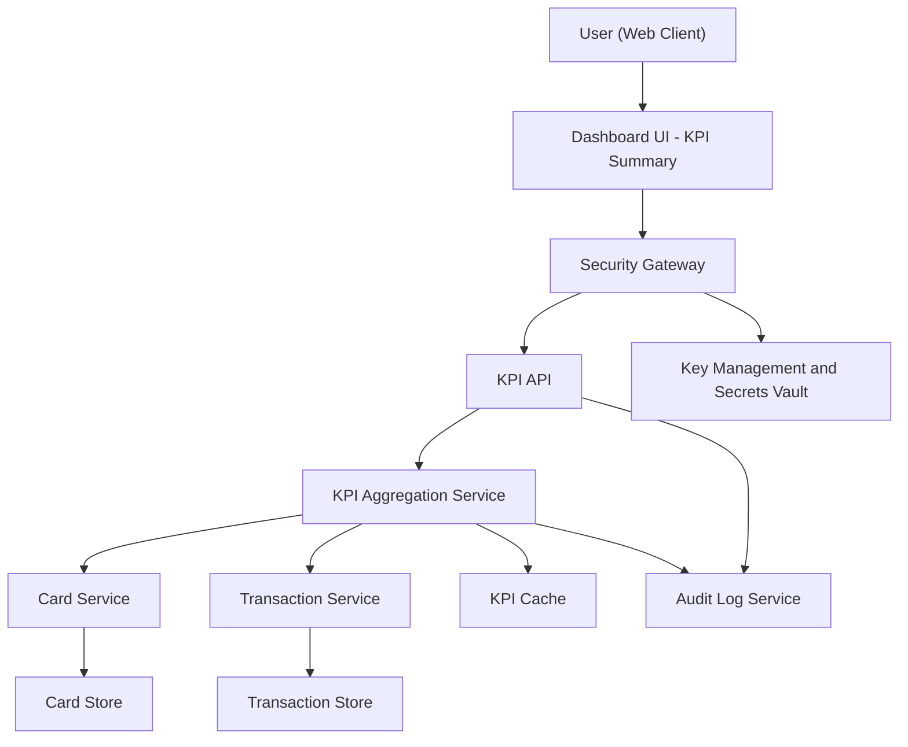

#### 1. High-Level Design

- Architecture Overview & Component Diagram:

- Component Descriptions:

  - Dashboard UI - KPI Summary:
    - Displays key KPIs (monthly spend, total credit limit, available credit, outstanding amount) across multiple cards in a responsive layout.
  - KPI Aggregation Service:
    - Computes consolidated KPIs by combining card and transaction data.
  - KPI Cache:
    - Stores precomputed KPI values for short intervals to maintain near real-time responsiveness.

- Integration Points & Data Flow:

  - UI  KPI API:
    - Requests summary KPIs and receives consolidated values.
  - KPI Aggregation Service  Card and Transaction Services:
    - Retrieves necessary data to compute KPIs.

- Security & Compliance Features:

  - Same controls as previous epics; summary data is derived, but access still restricted and logged.

- Resiliency & Error Handling:

  - Fallback to cached last-known KPIs on backend failures, with indicator that data may not be up to the second.

#### 2. Validation Report

- Requirements Coverage:

  - Consolidated dashboard view and multiple cards summary:
    - Covered via KPI Aggregation Service and UI layout.
  - Display of monthly spend, total credit limit, available credit, outstanding amount:
    - Explicitly supported via aggregation logic.
  - Responsive layout:
    - Ensured through front-end design constraints and NFRs, backed by fast APIs.

- Compliance Status:

  - Pass, given complete adherence to encryption, RBAC/ABAC, audit logging, and retention practices, even for summary data.

- Identified Ambiguities/Risks:

  - Exact definition of near real-time not specified:
    - Mitigation: define refresh intervals and SLAs during implementation.
  - Treatment of partial data (e.g., missing transactions from some cards) not described:
    - Mitigation: include confidence or completeness flags in KPI responses to avoid misinterpretation.

