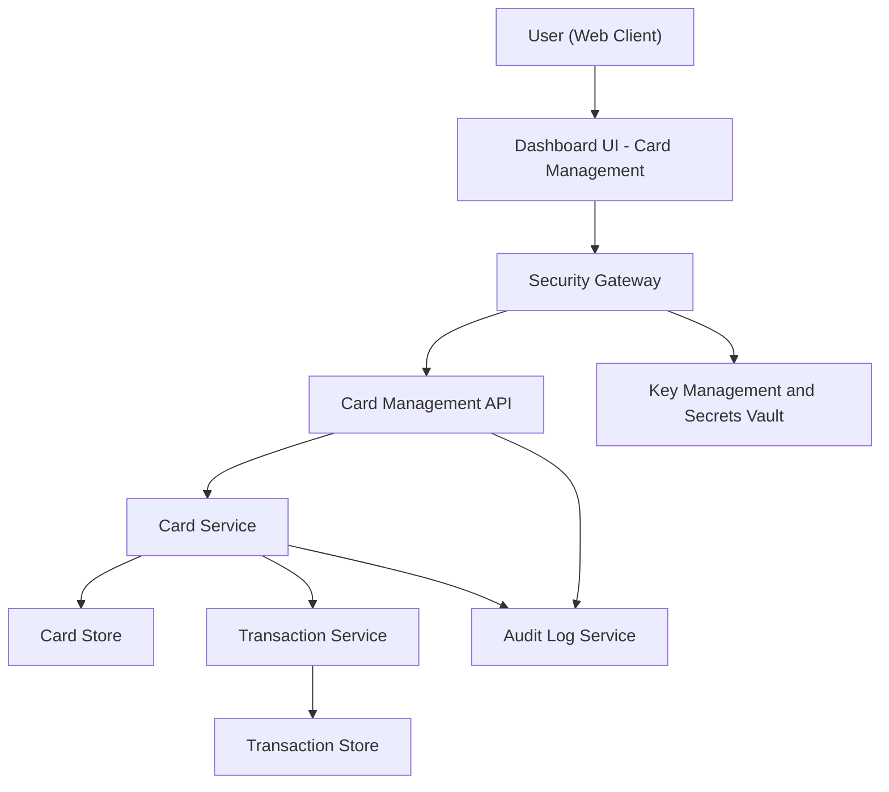

#### 1. High-Level Design

- Architecture Overview & Component Diagram:

- Component Descriptions:

  - Dashboard UI - Card Management:
    - Lists cards, provides views for card limits, available credit, outstanding amounts, and navigation to card-specific analytics.
  - Card Management API:
    - Handles card list, detail retrieval, and basic management operations.
  - Card Service:
    - Core service managing card entities, including relationships to user accounts and transactions.

- Integration Points & Data Flow:

  - UI  API  Card Service:
    - Retrieves list and details of cards.
  - Card Service  Transaction Service:
    - Fetches associated transactions for card-level summaries.

- Security & Compliance Features:

  - Ensures card records are scoped per user via RBAC/ABAC.
  - Encrypts sensitive card attributes (e.g., tokens, partial PAN) with AES-256.

- Resiliency & Error Handling:

  - Straightforward read patterns with retries and appropriate error messages when card data unavailable.

#### 2. Validation Report

- Requirements Coverage:

  - Multi-card representation and unified interface:
    - Delivered through Card Management UI and Card Service.
  - Card-level credit limit, available credit, outstanding amount:
    - Derived from Card Store and linked transaction data.
  - Linkage between cards and transactions:
    - Ensured via schema and services described.

- Compliance Status:

  - Pass, as card data governed with encryption, RBAC, and audit logging.

- Identified Ambiguities/Risks:

  - Handling of card removal or deactivation not specified.
  - Clarify allowed operations (view-only vs. management).

