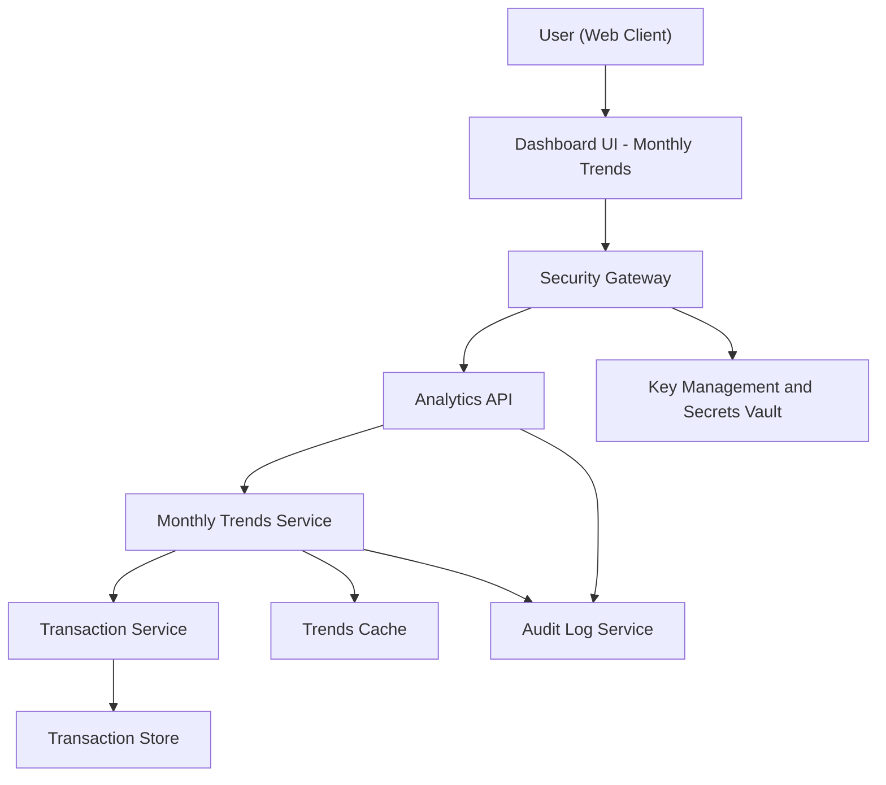

#### 1. High-Level Design

- Architecture Overview & Component Diagram:

- Component Descriptions:

  - Dashboard UI - Monthly Trends:
    - Visualizes time-series monthly spending charts with tooltips and filters.
  - Monthly Trends Service:
    - Aggregates transactions into monthly buckets, supports month-over-month comparisons and multi-card integration.
  - Trends Cache:
    - Stores precomputed monthly aggregates, e.g., for last 1224 months.

- Integration Points & Data Flow:

  - UI  API  Monthly Trends Service:
    - Requests time-series data; can specify range and card selection.
  - Monthly Trends Service  Transaction Service:
    - Fetches transactions in date range and aggregates by month.

- Security & Compliance Features:

  - Same as earlier epics, applied to time-series analytics.

- Resiliency & Error Handling:

  - Same patterns (circuit breakers, retries, fallbacks to cache) applied to trend computations.

#### 2. Validation Report

- Requirements Coverage:

  - Monthly spend trend charts and time-series aggregation:
    - Covered by Monthly Trends Service and UI charts.
  - Month-over-month comparison and aggregation across cards:
    - Provided as part of aggregated outputs and charts.
  - Interactive chart interactions:
    - Enabled by responsive UI consuming trend data with metadata for hover insights.
  - NFRs:
    - Performance requirements addressed via caching and optimized queries.

- Compliance Status:

  - Pass, leveraging same controls from foundational data epic.

- Identified Ambiguities/Risks:

  - Exact time horizon (e.g., past 6 vs. 12 vs. 24 months) not specified:
    - Mitigation: define default (e.g., 12 months) and consider configuration.

