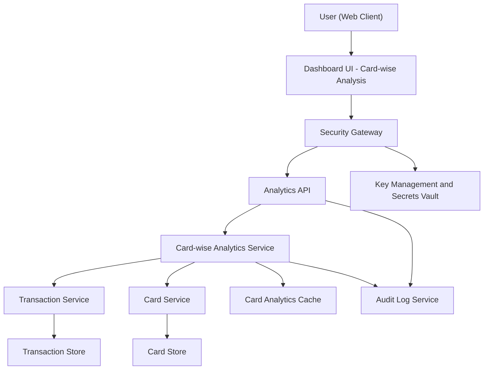

#### 1. High-Level Design

- Architecture Overview & Component Diagram:

- Component Descriptions:

  - Dashboard UI - Card-wise Analysis:
    - Displays per-card spend totals, charts, and comparison views.
  - Analytics API:
    - Provides endpoints for card-wise totals and comparison metrics; supports filtering by card and date.
  - Card-wise Analytics Service:
    - Computes per-card spend totals, card comparisons, and derived metrics (e.g., percentage contribution to total spend).
  - Transaction Service:
    - Provides transaction data for specific card(s).
  - Card Service:
    - Supplies card metadata (limits, names, issuers) for display and context.
  - Card Analytics Cache:
    - Caches per-card aggregates for recent periods to support quick switching between cards in UI.
  - Transaction Store and Card Store:
    - As described in QE-3634.
  - Audit Log Service and Key Management:
    - As described previously.

- Integration Points & Data Flow:

  - UI  API  Card-wise Analytics Service:
    - Requests per-card totals and comparison metrics.
  - Card-wise Analytics Service  Transaction Service:
    - Fetches transactions grouped by card; performs sums and counts as needed.
  - Card-wise Analytics Service  Card Service:
    - Retrieves card metadata to enrich results with card names and statuses.
  - Card-wise Analytics Service  Cache:
    - Stores recent aggregates keyed by user, card ID, and date range.

- Security & Compliance Features:

  - RBAC/ABAC enforcement ensuring card analytics restricted to card owners.
  - AES-256 and TLS 1.3 as above.
  - Audit logs for every card-wise analytics request, including which cards were accessed.

- Resiliency & Error Handling:

  - Circuit breakers and retries between Analytics and Transaction/Card services.
  - Fallback to last-known-good cache values if live recomputation fails, with flags indicating potential staleness.

#### 2. Validation Report

- Requirements Coverage:

  - Card-wise spend breakdown views:
    - Implemented via Card-wise Analytics Service and UI charts.
  - Per-card spend totals:
    - Derived directly from aggregated transactions per card.
  - Comparison across cards:
    - Provided via endpoints that return arrays of cards with totals to support comparison views.
  - Linking card-wise analysis to dashboard KPIs:
    - Achieved through consistent aggregation logic shared with dashboard KPIs and cross-navigation from KPIs to per-card details.
  - Filtering by card:
    - Supported via filters in the API interface.
  - NFRs for prompt loading:
    - Addressed via pre-aggregation, cache, and indexes.

- Compliance Status:

  - Data retention and privacy:
    - Pass; uses same underlying transaction and card data governed by retention and privacy controls.
  - RBAC/ABAC:
    - Pass; card ownership checks enforced.

- Identified Ambiguities/Risks:

  - Level of detail for card comparison:
    - Not specified whether to include additional info such as APR, rewards.
    - Mitigation: keep MVP focused on spend totals and balances as per scope; treat extras as future enhancements.
  - Handling closed or inactive cards:
    - Not explicitly stated.
    - Mitigation: define behavior (e.g., include historical data but label cards as inactive).

