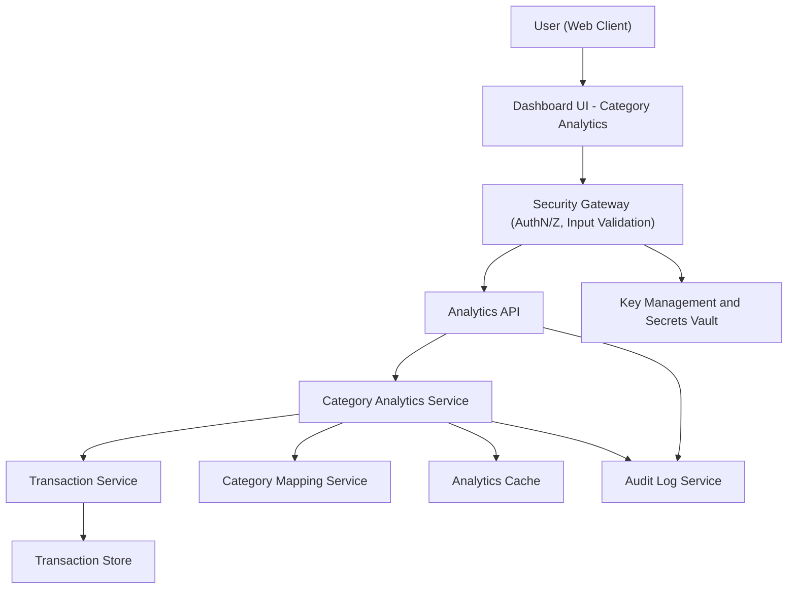

#### 1. High-Level Design

- Architecture Overview & Component Diagram:

- Component Descriptions:

  - Dashboard UI - Category Analytics:
    - Provides charts and visualizations of category-wise spending, legends, labels, and controls for date range/card filters.
  - Analytics API:
    - Exposes endpoints like `/analytics/categories` that accept filters (cards, date range) and return category-spend aggregates.
  - Security Gateway:
    - Handles authentication, RBAC/ABAC checks, request validation,, and rate limiting for analytics endpoints.
  - Category Analytics Service:
    - Orchestrates fetching transactions and mappings, computes aggregated spend per predefined category, and formats result sets for UI.
  - Transaction Service:
    - Supplies filtered transactions for given cards and date ranges.
  - Category Mapping Service:
    - Maps each transaction to one of the predefined categories based on merchant/category codes.
  - Analytics Cache:
    - Stores category aggregate results for commonly requested ranges (e.g., last month, last 3 months) to ensure responsiveness.
  - Transaction Store:
    - Same data foundation as QE-3634; source of truth for transactions.
  - Audit Log Service:
    - Logs user access to category analytics, including filters used.
  - Key Management and Secrets Vault:
    - Manages secrets for DB connections and encryption keys.

- Integration Points & Data Flow:

  - UI  Analytics API:
    - Sends filter parameters (card IDs, date ranges) and requests category-wise data.
  - Analytics API  Category Analytics Service:
    - Parses and validates filters, forwards requests with normalized parameters.
  - Category Analytics Service  Transaction Service:
    - Requests relevant transactions; ensures only authorized cards are queried.
  - Category Analytics Service  Category Mapping Service:
    - For each transaction, resolves category; handles unmapped transactions by assigning Miscellaneous or applying default rules.
  - Category Analytics Service  Analytics Cache:
    - Checks cache before computing; stores computed aggregates with TTL for reuse.
  - Analytics API  Audit Log Service:
    - Each request/response pair logged with user, filter, and result status.

- Security & Compliance Features:

  - AES-256/TLS 1.3:
    - TLS 1.3 for all communications; AES-256 for sensitive data in DB, including any derived category spend data if stored.
  - RBAC/ABAC:
    - Users can only access category analytics for their own cards; roles control access to more granular data (e.g., support may only see anonymized aggregates).
  - Audit Logging:
    - Records when users access or export category analytics; logs contain anonymized or pseudonymized identifiers where possible.
  - Compliance:
    - Data retention: category aggregates are derived; retention aligned with retention of source transactions or stored as ephemeral cache.
    - Consent: analytics not executed if user has opted out of analytics processing; API rejects with appropriate eror.
    - Data lineage: category results tagged with source dataset version and mapping configuration version.

- Resiliency & Error Handling:

  - Circuit Breakers:
    - Between Category Analytics Service and Transaction Service/DB to prevent overload.
  - Retries:
    - Controlled retries for transient errors when fetching transactions or category mappings.
  - Fallbacks:
    - If Category Mapping Service unavailable:
      - Use last-known mapping configuration from cache.
      - If none, fallback to raw uncategorized view or return partial data with explicit warning flag.
  - Error Responses:
    - Clear error codes/messages indicating whether problem stems from invalid filters, data unavailability, or internal failures.

#### 2. Validation Report

- Requirements Coverage:

  - Category-wise spend visualization:
    - Covered via Dashboard UI category charts and Analytics API responses.
  - Support for predefined categories:
    - Covered via Category Mapping Service with category list aligned to requirements (Food & Dining, Fuel, Shopping, Travel, Entertainment, Utilities, Healthcare, Education, Miscellaneous).
  - Aggregation of spends by category across cards:
    - Implemented by Category Analytics Service aggregating across all selected cards.
  - Interactive charts:
    - Enabled through responsive UI and JSON payloads including category labels and values for chart components.
  - Basic filtering by date range or cards:
    - Supported through filters accepted by Analytics API and validated at Security Gateway/API layer.
  - NFRs (performance and responsiveness):
    - Addressed via caching, indexing, and efficient aggregation queries.

- Compliance Status:

  - Data retention:
    - Pass, given ephemeral category aggregates and alignment with transaction retention.
  - Privacy:
    - Pass, as data is scoped to authorized users; no cross-tenant aggregation.
  - Consent:
    - Pass, with enforcement via consent flags before analytics execution.

- Identified Ambiguities/Risks:

  - Custom categories:
    - Out of scope but users may expect customization.
    - Mitigation: clearly communicate fixed category set in UI and documentation.
  - Category mapping accuracy:
    - Risk: incorrect mapping could mislead users.
    - Mitigation: governance process for mapping updates; test cases validating mapping rules.
  - Large transaction volumes:
    - Risk: performance degradation for long date ranges or many cards.
    - Mitigation: enforce maximum date range, pre-aggregated tables, and pagination where applicable.

