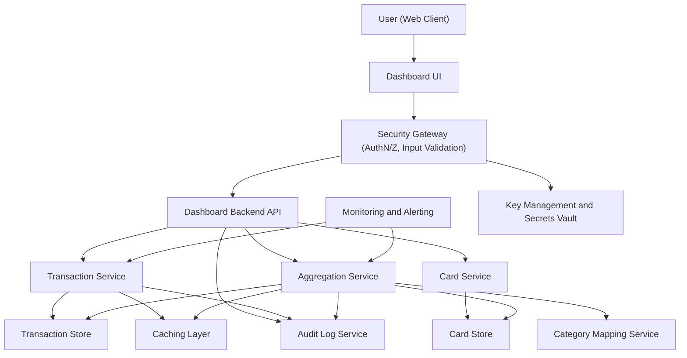

#### 1. High-Level Design

- Architecture Overview & Component Diagram:

- Component Descriptions:

  - User (Web Client) / Dashboard UI: Front-end consuming aggregated KPIs, monthly trends, card-wise and category-wise analytics.
  - Dashboard Backend API: REST/GraphQL API exposing endpoints for KPIs, trends, card-wise and category-wise data, handling request validation and orchestration.
  - Security Gateway: Terminates TLS 1.3, authenticates users, enforces RBAC/ABAC, performs input validation, and rate limiting.
  - Transaction Service: Manages CRUD and retrieval for transaction data, including pagination and filtering by card, date, and category.
  - Card Service: Manages card metadata, limits, and mappings between cards and transactions (card-to-transaction relationships).
  - Aggregation Service: Computes aggregations for monthly spend, card-wise spend, and category-wise spend using efficient queries and caching.
  - Category Mapping Service: Provides mappings from merchant/category codes or raw transaction metadata to predefined categories (Food & Dining, Fuel, Shopping, Travel, Entertainment, Utilities, Healthcare, Education, Miscellaneous).
  - Transaction Store (DB_TX): Primary storage (e.g., relational DB or document store) for transactions with indexes on card ID, date, and category.
  - Card Store (DB_CARD): Storage for card records, credit limits, available credit, and other card metadata required downstream.
  - Caching Layer: Stores hot aggregates (e.g., last 12 months monthly spend, frequently accessed card aggregates) to improve responsiveness.
  - Audit Log Service: Centralized immutable logging for access to transaction data, aggregation operations, and admin changes.
  - Key Management and Secrets Vault: Secure storage of encryption keys, DB credentials, and other secrets.
  - Monitoring and Alerting: Telemetry pipeline capturing performance metrics, error rates, and aggregation latencies.

- Integration Points & Data Flow:

  - UI  API:
    - Requests: Get transactions for card(s), get monthly spend aggregates, get card-wise and category-wise aggregates.
    - Responses: JSON payloads with normalized structures (e.g., per-card arrays, monthly time series).
  - API  Transaction Service:
    - Fetches raw transactions filtered by card ID, date range, and category. Uses pagination and query limits to protect back end.
  - API  Card Service:
    - Retrieves card metadata (limits, available credit, outstanding amount) and links card IDs to user accounts.
  - Aggregation Service  Transaction Store/Card Store:
    - Executes aggregation queries (e.g., group by month, group by card, group by category).
    - maintains consistent computation logic used by all analytics to ensure data consistency across dashboard views.
  - Aggregation Service  Category Mapping Service:
    - Applies category mappings to transactions lacking pre-assigned categories to ensure consistent category-wise analytics.
  - API/Aggregation/Transaction Services  Audit Log Service:
    - Emits structured audit events for data access and modifications, supporting compliance and traceability.
  - All services  Monitoring and Alerting:
    - Publish metrics on query latency, error rates, and cache hit ratios.

- Security & Compliance Features:

  - Transport Security:
    - All client-to-server and inter-service calls use TLS 1.3.
  - Data Encryption:
    - Sensitive fields (e.g., partial PAN tokens, user identifiers where applicable) encrypted at rest using AES-256.
    - Keys stored and rotated via Key Management and Secrets Vault.
  - Input Validation and Output Filtering:
    - API validates query parameters (date ranges, card identifiers) using strict schemas; rejects invalid or overly broad requests.
    - Output filtering ensures only the requesting users cards and transactions are returned (tenant isolation).
  - RBAC/ABAC:
    - RBAC roles (e.g., end-user, support, admin) enforced at the Security Gateway and API layer.
    - ABAC where needed (e.g., user can only see cards where they are owner; support roles restricted to masked data).
  - Audit Logging:
    - Every read of transaction or card data emits an audit event with user ID, purpose (view dashboard, export, etc.), resource ID, timestamp, and outcome.
    - Audit logs stored in append-only storage with retention matching compliance rules.
  - Compliance:
    - Data retention policies: transaction data retained per defined retention schedule; automatic archival or anonymization after expiry.
    - Consent management: downstream systems consume user consent flags when deciding if specific analytic views can be shown or if certain data must be masked.
    - Data lineage: each aggregate includes metadata about source tables and versioned aggregation logic, enabling traceability.
    - Compliance reporting: aggregates of access logs and usage metrics can be exported to compliance reporting tools.

- Resiliency & Error Handling:

  - Circuit Breakers:
    - Between API and Aggregation Service, and between Aggregation Service and DB_TX, DB_CARD, preventing cascading failures from slow or failing DBs.
  - Retries:
    - Configured with exponential backoff for idempotent read operations (e.g., read-only aggregation queries) when transient errors occur.
  - Fallback Patterns:
    - When live aggregation fails, system may:
      - Serve last-known-good cached aggregates.
      - Return partial results with explicit flags indicating degraded mode.
  - Logging and Monitoring:
    - Error logs include correlation IDs propagated from UI requests for traceability.
    - Alerts trigger when aggregation latencies cross thresholds or cache hit ratios fall below an acceptable level.

#### 2. Validation Report

- Requirements Coverage:

  - Transaction data storage and retrieval:
    - Covered by Transaction Service and Transaction Store with indexing for efficient retrieval.
  - Transaction-to-card mappings:
    - Covered by Card Service and database schema linking transaction records to card IDs.
  - Aggregation logic for:
    - Monthly spend:
      - Covered by Aggregation Service performing time-series group-by queries.
    - Card-wise spend:
      - Covered via card groupings and per-card totals in Aggregation Service.
    - Category-wise spend:
      - Covered via Category Mapping Service and aggregation by predefined categories.
  - Support for demo or simulated data sources:
    - Can be implemented as internal/mock data repositories behind Transaction Service and Card Service, fulfilling scope without real bank integration.
  - Data consistency across dashboard views:
    - Achieved by centralizing aggregation logic in Aggregation Service and using shared cached results.

- Compliance Status:

  - Data retention:
    - Pass, assuming retention policies configured and enforced via scheduled archival/anonymization jobs.
  - Consent management:
    - Pass, assuming the API and Security Gateway enforce consent flags before serving analytics (e.g., masking or omitting data when consent revoked).
  - Data lineage:
    - Pass: design includes lineage metadata for aggregates and logs.
  - Privacy constraints:
    - Pass: AES-256 encryption at rest, TLS 1.3 in transit, RBAC/ABAC, and output filtering limit access to authorized users only.

- Identified Ambiguities/Risks:

  - Level of detail for transaction fields:
    - Risk: Requirements do not explicitly define which fields per transaction are stored and displayed (merchant name, partial PAN, etc.).
    - Mitigation: Define a standard transaction schema during detailed design and apply minimization (store only what analytics require).
  - Demo vs. production-like data:
    - Risk: Requirements state support for demo or simulated data sources but not whether data must be realistic or anonymized production data.
    - Mitigation: Clarify whether a separate demo environment is needed; by default, treat all datasets as potentially sensitive and apply same controls.
  - Performance expectations:
    - Risk: NFRs mention responsive retrieval without numeric SLAs.
    - Mitigation: Define target latencies (e.g., p95 under 500 ms for typical workloads) during detailed NFR refinement.
  - Category mapping consistency:
    - Risk: The epic assumes categories exist but does not define the mapping rules.
    - Mitigation: Create a centrally managed category mapping table and governance process to avoid inconsistent classifications.

