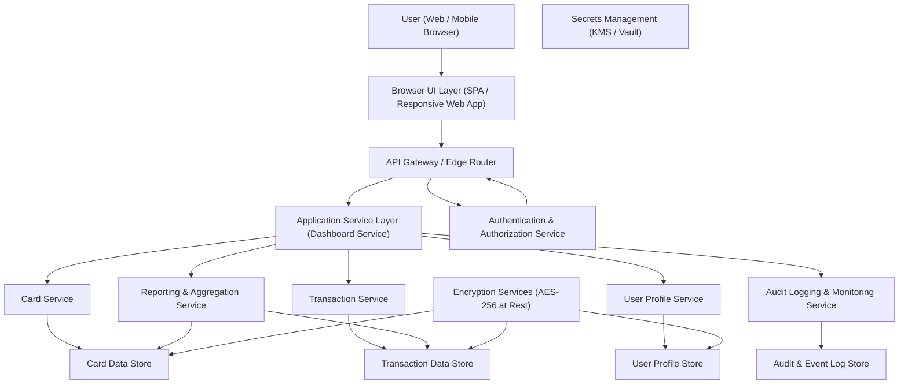

#### 1. High-Level Design

- Architecture Overview & Component Diagram:

- Component Descriptions:

  - **Browser UI Layer (SPA / Responsive Web App)**  
    - Presents the Credit Card Dashboard Overview with consolidated metrics: monthly spend, total credit limit, available credit, outstanding amount.  
    - Implements responsive layouts for different screen sizes (desktop, tablet, mobile).  
    - Handles client-side input validation (e.g., date ranges, filters).

  - **API Gateway / Edge Router**  
    - Single entry point for all client requests.  
    - Enforces TLS 1.3, rate limiting, request throttling, and basic DDoS protection.  
    - Performs request/response normalization and passes JWT/OAuth tokens downstream.

  - **Authentication & Authorization Service**  
    - Manages user authentication (e.g., OAuth2/OIDC) and token issuance.  
    - Enforces RBAC/ABAC policies to ensure a user can only access their own cards and spend data.

  - **Application Service Layer (Dashboard Service)**  
    - Orchestrates calls to Card Service, Transaction Service, User Profile Service, and Reporting & Aggregation Service.  
    - Computes or retrieves consolidated metrics for the dashboard.  
    - Applies server-side input validation and security controls.  
    - Implements error handling, retries, and circuit breaker calls to downstream services.

  - **Card Service**  
    - Provides per-card data (limits, balances, available credit, outstanding amount).  
    - Aggregates card data by user.  
    - Serves only card metadata and computed financial indicators (no full PAN where not necessary).

  - **Transaction Service**  
    - Provides transaction data per card and per user (within defined retention windows).  
    - Exposes APIs to list transactions used by reporting logic to compute monthly spend.

  - **User Profile Service**  
    - Manages user identity, card-to-user associations, and profile-level settings (e.g., currency, locale).  
    - Stores consent flags and legal bases required for data processing.

  - **Reporting & Aggregation Service**  
    - Aggregates card and transaction data to compute monthly spend, total credit limit, available credit, and outstanding balance across cards.  
    - Provides pre-aggregated views for dashboard performance and trend calculations (where relevant across epics).  
    - Ensures aggregation logic adheres to defined data lineage and audit requirements.

  - **Audit Logging & Monitoring Service**  
    - Captures access and administrative events (login, dashboard view, configuration changes).  
    - Provides structured logs for compliance reporting and incident investigations.

  - **Secrets Management (KMS / Vault)**  
    - Manages credentials, API keys, database passwords, and encryption keys.  
    - Integrates with data stores to support AES-256 encryption at rest.

  - **Data Stores (Card, Transaction, User Profile, Log Stores)**  
    - **Card Data Store:** Stores card metadata (limits, balances, product type, partial masked numbers).  
    - **Transaction Data Store:** Stores transaction data necessary to compute monthly spend and trends.  
    - **User Profile Store:** Stores user identity, preferences, and consent records.  
    - **Audit & Event Log Store:** WORM-capable storage for audit trail, used for compliance and forensic analysis.

  - **Encryption Services (AES-256 at Rest)**  
    - Handles database-level or application-level encryption using KMS-managed keys.  
    - Ensures all PII and sensitive financial information is encrypted at rest.

- Integration Points & Data Flow:

  1. **User Login and Session Establishment**  
     - User accesses the dashboard via browser.  
     - Browser communicates over **TLS 1.3** to the API Gateway.  
     - API Gateway forwards authentication request to Authentication Service.  
     - Upon successful login, user receives a secure session token (JWT / session ID).

  2. **Dashboard Load – Consolidated Metrics**  
     - Browser calls `GET /dashboard/overview` with users token.  
     - API Gateway validates token and forwards the request to the Dashboard Service.  
     - Dashboard Service:
       - Queries User Profile Service to confirm user identity and consent status.  
       - Calls Card Service to retrieve all cards associated with the user and per-card metrics (limit, balance, available credit, outstanding amount).  
       - Calls Reporting & Aggregation Service, which uses transaction data to compute:
         - Current month spend across all cards.  
         - Any pre-aggregated metrics needed for dashboard display.  
       - Combines responses to form a consolidated view.

  3. **Data Retrieval from Back-End Systems**  
     - Card Service reads from Card Data Store (encrypted at rest).  
     - Transaction Service and Reporting Service read from Transaction Data Store (encrypted at rest).  
     - User Profile Service reads from User Profile Store (encrypted at rest).  

  4. **Response and Rendering**  
     - Dashboard Service returns a consolidated payload (e.g., JSON) with:
       - `cards[]` (per card limit, available, outstanding)  
       - `summary` (total credit limit, total available credit, total outstanding, monthly spend)  
     - Browser renders responsive widgets/components:
       - Number tiles for key metrics  
       - Summaries and simple charts as necessary within the epic scope.  

  5. **Audit Logging and Monitoring**  
     - For each dashboard load, Dashboard Service sends structured logs to Audit Logging Service:
       - User ID (pseudonymized or hashed where feasible)  
       - Timestamp, IP (possibly truncated), action type (view_dashboard), resource (dashboard_overview)  
     - Logs are stored in Audit & Event Log Store.

- Security & Compliance Features:

  - **Transport Security (TLS 1.3)**  
    - All HTTP(S) endpoints (UI to API Gateway, Gateway to microservices) enforced with TLS 1.3.  
    - Strong cipher suites; HSTS enabled at the edge.

  - **Data-at-Rest Encryption (AES-256)**  
    - Card, transaction, user profile, and audit data encrypted with **AES-256** keys managed by a centralized KMS.  
    - Database backups and log archives also encrypted.

  - **Input Validation & Output Filtering**  
    - Input validation at UI:
      - Client-side checks for date filters, card selection, and pagination bounds.  
    - Input validation at API Gateway / Services:
      - Length, type, range, and format validation for user IDs, card IDs, and filters.  
      - Rejection of malformed or unsupported parameters.  
    - Output filtering:
      - Only fields relevant for dashboard are returned.  
      - No sensitive fields like full PAN, CVV, or full addresses are exposed.  
      - Data is scoped strictly to the authenticated user.

  - **RBAC/ABAC**  
    - Role-based access control:
      - Standard roles like `EndUser`, `SupportViewer`, `Admin`.  
      - Dashboard endpoints: `EndUser` only sees their own data; `SupportViewer` may see limited anonymized data for debugging via separate APIs.  
    - Attribute-based access control:
      - Policies consider user attributes (region, consent status) and resource attributes (data residency, retention) to allow/deny access.  
      - Example: Access to certain historical data may be restricted based on retention schedules or region.

  - **Audit Logging**  
    - All dashboard read events logged with minimal but sufficient detail:
      - User identifier (token subject), timestamp, operation, high-level result.  
    - Administrative changes (role assignments, configuration updates) logged separately.  
    - Time-synchronized, immutable log storage for compliance.

  - **Secrets Management**  
    - Database credentials, API keys, and KMS keys stored in a vault (e.g., HSM-backed or equivalent).  
    - No secrets in code repositories or configuration files.  
    - Rotation policies for keys and credentials enforced.

  - **Compliance: Data Retention, Consent, Lineage, Reporting**  
    - **Data Retention:**
      - Dashboard only reads data within defined retention windows (e.g., past N months).  
      - Archival tasks ensure older data is compacted, anonymized, or deleted per policy.  
    - **Consent Management:**
      - User Profile Service stores consent flags indicating if analytics and dashboard data can be processed.  
      - Dashboard Service checks consent before aggregations; if withdrawn, data access is limited or blocked.  
    - **Data Lineage:**
      - Reporting Service tracks source data tables and transformations used to compute each metric.  
      - Metadata catalogs (e.g., table names, transformations) are maintained for regulatory traceability.  
    - **Compliance Reporting:**
      - Predefined reports on data access, retention policy adherence, and dashboard usage compiled from Audit Log Store and metadata.

- Resiliency & Error Handling:

  - **Circuit Breakers**  
    - Dashboard Service uses circuit breakers for each downstream dependency:
      - Card Service, Transaction Service, Reporting Service, User Profile Service.  
    - On repeated failures, calls open the circuit and serve fallback responses:
      - Partial dashboard with available metrics and clear data temporarily unavailable indicators.

  - **Retry Mechanisms**  
    - Short, bounded retries for transient errors (e.g., network glitches or brief service unavailability).  
    - Exponential backoff with jitter, respecting idempotency for safe operations (reads/aggregations).

  - **Graceful Degradation**  
    - If transaction data is temporarily unavailable, dashboard:
      - Shows card-level limits and balances but omits monthly spend, with a clear message.  
    - If card service fails, dashboard:
      - Returns a user-friendly error and does not expose stack traces or internal details.

  - **Logging & Monitoring**  
    - Application logs include:
      - Correlation IDs passed from gateway through services.  
      - Error categories (client-side validation failures vs server runtime failures).  
    - Metrics and alerts:
      - Latency, error rates, and availability for each service.  
      - Compliance-critical alerts for unauthorized access patterns or repeated failures.

#### 2. Validation Report

- Requirements Coverage:

  - **From the Epic (QE-3635) description:**
    - Consolidated, modern, responsive dashboard showing:
      - Multiple cards.  
      - Monthly spend.  
      - Total credit limit.  
      - Available credit.  
      - Outstanding amount.  
      - Usability on multiple devices.

  - **Checklist:**

    - [x] Consolidated view of multiple credit cards  
      - Achieved via Card Service + Dashboard Service aggregation and multi-card representation in the UI.

    - [x] Display of monthly spend across cards  
      - Achieved via Reporting & Aggregation Service based on Transaction Service data, exposed as part of the dashboard payload.

    - [x] Display of total credit limit across cards  
      - Card Service provides per-card limits; Dashboard Service aggregates to total.

    - [x] Display of available credit across cards  
      - Card Service provides per-card available credit; Dashboard Service aggregates to total.

    - [x] Display of outstanding amount across cards  
      - Card Service provides per-card outstanding amounts; Dashboard Service aggregates to total.

    - [x] Responsive design for multiple devices  
      - Browser UI layer is explicitly defined as a responsive SPA; architecture supports device-agnostic access via TLS.

    - [x] Modern dashboard UX and layout  
      - Covered by UI layer design and supporting services; layout, widgets, and interactive components are delivered by the front end consuming consolidated APIs.

    - [x] Performance expectations / NFRs  
      - Use of pre-aggregations, efficient data stores, and service architecture aligns with NFR statements on responsiveness.

    - [x] In-scope only: Dashboard, Cards, Transactions  
      - Design relies solely on internal card, transaction, and user profile services; real bank integrations or payments are not included.

    - [x] Out-of-scope items respected  
      - No real bank integrations, payment gateways, loans, or fund transfers are part of this architecture.

- Compliance Status:

  - **Data Retention & Privacy Constraints:**
    - Retention windows implemented at data store or reporting layer.  
    - Dashboard reads only data within allowed windows.  
    - Log and audit data retention policies implemented and enforced.

  - **Consent & Data Processing:**
    - Consent flags stored in User Profile Service.  
    - Dashboard Service checks consent before exposing analytics and card data.  

  - **Security Controls:**
    - TLS 1.3 for transport security.  
    - AES-256 at rest for PII and financial data.  
    - RBAC/ABAC for fine-grained access.  
    - Comprehensive audit logging and immutable log storage.  
    - Secrets management via Vault/KMS.  

  - **Compliance Reporting & Lineage:**
    - Reporting Service maintains lineage information; Audit Service provides data access logs.  

  - **Overall Compliance Assessment:**
    - **Status:** Pass  
    - The HLD incorporates transport and data-at-rest encryption, access control, audit logging, retention, consent, and lineage mechanisms consistent with enterprise security and regulatory expectations for a credit card dashboard.

- Identified Ambiguities/Risks:

  - **Ambiguity: Exact Retention Periods and Regional Variations**  
    - Risk: The epic does not specify exact retention durations (e.g., 13 months vs 7 years) or region-specific retention rules.  
    - Mitigation:  
      - Parameterize retention policies and manage them via configuration per region.  
      - Integrate with compliance/legal configuration service that defines valid windows per jurisdiction.

  - **Ambiguity: Level of Detail for Transactions in Dashboard Context**  
    - Risk: It is not clear whether the dashboard should surface individual transactions or only aggregated metrics.  
    - Mitigation:  
      - HLD assumes dashboard overview focuses on aggregated metrics; detailed transaction views would be handled by separate views/services.  
      - Enforce a strict data minimization principle: the overview page only loads what is necessary for the high-level metrics.

  - **Risk: Performance Under High Transaction Volume**  
    - Risk: Aggregation might become slow under high transaction volumes.  
    - Mitigation:  
      - Use pre-aggregated monthly metrics stored in Reporting Service.  
      - Implement caching for frequently requested dashboard data (e.g., most recent month).  
      - Apply indexing and partitioning strategies to transaction data stores.

  - **Risk: Misconfiguration of RBAC/ABAC Policies**  
    - Risk: Incorrect configuration could expose one users card data to another.  
    - Mitigation:  
      - Enforce strict token-subject checks in every service.  
      - Use policy-as-code (e.g., OPA) with automated tests and regular audits.  
      - Include security regression tests in CI/CD.

  - **Risk: Front-End Responsiveness on Legacy Devices**  
    - Risk: Responsive layout may behave differently on older browsers or devices.  
    - Mitigation:  
      - Baseline support on defined browser matrix.  
      - Use progressive enhancement and test across the supported device list.  
      - Provide simplified layout fallback for low capability environments.
