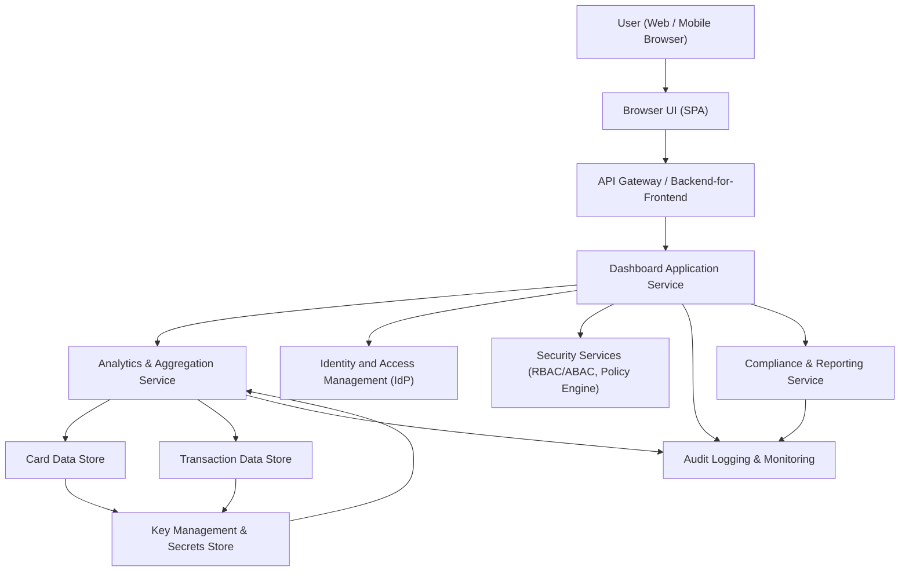

#### 1. High-Level Design

- Architecture Overview & Component Diagram:

- Component Descriptions:

  - User (Web / Mobile Browser):  
    End-user client accessing the responsive dashboard via browser or mobile web.

  - Browser UI (SPA):  
    Front-end single-page application that renders the dashboard, summary metrics, and responsive layouts. Handles user interactions, graph rendering, and calls to backend APIs via HTTPS (TLS 1.3).

  - API Gateway / Backend-for-Frontend (AG):  
    Single entry point for the UI. Handles routing, rate limiting, input validation, authentication token verification, and forwarding to downstream services. Ensures zero trust principles at the edge.

  - Dashboard Application Service (AS):  
    Orchestrates retrieval of aggregated metrics (monthly spend, total credit limit, available credit, outstanding amount) and formats them for the UI. Applies business rules, authorization checks, and transformation of data into DTOs.

  - Analytics & Aggregation Service (DS):  
    Performs computation of monthly spend, total credit limit, available credit, and outstanding balances across all cards. Executes read queries against card and transaction stores, aggregates by card and across cards, and caches frequently used metrics.

  - Card Data Store (CD):  
    Logical data store (e.g., relational DB) holding card master data: card identifier, masked number, credit limit, current outstanding, status, per-card utilization metrics. Enforces referential integrity and encryption at rest.

  - Transaction Data Store (TD):  
    Stores transaction-level details (amount, currency, timestamp, card ID, category, merchant, status). Supports aggregation queries for monthly spend and trends. Sensitive fields are encrypted at rest.

  - Identity and Access Management (IdP):  
    Provides authentication (OIDC/OAuth2, SSO) and issues tokens used by the UI and API Gateway. Stores user identities and associated account relationships.

  - Security Services (RBAC/ABAC, Policy Engine) (SEC):  
    Centralized service that evaluates whether a given user is allowed to view specific card or dashboard metrics using role-based and attribute-based access control.

  - Audit Logging & Monitoring (LOG):  
    Central service capturing security-relevant events (login, dashboard access, card view, parameter changes) and operational logs (errors, latency, failures). Supports forensic analysis and compliance reporting.

  - Key Management & Secrets Store (ENC):  
    Manages encryption keys (e.g., KMS/HSM) for AES-256 at rest and stores application secrets (DB passwords, API keys). Provides rotation and access policies.

  - Compliance & Reporting Service (CMP):  
    Manages data retention policies, consent records, data lineage metadata, and provides exportable compliance reports (e.g., for audits). Coordinates scheduled purges and pseudonymization when required.

- Integration Points & Data Flow:

  1. User Login & Session:
     - The user opens the dashboard in the browser UI.
     - Browser redirects to IdP for authentication (OIDC/OAuth2).
     - IdP authenticates and returns an access token (JWT) scoped for dashboard operations.
     - Browser stores token securely (HTTP-only cookies / secure storage) and includes it in HTTPS requests.

  2. Dashboard Summary Load:
     - Browser calls the API Gateway with a request for dashboard summary metrics (monthly spend, total credit limit, available credit, outstanding amount).
     - API Gateway validates the token signature and scopes using IdP keys, performs input validation (user ID, date filters), and forwards to the Dashboard Application Service.

  3. Metric Aggregation:
     - Dashboard Application Service:
       - Calls Security Services to verify RBAC/ABAC policies for the user (e.g., user can only see their own cards).
       - Calls Analytics & Aggregation Service, passing a tenant/user context and date range (e.g., current month).
     - Analytics & Aggregation Service:
       - Fetches list of cards for the user from Card Data Store.
       - Calculates:
         - Total credit limit: sum of card credit limits.
         - Outstanding amount: sum of per-card outstanding balances.
         - Available credit: total credit limit minus outstanding.
       - Queries Transaction Data Store to aggregate monthly spend for the current period.
       - Caches computed metrics for a short TTL to improve performance.

  4. Response to UI:
     - Dashboard Application Service maps aggregated results into response objects (e.g., `DashboardSummaryDTO`).
     - API Gateway returns response over HTTPS (TLS 1.3) to the browser.
     - Browser renders KPIs, charts, and responsive layouts.

  5. Ongoing Use:
     - User navigates to more detailed views (e.g., per-card or trend pages), which call related endpoints using similar flows.
     - All requests are logged for auditing and monitoring, including error states and latency metrics.

- Security & Compliance Features:

  - Transport Security:
    - All client-to-server and service-to-service communication uses HTTPS / TLS 1.3.
    - Enforced HSTS, modern cipher suites, and mutual TLS for internal services where required.

  - Data-at-Rest Encryption:
    - Card Data Store and Transaction Data Store use AES-256 encryption at rest.
    - Columns containing sensitive information (user identifiers, card numbers, PII) are encrypted with field-level keys from Key Management & Secrets Store.

  - Input Validation:
    - API Gateway performs syntactic validation (types, ranges, formats) and rejects malformed requests with standardized error responses.
    - Dashboard Application Service performs semantic validation (e.g., date ranges within allowed windows, non-negative limits).

  - Output Filtering:
    - Dashboard Application Service ensures only necessary fields are sent to the client (principle of least privilege).
    - Sensitive internal fields (e.g., full card numbers, internal IDs, flags) are not exposed.
    - Field-level masking (e.g., card number masked except last 4 digits) applied when required by policy.

  - RBAC/ABAC:
    - Role-based access control:
      - Roles like `END_USER`, `SUPPORT_READ_ONLY`, `ADMIN_AUDITOR`.
      - Dashboard access restricted to authenticated roles.
    - Attribute-based access control:
      - Policies enforced on attributes such as user ID, tenant ID, and card ownership.
      - Example: user can only view cards where `card.ownerId == user.id` and `card.status != CLOSED` unless they have a support role.
    - Policy decisions centralized in Security Services, enforced by Dashboard Application Service.

  - Audit Logging:
    - Every dashboard summary request logs:
      - User ID/subject (hashed or pseudonymized where required).
      - Timestamp, request parameters (sanitized), result status, latency.
    - Security events (failed auth, repeated invalid tokens, unusual access patterns) flagged and forwarded to SIEM.
    - Logs are immutable and retained per compliance policies, with access restricted.

  - Secrets Management:
    - Database credentials, API keys, and encryption keys stored in Key Management & Secrets Store.
    - Applications retrieve secrets via strongly authenticated channels at startup.
    - Regular key rotation and secret rotation with zero-downtime strategies supported.

  - Compliance (data retention, consent, lineage, reporting):
    - Data Retention:
      - Retention policies defined at the entity level:
        - Card records retained while account is active and for regulatory retention period post closure.
        - Transaction records retained for the required financial audit period.
      - Scheduled jobs coordinate with Compliance & Reporting Service to archive or purge data beyond retention windows.
    - Consent Management:
      - IdP or a consent registry stores user consent for data processing, analytics, and reporting.
      - Dashboard Application Service checks consent flags before enabling analytics or aggregations beyond strictly necessary operations.
    - Data Lineage:
      - For each metric (e.g., monthly spend, outstanding), lineage metadata maintained mapping metric ID to source tables, columns, and transformation steps.
      - Lineage metadata exposed via Compliance & Reporting Service for audits.
    - Compliance Reporting:
      - Periodic generated reports summarizing:
        - Access events.
        - Data retention activities (purges/archives).
        - Security incidents and resolutions.
      - Reports are accessible only to authorized compliance staff.

- Resiliency & Error Handling:

  - Circuit Breakers:
    - Dashboard Application Service uses circuit breaker patterns around calls to:
      - Analytics & Aggregation Service.
      - Card Data Store and Transaction Data Store proxies.
    - When repeated failures occur, circuits open to prevent cascading failures and quickly return fallback responses.

  - Retries:
    - Transient failures (network timeouts, 5xx responses) trigger limited, exponential backoff retries for idempotent read operations.
    - Non-idempotent operations (if any) will not be retried without explicit design.

  - Fallback Patterns:
    - If Analytics & Aggregation Service is temporarily unavailable:
      - Dashboard returns a graceful degraded view with last known cached metrics and a “data currently unavailable” indicator.
    - If Transaction Data Store is unavailable:
      - Card-level static metrics (credit limit, outstanding, available credit) are prioritized from Card Data Store where possible.
    - UI displays clear, non-technical messages for users while error details are logged for operators.

  - Logging and Monitoring:
    - All errors, warnings, and significant events are logged with correlation IDs.
    - Health endpoints for each service integrated with monitoring to detect anomalies (increased latency, error rates).
    - Alerting thresholds configured for key metrics (timeouts, failures in aggregation, database connectivity issues).

  - High Availability:
    - Stateless services (API Gateway, Dashboard Application Service, Analytics & Aggregation Service) deployed in redundant instances behind load balancers.
    - Data stores configured with replication and automated failover.

#### 2. Validation Report

- Requirements Coverage:

  - Requirement: Consolidated dashboard overview of all credit cards.
    - Coverage: Dashboard Application Service aggregates card metrics across Card Data Store, exposed via a single dashboard summary endpoint rendered by Browser UI with responsive layout.

  - Requirement: Monthly spend summary.
    - Coverage: Analytics & Aggregation Service calculates monthly spend across all cards from Transaction Data Store and surfaces this as part of dashboard summary metrics.

  - Requirement: Total credit limit.
    - Coverage: Total credit limit computed as sum of credit limits from Card Data Store and exposed via the dashboard.

  - Requirement: Available credit.
    - Coverage: Available credit computed as `total credit limit - outstanding amount` and displayed on dashboard.

  - Requirement: Outstanding amount.
    - Coverage: Outstanding per card stored in Card Data Store, aggregated across cards by Analytics & Aggregation Service, returned to dashboard.

  - Requirement: Responsive layout for different devices (mobile, tablet, desktop).
    - Coverage: Browser UI is implemented as responsive SPA using CSS responsive frameworks and tested for common breakpoints (mobile, tablet, desktop).

  - Requirement: Basic navigation to detailed views.
    - Coverage: Dashboard Summary tiles link to dedicated detailed views (e.g., per-card and trend pages) via routes handled in the SPA and supported by backend APIs.

  - Requirement: Performance and responsiveness.
    - Coverage: Non-functional requirements addressed by caching in Analytics & Aggregation Service, circuit breakers, retries, and high-availability deployment.

  - Requirement: Security and privacy best practices for financial-like information.
    - Coverage: TLS 1.3 everywhere, AES-256 at rest, RBAC/ABAC enforcement, audit logging, and secrets management implemented as described in Security & Compliance Features.

- Compliance Status:

  - Data Retention:
    - Status: Pass (Design includes entity-level retention policies, archiving/purging workflows driven by Compliance & Reporting Service).

  - Consent Management:
    - Status: Pass (Design integrates consent checks via IdP / consent registry before enabling optional analytics).

  - Data Lineage:
    - Status: Pass (Lineage metadata for each metric is maintained and exposed for audit via Compliance & Reporting Service).

  - Privacy and Data Minimization:
    - Status: Pass (Output filtering ensures the dashboard exposes only necessary fields; sensitive data is masked or omitted).

  - Security Logging and Incident Support:
    - Status: Pass (Audit logging and monitoring integrated; logs retained and access controlled per compliance policies).

- Identified Ambiguities/Risks:

  - Ambiguity: Exact retention periods for card and transaction data are not specified in the epic.
    - Risk: Misalignment with regulatory requirements or organizational policy.
    - Mitigation: Configure retention durations via policy driven configuration in Compliance & Reporting Service, referencing applicable regulations (e.g., local financial data retention rules). Require product owner and compliance team to define retention durations before production deployment.

  - Ambiguity: Exact device/browser support matrix for responsive layout is unspecified.
    - Risk: Users on older or niche devices may experience degraded UX.
    - Mitigation: Define and agree a supported browser/device matrix (e.g., last two versions of major browsers and common mobile OS versions). Incorporate into NFRs and test plans.

  - Ambiguity: Level of precision and currency conversion rules for multi-currency cards are not described.
    - Risk: Inconsistent metrics for users with multi-currency usage.
    - Mitigation: Establish a consistent currency normalization strategy (e.g., convert all amounts to user’s base currency using latest or averaged FX rates), document rules in the functional specification, and implement deterministic rounding logic.

  - Risk: Downstream dependencies (Card Data Store, Transaction Data Store) availability and data quality.
    - Mitigation: Implement data quality checks (e.g., reconciliations, completeness checks), include fallback behavior for partial data, and monitor for anomalies (e.g., sudden missing card records).

  - Risk: Role and attribute definitions for RBAC/ABAC may change over time.
    - Mitigation: Use configuration-driven policies in Security Services with clear governance for changes. Include regression tests to ensure policy changes do not inadvertently broaden access.

  - Ambiguity: Specific regulatory frameworks (e.g., GDPR, PCI-DSS) are not explicitly named.
    - Risk: Misinterpretation of compliance obligations.
    - Mitigation: Engage compliance/legal stakeholders to map the design to applicable frameworks and document explicit control mappings (e.g., encryption, data subject rights handling) in a separate compliance specification.

This HLD and Validation Report align the QE-3661 epic with the provided Credit Card Analysis Dashboard requirements, ensuring that the dashboard overview and summary metrics are designed with enterprise-grade security, compliance, and resiliency.
