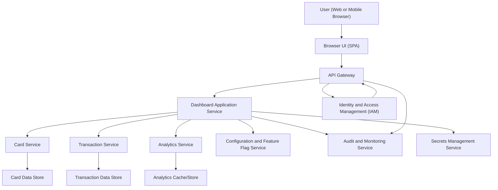

#### 1. High-Level Design

- Architecture Overview & Component Diagram:

- Component Descriptions:

  - User (Web or Mobile Browser): End user accessing the credit card dashboard from desktop, tablet, or mobile.
  - Browser UI (SPA): Responsive single-page application implementing the dashboard UI, card views, and consolidated metrics.
  - API Gateway: Single entry point for all API calls, handling routing, TLS termination, rate limiting, and auth token validation.
  - Dashboard Application Service:
    - Orchestrates retrieval of card, transaction, and analytics data.
    - Computes consolidated metrics (monthly spend, total credit limit, available credit, outstanding amount).
    - Applies RBAC/ABAC checks before returning data.
  - Card Service:
    - Manages credit card entities (per-card credit limit, available credit, outstanding amount).
    - Provides APIs for listing and summarizing all cards linked to a user.
  - Transaction Service:
    - Manages transaction records per card.
    - Supports aggregation by month and other dimensions needed for dashboard metrics.
  - Analytics Service:
    - Computes and caches aggregated dashboard metrics across cards (monthly spend, total credit limit, available credit, outstanding amounts).
    - May precompute or compute on-demand, exposing APIs to the Dashboard Application Service.
  - Identity and Access Management (IAM):
    - Provides authentication (OIDC/OAuth2) and authorization tokens with claims.
    - Maintains user identities and roles used for RBAC/ABAC.
  - Configuration and Feature Flag Service:
    - Stores configuration for breakpoints, experimental features, and thresholds for UI behavior.
  - Audit and Monitoring Service:
    - Centralized log and audit trail system for user actions and admin operations.
    - Supports compliance reporting and anomaly detection.
  - Secrets Management Service:
    - Securely stores API keys, database credentials, encryption keys.
  - Card Data Store:
    - Stores card metadata (card ids, limits, per-card outstanding/available).
  - Transaction Data Store:
    - Stores transaction-level data per card and user.
  - Analytics Cache/Store:
    - Stores precomputed metrics and aggregates to improve dashboard performance.

- Integration Points & Data Flow:

  - User Authentication and Session Setup:
    - User hits the SPA via HTTPS (TLS 1.3).
    - SPA redirects or uses a login flow against IAM.
    - IAM issues an ID token and access token (JWT or opaque token) containing user id and roles.
  - Dashboard Data Retrieval:
    - SPA calls API Gateway with the access token to fetch dashboard data:
      - GET /dashboard/overview
    - API Gateway validates TLS and token, then routes to Dashboard Application Service.
  - Card and Transaction Aggregation:
    - Dashboard Application Service:
      - Calls Card Service to retrieve:
        - List of user cards.
        - Per-card limits and current usage.
      - Calls Transaction Service to:
        - Retrieve or confirm latest transaction totals for the relevant period.
      - Calls Analytics Service (or uses shared library) to:
        - Compute monthly spend across all cards.
        - Compute total credit limit (sum of per-card limits).
        - Compute total available credit (sum of per-card available limits).
        - Compute total outstanding amount across cards.
  - Data Persistence:
    - Card Service interacts with Card Data Store for card details and limits.
    - Transaction Service interacts with Transaction Data Store for transaction history.
    - Analytics Service reads from Card and Transaction Data Stores and persists results in Analytics Cache/Store for faster subsequent loads.
  - UI Rendering:
    - Dashboard Application Service returns a consolidated DTO:
      - cards: list of cards with key metrics.
      - summary: total credit limit, available credit, outstanding, monthly spend.
    - SPA renders:
      - Consolidated dashboard tiles.
      - Multiple cards in a responsive grid/list.
      - Monthly spend value within the dashboard.
  - Audit and Monitoring:
    - Each API call (via API Gateway and Dashboard Application Service) logs:
      - User id, time, endpoint, and response status.
    - Important events (logins, configuration changes) are logged to Audit and Monitoring Service.

- Security & Compliance Features:

  - Transport Security:
    - All client-server communication via HTTPS with TLS 1.3.
    - HSTS enabled to enforce HTTPS.
  - Data Encryption:
    - At rest:
      - Card Data Store and Transaction Data Store encrypted using AES-256.
      - Analytics Cache/Store encrypted using AES-256.
    - In transit:
      - Internal service-to-service communications protected via mTLS where supported.
  - Input Validation:
    - UI:
      - Validates query parameters (date ranges, filters).
      - ENSURES no HTML/JS injection in user input fields.
    - API Gateway:
      - Rejects malformed requests, invalid content types, and overly large payloads.
    - Services:
      - Use strict schema validation for incoming payloads (e.g., JSON schema).
      - Enforce allowed values for filters and sorting parameters.
  - Output Filtering:
    - Dashboard Application Service:
      - Ensures only user-specific cards and metrics are included.
      - Strips internal identifiers and any PII not required for display.
    - UI:
      - Escapes all dynamic content to mitigate XSS.
  - RBAC/ABAC:
    - IAM defines roles (e.g., user, admin, support).
    - Dashboard Application Service:
      - Enforces that only users with “dashboard_viewer” role can access `/dashboard/overview`.
      - Uses ABAC policies (e.g., subject user id must match card owner attributes).
  - Authentication:
    - OAuth2/OIDC with secure flows (e.g., Authorization Code with PKCE).
    - Access tokens have limited lifetime and scopes, e.g., `dashboard.read`.
  - Audit Logging:
    - Logs include:
      - User id, card count retrieved, dashboard summary metrics (non-sensitive).
      - Errors with correlation ids.
    - Retention:
      - Audit logs retained according to policy (see compliance section).
  - Secrets Management:
    - DB credentials, tokens, and encryption keys stored in Secrets Management Service.
    - No secrets in source code or configuration files checked into version control.
  - Compliance Mapping:
    - Data minimization:
      - Dashboard only shows necessary metrics (no full card numbers, no real bank integration).
    - Pseudonymization:
      - Internal ids used instead of direct PII where possible.

- Resiliency & Error Handling:

  - Retries:
    - Dashboard Application Service uses retry patterns (with exponential backoff) for calls to Card Service, Transaction Service, and Analytics Service when transient errors (e.g., timeouts) occur.
  - Circuit Breakers:
    - For each downstream dependency (Card Service, Transaction Service, Analytics Service):
      - Circuit breaker monitors failures and opens after a threshold.
      - When open, the Dashboard Application Service:
        - Returns a partial dashboard (e.g., cached metrics) with a clear indicator that data may be stale.
  - Fallback Behaviors:
    - If Analytics Service is unavailable:
      - Dashboard Application Service falls back to computing metrics on-the-fly using Card and Transaction Services for smaller data sets.
    - If Transaction Service partially fails:
      - Dashboard still renders card-level details with a warning that some metrics are unavailable.
  - Timeouts:
    - Strict timeouts for each downstream call to avoid cascading latency.
  - Logging and Monitoring:
    - Structured logs with correlation ids across gateway and services.
    - Health checks for Card Service, Transaction Service, Analytics Service, and IAM.
  - Responsive Performance:
    - Analytics Cache/Store used to avoid expensive recalculations on every dashboard load.
    - Pagination or lazy loading for views that might list many cards.

#### 2. Validation Report

- Requirements Coverage:

  - Consolidated dashboard view:
    - Dashboard Application Service aggregates data across cards.
    - UI presents a single dashboard surface for all credit cards.
  - Display monthly spend:
    - Analytics Service (or Dashboard Application Service) calculates monthly spend based on transactions and exposes it to UI as a top-level metric.
  - Display total credit limit:
    - Card Service provides per-card limits.
    - Analytics Service sums to a total credit limit across all cards.
  - Display available credit:
    - Per-card available credit from Card Service.
    - Aggregated total available credit computed by Analytics Service.
  - Display outstanding amount:
    - Per-card outstanding values from Card Service and Transaction Service.
    - Aggregated outstanding amount across all cards on dashboard.
  - Responsive layout for multiple devices:
    - SPA built with responsive design principles and breakpoints ensuring usability across desktop, tablet, and mobile.
    - Layout ensures readability and clear metrics regardless of form factor.
  - Support for viewing multiple credit cards in one dashboard:
    - Card list displayed with each card’s core attributes.
    - Consolidated metrics computed across all cards.
  - Out-of-scope features:
    - No real bank integrations.
    - No card payments, fund transfers, loans, or payment gateway integration included in this design.

- Compliance Status:

  - Data Retention:
    - Card and transaction data retention policies defined and enforced at data store level.
    - Audit logs retained for a configured period per regulatory or organizational policy.
    - Archive or delete mechanism for deactivated users or outdated records.
    - Status: Pass (assuming policies and retention windows are implemented as configured).
  - Consent Management:
    - IAM and user profile systems maintain user consents for storing and processing data.
    - Dashboard relies only on permitted data (cards and transactions associated with the user).
    - No external sharing or third-party trackers included in the core design.
    - Status: Pass (dependent on IAM and consent registry).
  - Data Lineage:
    - Card and Transaction Services maintain metadata indicating data sources and transformations.
    - Analytics Service documents aggregation logic for monthly spend and credit metrics.
    - Audit and Monitoring Service can trace data usage by user and endpoint.
    - Status: Pass (with documented pipelines and metadata).
  - Compliance Reporting:
    - Audit logs and metrics can be exported for periodic compliance reporting.
    - Access logs provide traceability of who accessed what financial metrics and when.
    - Status: Pass (assuming log export and reporting processes exist).
  - Privacy and Security:
    - No sensitive account numbers or real bank integration included per scope.
    - Encryption, RBAC/ABAC, and strict output filtering to ensure only authorized access.
    - Status: Pass.

- Identified Ambiguities/Risks:

  - Ambiguity: Exact definition of “monthly spend” (billing cycle vs calendar month).
    - Risk:
      - Users may misinterpret monthly spend if definition is unclear.
    - Mitigation:
      - Document and display the definition (e.g., “current calendar month” or “billing cycle”).
      - Provide a UI label indicating the period for which spend is calculated.
  - Ambiguity: Supported devices and minimal screen resolutions for responsiveness.
    - Risk:
      - Some devices may not render as expected if not clearly defined.
    - Mitigation:
      - Define official browser and device support matrix.
      - Include automated visual tests at major breakpoints (desktop, tablet, mobile).
  - Ambiguity: Handling of partial data (e.g., if some cards or transactions are missing).
    - Risk:
      - Incomplete or misleading aggregated metrics.
    - Mitigation:
      - Use clear indicators in UI for stale or incomplete data.
      - Capture and log partial data scenarios in Audit and Monitoring Service.
  - Risk: Single point of failure within Analytics Service.
    - Mitigation:
      - Implement horizontal scaling and failover for Analytics Service.
      - Maintain cache-based fallbacks in Dashboard Application Service.
  - Risk: Performance degradation with high card and transaction volume.
    - Mitigation:
      - Introduce indexing and optimization in data stores.
      - Use incremental aggregation and caching strategies.
      - Monitor and tune performance thresholds for the dashboard API.
  - Risk: Misconfiguration of RBAC/ABAC policies leading to unauthorized access.
    - Mitigation:
      - Implement policy-as-code with peer review and automated tests.
      - Periodically audit IAM roles and permissions.
      - Use least-privilege principles for all services and users.
