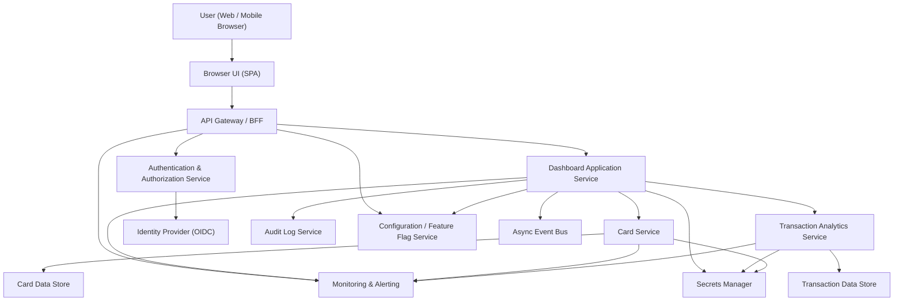

#### 1. High-Level Design

- Architecture Overview & Component Diagram:

- Component Descriptions:

  - User (Web / Mobile Browser): End user accessing the responsive dashboard via modern browser.
  - Browser UI (SPA): Single Page Application that renders the dashboard, charts, and card details; handles client-side routing and basic input validation.
  - API Gateway / BFF:
    - Single entry point for the UI.
    - Terminates TLS 1.3.
    - Performs request throttling, authentication token inspection, and routing to backend services.
    - Implements coarse-grained RBAC checks where applicable.
  - Dashboard Application Service:
    - Orchestrates data retrieval from Card Service and Transaction Analytics Service.
    - Aggregates monthly spend, total credit limit, available credit, and outstanding amounts.
    - Applies business rules (e.g., aggregation across cards per user).
    - Enforces fine-grained RBAC/ABAC based on user identity and card ownership.
    - Emits audit events for read and configuration actions.
  - Card Service:
    - Manages card metadata (limits, outstanding balances, availability).
    - Exposes APIs for listing all cards per user and retrieving per-card metrics.
    - Maintains consistency with transaction analytics via IDs and references.
  - Transaction Analytics Service:
    - Aggregates transaction data per card and per user.
    - Computes monthly spend and feeds both dashboard totals and trend charts.
    - Supports category-wise analytics for future or related epics (aligned with project overview).
  - Authentication & Authorization Service:
    - Validates tokens (OIDC/JWT).
    - Issues access tokens via Identity Provider.
    - Provides user roles, entitlements, and policy inputs for RBAC/ABAC.
  - Identity Provider (OIDC):
    - Handles login, MFA, and SSO.
    - Issues signed JWT tokens with claims (user ID, roles, consent flags, etc.).
  - Card Data Store:
    - Stores card attributes: card identifier (internal), credit limit, available credit, outstanding balance, card status, and linkage to user.
    - Encrypts sensitive data at rest with AES-256.
  - Transaction Data Store:
    - Stores transaction-level records required for monthly spend and trends.
    - Indexed by user and card, with time-based indexes for efficient aggregation.
    - Data encrypted at rest (AES-256).
  - Audit Log Service:
    - Receives structured audit events (user ID, action, resource, timestamp, outcome).
    - Supports compliance reporting and investigations.
  - Configuration / Feature Flag Service:
    - Controls feature rollout (e.g., certain analytics views).
    - Stores non-secret configuration for dashboard behavior.
  - Secrets Manager:
    - Securely stores credentials, encryption keys, and tokens.
    - Provides short-lived credentials to services (Card Service, Transaction Analytics, etc.).
  - Async Event Bus:
    - Used for publishing events such as “CardSnapshotUpdated” or “MonthlySpendRecalculated”.
    - Enables eventual consistency and decoupled recalculations without blocking UI requests.
  - Monitoring & Alerting:
    - Collects metrics and logs (latency, error rates).
    - Triggers alerts on SLA violations for dashboard response times.

- Integration Points & Data Flow:

  1) User Login and Session Establishment:
     - User accesses dashboard URL via browser.
     - Browser UI redirects to Identity Provider for login (OIDC).
     - On success, IDP issues a JWT token; Browser UI stores it in secure storage (e.g., HTTP-only cookies).
     - Browser UI calls API Gateway with token; API Gateway validates token with Authentication & Authorization Service.

  2) Dashboard Data Retrieval:
     - Browser UI sends a “Get Dashboard Summary” request to API Gateway.
     - API Gateway:
       - Terminates TLS 1.3.
       - Validates token signature and expiration.
       - Routes to Dashboard Application Service.
     - Dashboard Application Service:
       - Calls Card Service to retrieve:
         - User’s card list.
         - Total credit limit per card.
         - Outstanding balance and available credit.
       - Calls Transaction Analytics Service to retrieve:
         - Monthly spend totals across cards.
         - Time-series data for monthly spend trends.
       - Aggregates:
         - Total credit limit = sum of per-card limits.
         - Total outstanding = sum of per-card outstanding balances.
         - Total available = sum or derived from limits and outstanding.
       - Constructs response: monthly spend, total credit limit, available credit, outstanding amount, and card-level metrics.
     - Response is returned via API Gateway back to Browser UI.

  3) Multi-Device Responsive Rendering:
     - Browser UI:
       - Uses responsive layout (CSS grid / flexbox) to adapt to desktop, tablet, and mobile.
       - Renders aggregated metrics and card list with consistent layout.
       - Calls the same APIs regardless of device; only presentation changes.

  4) Data Refresh and Recalculation:
     - Transaction ingestion (out of scope regarding real bank integration) or synthetic data updates trigger events in Transaction Analytics Service.
     - Transaction Analytics Service publishes “MonthlySpendRecalculated” events to Async Event Bus.
     - Dashboard Application Service can precompute or cache aggregated metrics based on these events.
     - When the user refreshes, they see up-to-date metrics consistent with the latest transaction data.

- Security & Compliance Features:

  - Transport Security:
    - All external and internal service calls use TLS 1.3.
    - API Gateway enforces HTTPS; no plaintext HTTP for user-facing endpoints.

  - Data-at-Rest Encryption:
    - Card Data Store and Transaction Data Store encrypt sensitive fields using AES-256.
    - Encryption keys are managed by the Secrets Manager or KMS, with strict access controls.

  - Input Validation & Output Filtering:
    - Browser UI:
      - Performs basic client-side validation (e.g., date filters, query parameters).
      - Sanitizes user-entered filters before sending to backend.
    - API Gateway and services:
      - Enforce strict schema validation for all API inputs.
      - Reject unknown fields and malformed requests to prevent injection.
      - Output filtering ensures only necessary fields are returned; no internal IDs or sensitive metadata leaked.

  - RBAC/ABAC:
    - Identity Provider issues tokens with claims:
      - user_id, roles (e.g., “customer”, “support-read-only”), and risk / consent flags.
    - API Gateway enforces role-based access at route level (e.g., dashboard routes require “customer”).
    - Dashboard Application Service enforces ABAC:
      - Ensures user_id from token matches user_id associated with requested cards.
      - Prevents cross-tenant data leakage by scoping all queries to the authenticated user context.

  - Audit Logging:
    - For each dashboard access:
      - Dashboard Application Service emits an audit event:
        - user_id, action = “VIEW_DASHBOARD”, resource = “CREDIT_CARD_DASHBOARD”, timestamp, outcome (success/failure).
    - Audit Log Service stores immutable logs with retention configured per compliance requirements.
    - Access to audit logs is restricted to authorized operations/compliance roles.

  - Compliance (Data Retention, Consent, Data Lineage, Reporting):
    - Data Retention:
      - Retention policies defined per region (e.g., rolling window for transaction and card data).
      - Card and transaction records are automatically purged or anonymized after retention period.
      - Dashboard uses only current and retained data; queries never access deleted records.
    - Consent Management:
      - Identity Provider or profile service maintains user consent for analytics.
      - Dashboard Application Service checks consent flags before displaying analytics-heavy components.
      - If consent withdrawn, dashboard falls back to minimal required views or masks data per policy.
    - Data Lineage:
      - Each aggregated metric (e.g., total outstanding) is traceable back to underlying card and transaction records via IDs and timestamps.
      - Lineage metadata stored as part of analytics computations to support investigations.
    - Compliance Reporting:
      - Audit Log Service and Monitoring produce reports on access patterns (e.g., number of dashboard views, access by support users).
      - Exportable logs for periodic compliance assessments.

- Resiliency & Error Handling:

  - Circuit Breakers:
    - API Gateway and Dashboard Application Service implement circuit breakers around Card Service and Transaction Analytics Service calls.
    - If a downstream service is failing consistently:
      - Circuit opens; subsequent calls fail fast.
      - Dashboard returns partial data with clear indications of degraded state (e.g., “Card details temporarily unavailable”).

  - Retry Mechanisms:
    - Idempotent read operations to Card Service and Transaction Analytics Service are retried with exponential backoff for transient network errors.
    - Retries are bounded to avoid cascading failures or excessive latency.

  - Fallback Patterns:
    - Cached data:
      - Dashboard Application Service can fall back to last-known-good aggregates if live calls fail, explicitly indicating that data may be slightly outdated.
    - Graceful Degradation:
      - If transaction analytics is unavailable:
        - Dashboard still shows card-level metrics (limits, outstanding, available) from Card Service.
      - If card service is unavailable:
        - Minimal message indicating unavailability, while charts may be hidden or replaced with informative placeholders.

  - Error Logging:
    - All errors include correlation IDs for tracing requests end-to-end.
    - Security-related failures (auth, authorization) are highlighted in logs and audit events.
    - Monitoring & Alerting triggers notifications on:
      - Elevated error rates.
      - Increased latency beyond defined thresholds.

#### 2. Validation Report

- Requirements Coverage:

  1) Consolidated dashboard view:
     - Covered: Dashboard Application Service aggregates metrics from Card Service and Transaction Analytics Service and presents them via a single dashboard view.

  2) Display monthly spend:
     - Covered: Transaction Analytics Service computes monthly spend across cards; Dashboard renders this metric and trend.

  3) Display total credit limit:
     - Covered: Card Service exposes per-card credit limits; Dashboard aggregates to total credit limit.

  4) Display available credit:
     - Covered: Card Service exposes available credit per card; Dashboard aggregates available credit across cards.

  5) Display outstanding amount:
     - Covered: Card Service exposes outstanding balances; Dashboard aggregates to total outstanding amount.

  6) Responsive layout for multiple devices:
     - Covered: Browser UI designed as responsive SPA using adaptive layout techniques for desktop, tablet, and mobile.

  7) Support viewing multiple credit cards in one dashboard:
     - Covered: Card Service supports multiple cards per user; Dashboard UI lists all cards and presents aggregated metrics across them.

  8) Scope alignment (Dashboard, Cards, Transactions in scope; real bank integration, payments, transfers, loans, gateway out of scope):
     - Covered: Design uses internal card and transaction data stores/services; no real bank, payment, transfer, loan, or payment gateway integration is introduced.

  9) Performance / NFRs (dashboard render within acceptable thresholds, responsive layout, clear data presentation):
     - Covered:
       - Service decomposition, caching, and async event processing support performant aggregations.
       - Monitoring & Alerting ensures SLOs are tracked.
       - UI designed for clarity even with multiple cards.

- Compliance Status:

  - Data Retention:
    - Pass: HLD defines retention policies and automatic purge/anonymization aligned with compliance requirements. Dashboard queries operate only on retained data.

  - Privacy & Security:
    - Pass:
      - TLS 1.3 enforced for transport.
      - AES-256 encryption for card and transaction data at rest.
      - RBAC/ABAC implemented based on user roles and ownership, preventing cross-user data access.
      - Secrets managed via dedicated Secrets Manager.
      - Audit logging implemented for dashboard access and key operations.

  - Consent Management:
    - Pass:
      - Design includes consent flags checked by Dashboard Application Service before presenting analytics.
      - Supports fallback views when consent is withdrawn.

  - Data Lineage & Reporting:
    - Pass:
      - Lineage through IDs and aggregation metadata.
      - Audit Log Service and monitoring provide necessary data for compliance reporting.

- Identified Ambiguities/Risks:

  1) “Acceptable user experience thresholds” for dashboard rendering:
     - Ambiguity: Exact latency targets (e.g., p95 response time) are not specified.
     - Mitigation: HLD relies on Monitoring & Alerting and SLO definition; concrete targets to be defined during implementation (e.g., p95 < 2 seconds for dashboard load).

  2) “Typical consumer transaction volumes”:
     - Ambiguity: Volume/scale not numerically defined.
     - Mitigation: Architecture uses separate analytics service and data stores with indexing and scaling; performance testing and capacity planning to refine limits.

  3) Level of detail for monthly spend (e.g., per month range selection):
     - Ambiguity: Exact range (e.g., last 6 months, last 12 months) is not explicitly stated.
     - Mitigation: HLD supports configurable periods via Configuration / Feature Flag Service; default to a sensible range (e.g., 6–12 months) agreed during refinement.

  4) Consent semantics for purely functional metrics vs. analytics:
     - Ambiguity: Whether basic dashboard totals require explicit analytics consent.
     - Mitigation: HLD separates core account information (required for service) from advanced analytics; consent checks can be scoped to analytics-specific visualizations, clarified with legal/compliance during implementation.

  5) Support users / customer service access:
     - Ambiguity: The epic does not mention support operator access to dashboards.
     - Mitigation: RBAC/ABAC design supports additional roles; policies to be set by governance if support access is needed, ensuring strict audit logging and masking where necessary.

Overall, the HLD meets the epic’s stated scope and non-functional constraints, enforces enterprise-grade security and compliance controls, and provides clear paths to address identified ambiguities during detailed design and implementation.
