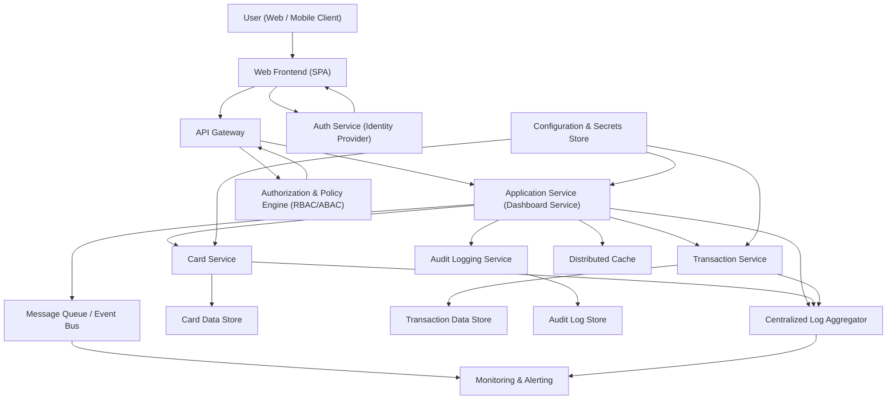

### Epic: QE-3720 - APPMRN25-Dashboard Overview and Credit Summary

#### 1. High-Level Design

- Architecture Overview & Component Diagram:

- Component Descriptions:

  - **User (Web / Mobile Client)**: Browser or mobile app that renders the responsive credit card dashboard and interacts via secure HTTPS APIs.
  - **Web Frontend (SPA)**: Single-page application (e.g., React/Angular/Vue) responsible for UI, including dashboard layout, charts, responsive behavior, and client-side input validation.
  - **API Gateway**: Single entry point enforcing TLS 1.3, rate limiting, JWT validation, and routing to backend services.
  - **Application Service (Dashboard Service)**: Orchestrates data required for the dashboard overview, aggregating metrics across cards and transactions (monthly spend, total credit limit, available credit, outstanding amount).
  - **Card Service**: Manages card master data (card identifiers, credit limits, balances, available credit) and supports multi-card aggregation.
  - **Transaction Service**: Handles ingestion, storage, and retrieval of transaction data that feeds monthly spend and analytics.
  - **Auth Service (Identity Provider)**: Issues tokens, manages identities, supports MFA and secure session management.
  - **Authorization & Policy Engine (RBAC/ABAC)**: Enforces role-based and attribute-based access control on API calls (e.g., user-to-card ownership).
  - **Audit Logging Service**: Records security- and compliance-relevant events (logins, dashboard views, configuration changes).
  - **Configuration & Secrets Store**: Centralized, encrypted store (e.g., HashiCorp Vault, AWS Secrets Manager) for secrets, keys, and configuration.
  - **Message Queue / Event Bus**: Supports decoupled async events (e.g., transaction updates, card changes) to update dashboard summaries.
  - **Distributed Cache**: Caches computed dashboard summaries and reference data to meet latency requirements.
  - **Card Data Store (DB_CARD)**: Persistent storage for card entities (limits, balances, ownership).
  - **Transaction Data Store (DB_TXN)**: Persistent storage for transactions that drive monthly and category analytics.
  - **Audit Log Store (DB_AUDIT)**: Append-only store for audit events, with retention policies aligned to compliance.
  - **Centralized Log Aggregator**: Collects logs from all services (e.g., ELK/Cloud-native logging).
  - **Monitoring & Alerting**: Observability stack (metrics, traces, alerts) for uptime and performance SLAs.

- Integration Points & Data Flow:

  1. **User Authentication & Authorization**
     - User accesses dashboard via browser/mobile.
     - Frontend redirects to Auth Service for authentication (TLS 1.3).
     - Auth Service issues JWT/OIDC token with user claims (roles, attributes).
     - API Gateway validates token and passes it to the Authorization & Policy Engine.
     - RBAC/ABAC engine evaluates policies (user owns card, role, risk context) and grants/denies access.

  2. **Dashboard Overview Data Retrieval**
     - Frontend calls `/dashboard/overview` on API Gateway.
     - Gateway routes to Application Service.
     - Application Service:
       - Checks cache for a recent dashboard snapshot (per user).
       - If cache miss or stale:
         - Calls Card Service for:
           - List of cards for the user.
           - For each card: credit limit, outstanding balance, available credit.
         - Calls Transaction Service for:
           - Monthly spend per card.
           - Consolidated monthly spend across cards.
       - Aggregates:
         - **Total credit limit** = sum of per-card credit limits.
         - **Outstanding amount** = sum of per-card outstanding balances.
         - **Available credit** = sum of per-card available credit.
         - **Monthly spend** = sum of monthly spend across cards.
       - Stores aggregated result in cache with TTL.
     - Application Service returns response to client via API Gateway (TLS 1.3).

  3. **Transaction Ingestion and Monthly Spend Computation**
     - Transaction Service receives transaction records (within app scope).
     - Validates and writes to DB_TXN.
     - Computes per-card and total monthly spend:
       - Jobs or events update aggregates (e.g., scheduled batch or streaming pipeline).
       - Aggregated monthly spend stored in precomputed tables or cache.
     - Message Queue publishes events on transaction changes so Dashboard Service can refresh caches.

  4. **Multi-Card Management**
     - Card Service maintains card entities with ownership links to user.
     - Dashboard Service retrieves card list for UI:
       - Card name/alias.
       - Credit limit.
       - Outstanding and available credit.
     - Dashboard UI:
       - Shows consolidated overview plus card selection and per-card breakdown.

  5. **Audit, Logs, and Monitoring**
     - Dashboard Service sends audit events (dashboard viewed, configuration change, failed auth) to Audit Logging Service.
     - All services write structured logs to Log Aggregator.
     - Monitoring collects metrics (latency, error rates, cache hit rate) and triggers alerts on threshold breaches.

- Security & Compliance Features:

  - **Transport & Data Security**
    - All client-to-server and inter-service communication enforced via **TLS 1.3**.
    - Mutual TLS (mTLS) between internal services where applicable.
    - Sensitive data at rest (e.g., user identifiers, card references) encrypted using **AES-256** in DB_CARD, DB_TXN, DB_AUDIT, and configuration store.
    - Database-level encryption with KMS-managed keys; key rotation policies enforced.

  - **Input Validation & Output Filtering**
    - Frontend performs basic validation (format, required fields) but never trusts client-side validation alone.
    - API Gateway and services enforce:
      - Whitelisting for allowed fields (no extra parameters).
      - Strong type validation for request parameters (e.g., cardId format, date ranges).
      - Length, encoding, and pattern checks to prevent injection (SQL/NoSQL, XSS).
      - Output encoding in the frontend to mitigate XSS in dynamic UI elements.

  - **RBAC/ABAC**
    - RBAC: roles such as `User`, `Support`, `Admin`.
      - Dashboard access restricted to `User` role with self data.
      - Support/Admin roles may have additional read-only capabilities, with scope restrictions.
    - ABAC: additional checks based on:
      - User ID and card ownership.
      - Context attributes (IP range, device risk score).
      - Flags indicating privacy consents.
    - Policy Engine centrally manages authorization rules; services delegate decisions to it.

  - **Authentication**
    - Auth Service supports:
      - Secure password handling with modern hashing (e.g., Argon2/bcrypt).
      - Optional MFA (OTP, authenticator apps).
      - Session and token lifetimes clearly defined; refresh tokens securely stored.

  - **Audit Logging**
    - Audit Logging Service records:
      - Successful/failed logins.
      - Access to dashboard overview (user, timestamp, device, IP).
      - Administrative operations (role changes, configuration updates).
    - Audit entries stored in DB_AUDIT:
      - Append-only model with tamper-evident mechanisms (e.g., hash chains).
      - Access to audit logs restricted to privileged roles and monitored.

  - **Secrets Management**
    - No secrets in code or configuration files.
    - Application Service, Card Service, Transaction Service retrieve credentials (DB, MQ, cache) from configuration & secrets store.
    - Secrets encrypted using AES-256 with KMS-managed keys; fine-grained access controls and rotation.

  - **Compliance (Data Retention, Consent, Data Lineage, Reporting)**
    - **Data Retention**:
      - Card and transaction data retention windows defined (e.g., up to N years, configurable).
      - Scheduled jobs purge or anonymize older data in DB_TXN and DB_CARD, consistent with business and regulatory requirements.
      - Audit logs retention defined separately (e.g., longer duration for security compliance).
    - **Consent Management**:
      - User consents (e.g., analytics usage, profiling) stored with timestamps and versions.
      - Dashboard Service queries consent state before using data for non-essential analytic features.
    - **Data Lineage**:
      - Each aggregated value (monthly spend, total limit, etc.) traceable:
        - Source tables (card, transaction).
        - Transformation logic (e.g., applied exchange rates, filters).
      - Metadata logged with aggregation jobs for auditability.
    - **Compliance Reporting**:
      - Predefined reports for:
        - Access logs (who accessed which dashboard).
        - Data retention compliance (records removed vs. expected).
      - Reporting services can query audit and operational logs to produce evidence for audits.

- Resiliency & Error Handling:

  - **Circuit Breakers**
    - Between Application Service and:
      - Card Service.
      - Transaction Service.
      - Authorization & Policy Engine.
    - When dependent service is failing (high error rate, timeouts), circuit opens:
      - Dashboard Service returns partial data (cached last-known-good values) with indication that data might be stale.
      - Prevents cascading failures.

  - **Retries**
    - Idempotent operations (GET dashboard overview, reading card/transaction data) use:
      - Exponential backoff with jitter for transient errors.
      - Max retry count configured to avoid overload.
    - Non-idempotent operations carefully avoid retries or use idempotency keys.

  - **Graceful Degradation**
    - If Transaction Service is unavailable:
      - Dashboard shows last-known monthly spend with timestamp label or displays a message indicating temporary unavailability of updated spend data.
    - If Card Service is unavailable:
      - Returns cached card-level figures or informs user the dashboard cannot load at the moment.
    - Frontend displays clear non-technical error messages and retry options.

  - **Error Handling & Logging**
    - Services use standardized error codes and messages (no sensitive details).
    - PII is never logged; identifiers are pseudonymized where needed.
    - Centralized logging with correlation IDs for tracing requests end-to-end.
    - Monitoring & alerts:
      - Latency thresholds for `/dashboard/overview`.
      - Error budget and SLO (e.g., 99.5% success rate).

  - **Performance & NFRs**
    - Pre-aggregation of monthly spend and totals:
      - Background jobs compute aggregates to meet dashboard latency targets.
      - Cache results close to the Application Service to avoid repeated heavy queries.
    - Horizontal scaling:
      - Frontend, API Gateway, and stateless services (Dashboard, Card, Transaction) scale out behind load balancers.
    - Database:
      - Indexed on user ID, card ID, and date to support dashboard queries efficiently.

#### 2. Validation Report

- Requirements Coverage:

  1. **Modern, responsive dashboard**
     - UI designed as responsive SPA supporting desktop and mobile.
     - Layout supports consolidated view of key metrics; responsive design enforced via frontend layer.
  2. **Multiple credit cards support**
     - Card Service maintains multiple cards per user.
     - Dashboard overview aggregates metrics across all cards while allowing per-card breakdown.
  3. **Monthly Spend**
     - Transaction Service computes monthly spend per card and consolidated across cards.
     - Dashboard Service exposes monthly spend in overview; pre-aggregation ensures performance.
  4. **Total Credit Limit**
     - Card Service exposes per-card credit limits.
     - Dashboard Service calculates total credit limit as sum across cards and returns to UI.
  5. **Available Credit**
     - Card Service exposes per-card available credit.
     - Dashboard Service aggregates available credit across all user cards.
  6. **Outstanding Amount**
     - Card Service exposes per-card outstanding balance.
     - Dashboard Service aggregates outstanding amounts for overall view.
  7. **Consolidated Overview Across Cards**
     - Application Service orchestrates multi-card data into one overview, satisfying the requirement for a consolidated dashboard.
  8. **Performance/NFRs**
     - Use of caching, pre-aggregation, and distributed cache supports acceptable latency.
     - Horizontal scaling and indexing strategies support responsiveness as card count increases.
  9. **Scope Alignment**
     - In-scope: dashboard, cards, transactions—fully modeled via Card and Transaction Services plus Dashboard Service.
     - Out-of-scope: real bank integration, card payments, fund transfers, loans, payment gateway integration—not present in the design and explicitly excluded from architecture.

- Compliance Status:

  - **Data Retention**:  
    - Retention policies specified for card, transaction, and audit data.  
    - Mechanisms for purge/anonymization included.  
    - **Status**: Pass (subject to final regulatory parameterization and legal sign-off).

  - **Privacy & Consent**:
    - Consent management integrated; ABAC policies can rely on consent flags.
    - Access controls ensure users only see their own cards and transactions.
    - **Status**: Pass (requires integration with organizational consent registry).

  - **Security Controls (AES-256/TLS 1.3, RBAC/ABAC, Audit Logging)**:
    - TLS 1.3 mandated for all communications.
    - AES-256 at rest for databases and secrets; centralized key management and rotation.
    - RBAC/ABAC engine enforces fine-grained access control.
    - Comprehensive audit logging with tamper-evident store and restricted access.
    - **Status**: Pass.

  - **Data Lineage & Compliance Reporting**:
    - Aggregation processes clearly defined; lineage metadata for transformations.
    - Reporting capabilities described for access and retention evidence.
    - **Status**: Pass.

- Identified Ambiguities/Risks:

  1. **Exact Performance Targets Not Specified**
     - Requirement mentions “acceptable latency” but no explicit SLA (e.g., 95th percentile latency).
     - Mitigation:
       - Design supports low latency (caching, pre-computation).
       - Proposal: define concrete targets (e.g., 95% of dashboard loads < 2 seconds, 99% < 3 seconds) in a subsequent NFR refinement.

  2. **Monthly Spend Definition (Billing vs Calendar Month)**
     - Requirements mention monthly spend but not whether it is based on billing cycles or calendar months.
     - Mitigation:
       - Architecture supports both by parameterizing aggregation windows.
       - Suggest additional requirement to clarify whether this epic uses billing month, calendar month, or both (with toggles).

  3. **Level of Detail for Transactions in This Epic**
     - The epic focuses on dashboard overview; detailed transaction lists are more strongly tied to transaction-specific epics.
     - Mitigation:
       - This design assumes transaction detail endpoints exist but keeps dashboard-specific concerns limited to aggregates.
       - Alignment required with the transaction-focused epics to avoid overlapping scope.

  4. **Regulatory Jurisdiction & Specific Legal Frameworks**
     - Requirements mention compliance expectations but not whether specific regulations (e.g., GDPR, CCPA) apply.
     - Mitigation:
       - Design is generic but supports necessary controls (consent, retention, lineage).
       - Legal/compliance teams should map these controls to specific regulations and refine retention policies, consent texts, and data subject rights workflows.

  5. **User Segmentation and Administrative Access**
     - The epic does not explicitly address whether support/admin personnel can view user dashboards for troubleshooting.
     - Mitigation:
       - RBAC/ABAC engine can support admin views with strict policies and audit logging.
       - Requires explicit requirements and approvals, as accessing user data by staff is sensitive.

Overall, the High-Level Design meets the epic’s functional and non-functional scope, including multi-card dashboard overview, monthly spend visibility, and key credit metrics, while embedding enterprise-grade security, compliance, and resiliency controls as required.
