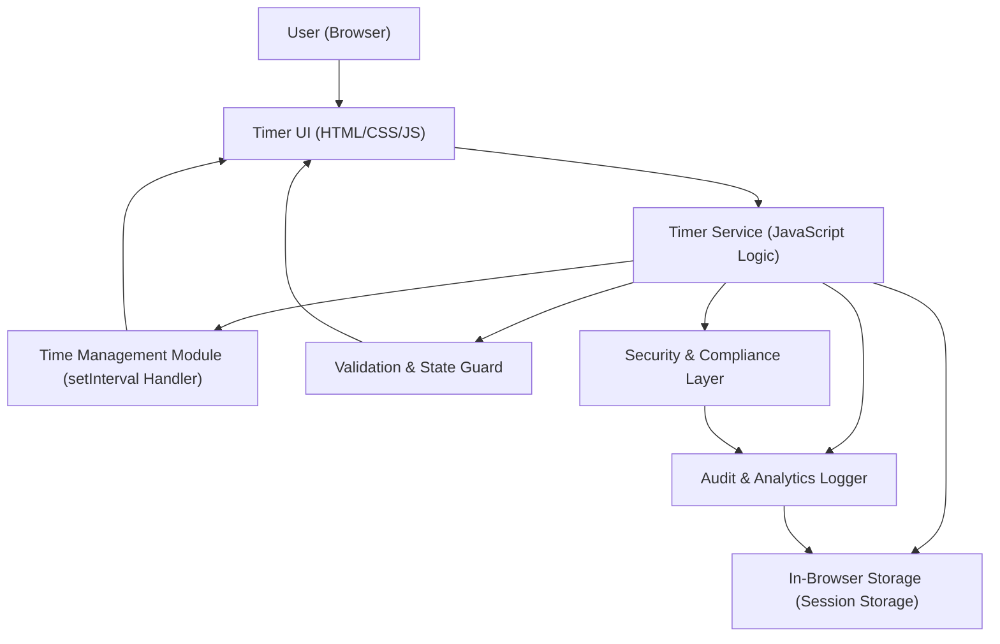

#### 1. High-Level Design

- Architecture Overview & Component Diagram:

- Component Descriptions:

  - **User (Browser)**  
    End user interacting with the timer through a modern web browser (desktop or mobile).

  - **Timer UI (HTML/CSS/JS)**  
    - White-background web page.  
    - Displays elapsed time in `HH:MM:SS`.  
    - Provides Start, Pause, and Stop buttons.  
    - Handles basic input events (button clicks).

  - **Timer Service (JavaScript Logic)**  
    - Central controller for timer operations.  
    - Maintains timer state: `idle`, `running`, `paused`.  
    - Provides functions: `startTimer()`, `pauseTimer()`, `stopTimer()`, `updateDisplay()`.  
    - Ensures only one timer instance runs at a time by tracking and managing a single interval ID.

  - **Time Management Module (setInterval Handler)**  
    - Encapsulates usage of `setInterval` / `clearInterval`.  
    - Calculates elapsed time differences using timestamps (e.g., `Date.now()` deltas) to keep consistent timing.  
    - Updates the Timer Service with current elapsed time.

  - **Validation & State Guard**  
    - Guards against invalid state transitions (e.g., starting an already running timer, pausing an idle timer).  
    - Ensures button actions are only accepted in valid states:
      - Start allowed when `idle` or `paused`.  
      - Pause allowed when `running`.  
      - Stop allowed when `running` or `paused`.  
    - Prevents multiple concurrent intervals through a single authoritative interval reference.

  - **Security & Compliance Layer**  
    - Applies secure coding and browser security best practices:
      - Input validation for any user-provided data (e.g., future enhancements such as naming sessions).  
      - Output encoding/escaping for UI text if any dynamic data is introduced.  
      - Ensures usage of HTTPS (TLS 1.3) in deployment configuration.  
      - Handles secrets management if any external services are added (none required in current scope).

  - **Audit & Analytics Logger**  
    - Optional module to log user actions in-memory or to browser storage for diagnostic purposes:
      - Events: Start, Pause, Stop, reset actions, and error conditions.  
    - Supports future integration with server-side logging or analytics (over secure channels using TLS 1.3).

  - **In-Browser Storage (Session Storage)**  
    - Optional mechanism to persist current elapsed time and state for page reload resilience in future enhancements (not required by current scope).  
    - Can store:
      - Current elapsed time.  
      - Current state (`idle`, `running`, `paused`).  
      - Last action timestamp.  

- Integration Points & Data Flow:

  1. **Page Load Initialization**  
     - Browser loads static assets (HTML/CSS/JS) from the web server over HTTPS.  
     - Timer UI initializes with:
       - White background.  
       - Display set to `00:00:00`.  
       - Buttons wired to event handlers in Timer Service.  
     - Timer Service sets initial state to `idle` and interval reference to `null`.

  2. **Start Button Flow**  
     - User clicks Start -> event captured in Timer UI.  
     - Timer UI calls `TimerService.startTimer()`.  
     - Validation & State Guard checks:
       - If current state is `idle` or `paused`.  
       - If no active interval is running.  
     - Time Management Module:
       - Records `startTimestamp` (for `idle`) or resumes using existing elapsed time (for `paused`).  
       - Creates a single `setInterval` to increment elapsed time (e.g., every 1000 ms).  
     - On each tick:
       - Time Management Module computes elapsed time.  
       - Timer Service formats time to `HH:MM:SS`.  
       - UI display is updated accordingly.  

  3. **Pause Button Flow**  
     - User clicks Pause -> Timer UI calls `TimerService.pauseTimer()`.  
     - Validation & State Guard verifies state is `running`.  
     - Time Management Module:
       - Calls `clearInterval` to stop updates.  
       - Captures current elapsed time.  
     - Timer Service transitions state to `paused`.  
     - UI remains showing the last elapsed value.  

  4. **Stop Button Flow**  
     - User clicks Stop -> Timer UI calls `TimerService.stopTimer()`.  
     - Validation & State Guard allows if state is `running` or `paused`.  
     - Time Management Module:
       - Calls `clearInterval` if running.  
       - Resets elapsed time to zero.  
     - Timer Service:
       - Sets state to `idle`.  
       - Updates display to `00:00:00`.  

  5. **Security & Compliance/Data Handling**  
     - For this epic, there is no back-end data transfer or storage of personal data.  
     - If integrated with back-end or analytics later, all calls must:
       - Use HTTPS (TLS 1.3).  
       - Use secure headers (CSP, X-Content-Type-Options, X-Frame-Options).  
       - Apply RBAC/ABAC if user identities are introduced.

- Security & Compliance Features:

  - **Enterprise Security Controls**

    - **Transport Security**  
      - Application must be served exclusively over HTTPS with TLS 1.3 enforced via infrastructure (web server, reverse proxy, or CDN configuration).  
      - HSTS should be configured at deployment level to prevent downgrade attacks.

    - **Input Validation & Output Filtering**  
      - Timer control inputs are strictly event-based (clicks on Start/Pause/Stop).  
      - Any future user input (e.g., labels, settings) must:
        - Be validated client-side for allowed characters and length.  
        - Be sanitized/escaped before rendering to avoid injection into DOM.  
      - UI updates rely on safe DOM manipulation (e.g., setting `textContent` instead of `innerHTML`).

    - **RBAC/ABAC**  
      - Current scope: No authentication or authorization. This is explicitly out of scope per PRD.  
      - Future extension guidance:
        - If user accounts or shared timers are introduced:
          - Role-Based Access Control (RBAC) to segregate admin vs standard users.  
          - Attribute-Based Access Control (ABAC) for context-based rules (e.g., time, device, environment).  

    - **Audit Logging**  
      - Front-end logging:
        - Capture and log errors and anomalous behavior in browser console (development) and optional in-browser buffer for diagnostics.  
      - Future server-side extension:
        - Log key events (start/pause/stop) with timestamps and anonymized identifiers over secure API calls.

    - **Secrets Management**  
      - Current build requires no secrets or keys.  
      - Future integrations (e.g., calling APIs) must:
        - Store API keys and secrets on server-side using a secure secrets manager.  
        - Never embed secrets in front-end code or static configuration.

    - **Cryptography (AES-256/TLS 1.3)**  
      - TLS 1.3 required for all client-server communications.  
      - If client-side or server-side storage of sensitive data is ever added:
        - Use AES-256 for data-at-rest encryption at the back-end.  
        - No cryptographic operations are required in the browser for the current basic timer.

  - **Compliance Features**

    - **Data Retention**  
      - Current implementation: No user data persisted, so retention is effectively immediate deletion.  
      - If analytics or logs are introduced:
        - Define retention periods based on applicable policies (e.g., 30–90 days for operational logs).  
        - Implement automatic log rotation and deletion on the server.

    - **Consent Management**  
      - No cookies or personal data by default.  
      - If cookies or tracking are introduced:
        - Present a clear consent banner compliant with relevant privacy regulations.  
        - Provide options to opt in/out of non-essential tracking.

    - **Data Lineage**  
      - For the current scope, no data lineage is needed as no personal or persistent data is collected.  
      - For extended implementations, document:
        - Data sources (client events).  
        - Data sinks (logs, analytics platforms).  

    - **Compliance Reporting**  
      - Provide architecture documentation and configurations that show:
        - Use of HTTPS/TLS 1.3.  
        - Absence or minimal use of personal data.  
      - If integrated into a regulated environment:
        - Maintain configuration evidence (infrastructure as code, certificates, logging policies) to support audits.

- Resiliency & Error Handling:

  - **Error Handling**

    - **JavaScript Error Handling**  
      - Wrap critical timer operations (`startTimer`, `pauseTimer`, `stopTimer`) with try/catch blocks to:
        - Prevent UI from locking on runtime errors.  
        - Log errors via the Audit & Analytics Logger.  

    - **State Inconsistency Handling**  
      - Validation & State Guard prevents illegal operations:
        - Ignore repeated Start requests when already running.  
        - Ignore Pause when idle.  
        - Ignore Stop when already at `00:00:00` and idle (optional).  
      - In case of state desync, reset:
        - If the interval handle is non-null but state is not `running`, clear interval and reset to `idle`.  

  - **Resiliency Patterns**

    - **Circuit Breaker (Conceptual for Future Back-End Calls)**  
      - If future enhancements call remote APIs (e.g., logging, analytics):
        - Implement a client-side circuit breaker:
          - After a configurable number of failed network calls, temporarily stop sending further requests.  
          - Provide backoff/retry behavior and local queuing if needed.  

    - **Retry Mechanisms**  
      - For current local-only implementation, no network retries are required.  
      - In future integrations:
        - Implement exponential backoff for transient network errors.  
        - Cap maximum retry attempts to avoid resource exhaustion.

    - **Graceful Degradation**  
      - If high-frequency intervals cause performance issues, increase tick interval (e.g., 1000 ms) and compute delta times using `Date.now()` to maintain accuracy.  
      - Ensure the application still displays a functional, albeit less precise, timer if advanced features fail.

    - **Browser Compatibility**  
      - Test and ensure consistent behavior across modern browsers (Chrome, Firefox, Edge, Safari).  
      - Use only widely supported JavaScript APIs (`setInterval`, `clearInterval`, `Date.now`) to minimize compatibility issues.

#### 2. Validation Report

- Requirements Coverage:

  - **From PRD – Timer Web Application / Epic Description:**

    1. **White application background.**  
       - Covered: Timer UI explicitly uses a white background as default style.  

    2. **The timer displays 00:00:00 on page load.**  
       - Covered: Initialization logic sets display to `00:00:00` when page loads and state is `idle`.  

    3. **Clicking Start begins the timer.**  
       - Covered: `startTimer()` transitions from `idle` or `paused` to `running`, starts interval, and updates display.  

    4. **Clicking Pause temporarily stops the timer while preserving the elapsed time.**  
       - Covered: `pauseTimer()` clears interval, preserves elapsed time, transitions state to `paused`, display remains unchanged.  

    5. **Clicking Start after Pause resumes the timer.**  
       - Covered: `startTimer()` from `paused` uses preserved elapsed time and resumes the timer using Time Management Module.  

    6. **Clicking Stop resets the timer to 00:00:00.**  
       - Covered: `stopTimer()` clears interval (if any), resets elapsed time to zero and display to `00:00:00`, and sets state to `idle`.  

    7. **Only one timer can run at a time.**  
       - Covered: Time Management Module maintains a single interval handle; Validation & State Guard prevents starting a new interval when one is active.  

    8. **The application works correctly in modern web browsers.**  
       - Covered: Design uses standard HTML/CSS/JS and APIs widely supported in modern browsers; includes compatibility considerations.  

    9. **NFR – Timer display updates consistently and accurately in HH:MM:SS format.**  
       - Covered: Time formatting function in Timer Service converts elapsed milliseconds to HH:MM:SS consistently; updates driven by a single interval based on `Date.now()` delta calculations.  

    10. **NFR – Minimal perceptible delay on user interactions (start, pause, stop).**  
        - Covered: All logic is client-side, using direct event handlers for immediate state changes; only local computation and DOM updates are involved, keeping latency minimal.  

- Compliance Status:

  - **Data Retention: Pass**  
    - No user data is persisted in the base implementation.  
    - Any future logs or analytics must define retention policies; this design allows easy isolation and deletion of log data.

  - **Consent Management: Pass (current scope)**  
    - No cookies, identifiers, or personal data are required for the base timer.  
    - If non-essential tracking is introduced in the future, consent management can be layered without impacting core timer behavior.

  - **Data Lineage: Pass (current scope)**  
    - No personal or persistent data is handled; lineage concerns are minimal.  
    - For future telemetry, a clear flow from browser events to secure endpoints is anticipated and can be documented.

  - **Transport Security (TLS 1.3): Pass (with deployment requirement)**  
    - Design prescribes deployment over HTTPS with TLS 1.3; actual compliance depends on infrastructure configuration, which must be enforced in operations.

  - **Encryption (AES-256): Not Applicable / Pass by Exemption**  
    - No sensitive data is stored or transmitted in the current scope; AES-256 is reserved for future back-end storage if added.

  - **RBAC/ABAC: Not Applicable / Pass by Exemption**  
    - PRD explicitly lists user authentication as out of scope; thus, RBAC/ABAC cannot be meaningfully applied.  
    - Design provides guidance for future enhancements if authentication is introduced.

- Identified Ambiguities/Risks:

  - **Ambiguity 1: Browser Compatibility Detail Level**  
    - PRD only states "modern web browsers" without explicitly listing versions or devices.  
    - Mitigation:
      - Use only standards-based APIs compatible with current versions of Chrome, Firefox, Edge, and Safari.  
      - Define a separate compatibility matrix in project documentation if required by the organization.

  - **Ambiguity 2: Timer Precision Requirements**  
    - PRD does not specify precision tolerance (e.g., allowed drift over long durations).  
    - Mitigation:
      - Use `Date.now()`-based elapsed time, which reduces drift compared to relying solely on `setInterval` ticks.  
      - If stricter precision is required, define explicit tolerances and add tests.

  - **Ambiguity 3: Local Persistence**  
    - PRD does not mention whether the timer should survive page refreshes.  
    - Mitigation:
      - Base design does not persist timer state; on refresh, timer resets to `00:00:00`.  
      - This aligns with minimalistic requirements and can be extended later using session storage if needed.

  - **Risk 1: Future Feature Creep (e.g., authentication, laps, history)**  
    - The PRD explicitly declares several features out of scope (countdown, laps, alarms, history, theme customization, user auth).  
    - Mitigation:
      - Architecture is modular so that future enhancements can be added without compromising the stability and simplicity of the current implementation.  
      - Security and compliance guidance is already embedded for a potential future back-end, reducing risk when expanding scope.

  - **Risk 2: Operational Security Drift**  
    - Actual TLS configuration and secure headers enforcement are operational concerns that may drift over time.  
    - Mitigation:
      - Infrastructure as code and automated security checks should be used to ensure HTTPS/TLS 1.3, HSTS and security headers remain correctly configured.  

  - **Risk 3: Error Handling Visibility**  
    - PRD does not describe how errors should be surfaced to users.  
    - Mitigation:
      - Current design assumes silent failure with console logging for non-critical issues.  
      - For critical failures (e.g., timer cannot start), the UI can display a simple non-technical error message while logging detailed diagnostics for developers.  
