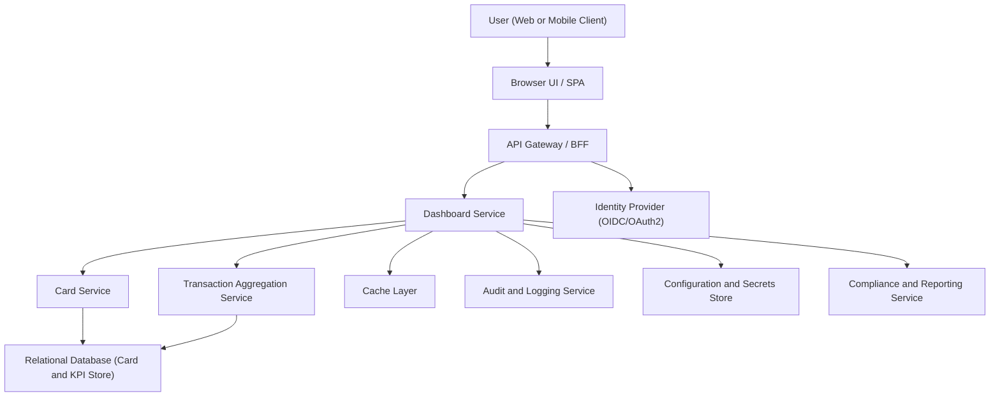

#### 1. High-Level Design

- Architecture Overview & Component Diagram:

- Component Descriptions:

  - User (Web or Mobile Client): End user using browser or mobile web to view the dashboard.
  - Browser UI / SPA: Responsive dashboard front-end (e.g., React, Angular, Vue) rendering KPIs, charts, and layouts for multiple cards.
  - API Gateway / BFF: Single entry point for the UI. Handles authentication, routing to backend services, request throttling, and response aggregation.
  - Dashboard Service:
    - Computes and exposes KPIs:
      - Monthly Spend (across cards).
      - Total Credit Limit.
      - Available Credit.
      - Outstanding Amount.
    - Orchestrates calls to Card Service and Transaction Aggregation Service.
    - Applies business rules for KPI calculation and formatting.
  - Card Service:
    - Manages card-level data: card name, masked identifier, credit limit, available credit, outstanding balance.
    - Provides per-card data to Dashboard Service.
  - Transaction Aggregation Service:
    - Aggregates transaction data for monthly spend and other derived KPIs.
    - Computes period-based aggregations across all cards.
  - Relational Database (Card and KPI Store):
    - Stores card metadata, card limits, outstanding balances, and precomputed or raw KPI inputs.
    - Stores transaction summaries necessary for dashboard KPIs.
  - Cache Layer:
    - Caches frequently accessed KPI results and card metadata to improve response times.
  - Identity Provider (OIDC/OAuth2):
    - Authenticates users and issues tokens.
    - Supports MFA as required by enterprise policy.
  - Audit and Logging Service:
    - Receives structured logs and audit events from Dashboard Service and API Gateway.
    - Stores access logs and KPI view events for compliance.
  - Configuration and Secrets Store:
    - Stores encrypted configuration values, database credentials, and external service keys.
    - Ensures secrets are never hardcoded or logged.
  - Compliance and Reporting Service:
    - Produces reports on data usage, access patterns, retention compliance, and privacy constraints.

- Integration Points & Data Flow:

  1. Authentication and Session Setup:
     - User initiates dashboard access via Browser UI.
     - Browser redirects to Identity Provider for login using TLS 1.3.
     - Upon successful authentication, the Identity Provider issues an access token (JWT or opaque token).
     - Browser stores token securely (e.g., HTTP-only secure cookie or secure storage as per enterprise guidelines).

  2. KPI Retrieval Flow:
     - Browser sends a GET request to API Gateway for “Dashboard KPIs” endpoint with the access token.
     - API Gateway validates token signature, issuer, and audience using Identity Provider’s public keys.
     - API Gateway applies RBAC checks based on claims (subject, roles, tenant).

     - Dashboard Service:
       - Receives request from API Gateway.
       - Checks cache for KPIs keyed by user and period.
       - If cache hit:
         - Returns cached KPI response to API Gateway.
       - If cache miss:
         - Calls Card Service to obtain:
           - Card list (per user).
           - Per-card credit limits, available credit, outstanding balance.
         - Calls Transaction Aggregation Service to obtain:
           - Monthly spend aggregated across all cards.
         - Applies business logic:
           - Total Credit Limit = sum of per-card limits.
           - Available Credit = sum of per-card available credit.
           - Outstanding Amount = sum of per-card outstanding balances.
           - Monthly Spend = aggregated amount across cards for the current month.
         - Stores or updates summary data in cache and optionally persists derived KPIs.
         - Returns response to API Gateway.

     - API Gateway passes the response to the Browser UI.
     - Browser renders KPIs and adjusts layout for responsive behavior (desktop, tablet, mobile).

  3. Card-Level Data Flow:
     - For underlying data synchronization:
       - Card Service reads and writes card metadata and balances from Relational Database.
       - Recalculations for available credit and outstanding balances occur after scheduled syncs or user-triggered events (within the scope of mock/internal integrations only).

  4. Audit and Compliance:
     - For each KPI invocation:
       - Dashboard Service publishes an audit event to Audit and Logging Service, including:
         - User identifier (pseudonymized where required).
         - Accessed resource (dashboard KPIs).
         - Timestamp and client context.
       - Compliance and Reporting Service consumes logs for data lineage and usage reports.

- Security & Compliance Features:

  - Enterprise Security Controls:

    - Transport Security:
      - All client-server and service-to-service communication uses HTTPS with TLS 1.3 enforced.
      - HSTS enabled at API Gateway level.

    - Data Encryption:
      - At Rest:
        - Relational Database uses AES-256 encryption for stored data (card metadata, KPI tables, and transaction summaries).
        - Disk-level or column-level encryption for sensitive attributes.
      - In Transit:
        - All internal microservice calls use mTLS where applicable.
        - Tokens and credentials are never transmitted over unencrypted channels.

    - Input Validation:
      - API Gateway:
        - Validates request size limits, rate limits, and basic schema conformance.
        - Rejects malformed JSON or unexpected parameters.
      - Dashboard Service:
        - Validates date ranges, filters, and pagination parameters.
        - Enforces whitelist-based validation for enumerated fields (e.g., period type).
      - UI:
        - Performs basic client-side validation but does not rely solely on it.

    - Output Filtering:
      - Card Service returns only non-sensitive card identifiers (e.g., masked card numbers or aliases).
      - No full card numbers, CVVs, or personal identifiers are exposed in dashboards.
      - Responses are filtered to include only fields required for dashboard KPIs.

    - Authentication and Authorization:
      - Identity Provider issues tokens with roles and scopes.
      - RBAC:
        - Roles such as “EndUser” are allowed to access only their own dashboard KPIs.
        - Administrative roles restricted to aggregated or anonymized data where applicable.
      - ABAC:
        - Attribute-based checks enforce that user can only access dashboards tied to their user ID and tenant or segment attributes.

    - Audit Logging:
      - Dashboard Service logs:
        - Access events for dashboard endpoints.
        - Security-relevant events (authorization failures, unusual usage).
      - Logs sent to centralized Audit and Logging Service with immutable storage (e.g., WORM-compliant).
      - Logs are redact-safe (no secrets, no full PAN, no sensitive PII).

    - Secrets Management:
      - All secrets (database credentials, keys, API tokens) stored in Configuration and Secrets Store.
      - Rotated regularly and never written to logs or client.
      - Services obtain secrets via short-lived tokens and secure channels.

  - Compliance Features:

    - Data Retention:
      - KPI-related data is retained based on policy:
        - Transaction aggregates retained only as long as necessary for trend analysis.
        - Raw transaction identifiers beyond the scope of aggregated KPIs are not retained in this epic’s data model (aligned with the stated scope).
      - Scheduled jobs enforce deletion or anonymization after retention window expiry.

    - Consent Management:
      - Dashboard depends on existing consent obtained at account registration.
      - Access to dashboard is limited to users with valid consent status in user profile (checked via Identity Provider attributes or user-service metadata).

    - Data Lineage:
      - Each KPI computation stores metadata about:
        - Source dataset (card table, transaction summary table).
        - Calculation timestamp and version of calculation logic.
      - Compliance and Reporting Service provides lineage view indicating which data sources contributed to each KPI.

    - Compliance Reporting:
      - Regular reports (e.g., monthly) generated:
        - Access volumes per user segment.
        - KPI computation statistics.
        - Data deletion or anonymization metrics aligned with retention policies.

- Resiliency & Error Handling:

  - Circuit Breakers:
    - Dashboard Service implements circuit breakers when calling:
      - Card Service.
      - Transaction Aggregation Service.
    - On repeated failures, calls use fallbacks:
      - Serve last known KPI values from cache, clearly marked as “last updated at timestamp”.
      - Return partial KPIs with explanatory messages if some services are unavailable.

  - Retry Mechanisms:
    - Idempotent requests to Card Service and Transaction Aggregation Service use limited retries with exponential backoff.
    - Retries are bounded to avoid cascading failures and overload.

  - Timeouts:
    - Strict timeouts configured per service call to avoid blocking UI.
    - If backend services exceed timeouts, Dashboard Service returns partial or degraded responses.

  - Error Handling Patterns:
    - API Gateway translates backend errors into user-friendly HTTP responses:
      - 4xx for client errors (invalid inputs, unauthorized).
      - 5xx for transient server errors with generic messaging.
    - Dashboard Service:
      - Logs detailed technical errors with correlation IDs.
      - Returns correlation IDs to client for support tracing (without leaking internal details).

  - Observability:
    - Metrics and tracing:
      - Request latency, error rates, cache hit ratio.
      - Instrumentation with distributed tracing to track calls across Gateway, Dashboard Service, Card Service, and Transaction Aggregation Service.
    - Alerts:
      - Threshold-based alerts on latency and error rates.
      - Alerts routed to operations team for timely remediation.

#### 2. Validation Report

- Requirements Coverage:

  - Project Overview and Business Objectives:
    - The architecture supports a modern, responsive dashboard where users can monitor:
      - Multiple credit cards.
      - Spending and outstanding balances.
      - Financial insights via aggregated KPIs.
    - Consolidated view:
      - The Dashboard Service aggregates card-level and transaction-level data, satisfying the requirement for consolidated multi-card visibility.

  - Dashboard KPIs:
    - Monthly Spend:
      - Provided by Transaction Aggregation Service and surfaced on the dashboard.
    - Total Credit Limit:
      - Aggregated from Card Service per-card limits.
    - Available Credit:
      - Aggregated from per-card available credit.
    - Outstanding Amount:
      - Aggregated from per-card outstanding balances.
    - All required KPIs are explicitly modeled in the Dashboard Service and data flow.

  - Multiple Credit Cards:
    - Dashboard architecture integrates with Card Service returning multiple cards for the logged-in user.
    - UI is designed to render aggregated KPIs across multiple cards, aligning with the “Multiple Credit Cards” must-have requirement.

  - Monthly Spend Trends and Card-wise Spend Analysis:
    - For QE-3762, scope focuses on KPIs and summary.
    - Integration with Transaction Aggregation Service ensures monthly aggregated spend is available to this epic.
    - Card-wise and trend visualizations are supported by other epics but the KPI calculations and data availability are included in this design, ensuring foundational support.

  - Category-wise Spending Analytics:
    - QE-3762 does not directly surface category-wise charts but:
      - The design allows integration with category analytics by reusing Transaction Aggregation Service outputs.
      - Ensures KPIs are computed in a way that does not block future category-level analytics.

  - Scope and Out-of-Scope:
    - In Scope:
      - Dashboard KPIs, multiple credit cards, transactions as aggregates.
      - Design is limited to summarization and viewing; no payment or transfer flows.
    - Out of Scope:
      - Real bank integration, card payments, fund transfers, loans, payment gateway.
      - Design respects these constraints by assuming internal or mock data sources only.

  - Non-Functional Requirements (NFRs):
    - Responsive Dashboard:
      - UI architecture supports responsive layouts for modern devices.
      - KPI endpoints optimized with caching and aggregated queries.
    - Performance:
      - Caching and efficient aggregation reduce latency.
      - Circuit breakers and timeouts prevent slow downstream services from blocking the UI.
    - Security:
      - AES-256 at rest and TLS 1.3 in transit.
      - RBAC/ABAC controls at Gateway and service layers.
      - No unnecessary exposure of sensitive card identifiers or transaction details.

- Compliance Status:

  - Data Retention:
    - Aggregated KPI data retained per policy.
    - Raw transaction details are not retained beyond what is needed for KPI computation within this epic’s design.
    - Automated retention jobs enforce deletion/anonymization.
    - Status: Pass, assuming policies and jobs are implemented as described.

  - Privacy and Data Minimization:
    - Card identifiers are masked; sensitive data avoided in UI.
    - Output filtering ensures only necessary data for KPIs is exposed.
    - Status: Pass.

  - Consent and Lawful Basis:
    - Design assumes consent is captured at account registration and reflected as attributes in Identity Provider or related user profile service.
    - Access checks ensure only consented users can view dashboards.
    - Status: Pass, contingent on integration with existing consent records.

  - Data Lineage and Reporting:
    - KPIs annotated with source and computation metadata.
    - Audit and Logging Service plus Compliance and Reporting Service provide lineage and reporting capabilities.
    - Status: Pass.

- Identified Ambiguities/Risks:

  - Ambiguity: Level of Detail in Transaction Data for KPIs:
    - Risk:
      - Requirements do not specify whether KPI calculations must be based on near-real-time raw transactions or pre-aggregated summaries.
    - Mitigation:
      - Design allows both:
        - Transaction Aggregation Service can consume raw transactions or precomputed aggregates.
        - Clear contracts specify aggregation windows and latency expectations.

  - Ambiguity: Specific Latency Targets for KPI Refresh:
    - Risk:
      - NFRs state KPIs “should refresh within acceptable UI latency” but no quantitative SLA is provided (e.g., 95th percentile latency).
    - Mitigation:
      - Define explicit SLAs during implementation phase (for example, 95th percentile < 500 ms for KPI endpoint) and track via observability metrics.

  - Ambiguity: Mobile vs Desktop Feature Parity:
    - Risk:
      - Requirements emphasize “responsive layout” without stating whether all features must be identical across form factors.
    - Mitigation:
      - Adopt a mobile-first layout with functional parity for KPIs, ensuring any deviations are documented and validated with stakeholders.

  - Risk: Data Source Validity and Mocking:
    - Risk:
      - Since real bank integration is out of scope, KPI correctness depends on quality of internal or mock data sources.
    - Mitigation:
      - Establish test data generation and synthetic datasets with known KPI outputs.
      - Define clear boundaries so that future real integrations can replace mock feeds without architectural changes.

  - Risk: Overlapping Responsibilities Across Epics:
    - Risk:
      - Monthly trends and card-wise analytics epics also manipulate transaction aggregates.
    - Mitigation:
      - Ensure shared services (Transaction Aggregation Service, Card Service) are single sources of truth.
      - Define a common domain model to avoid duplicated logic and inconsistencies between this epic and related analytics epics.