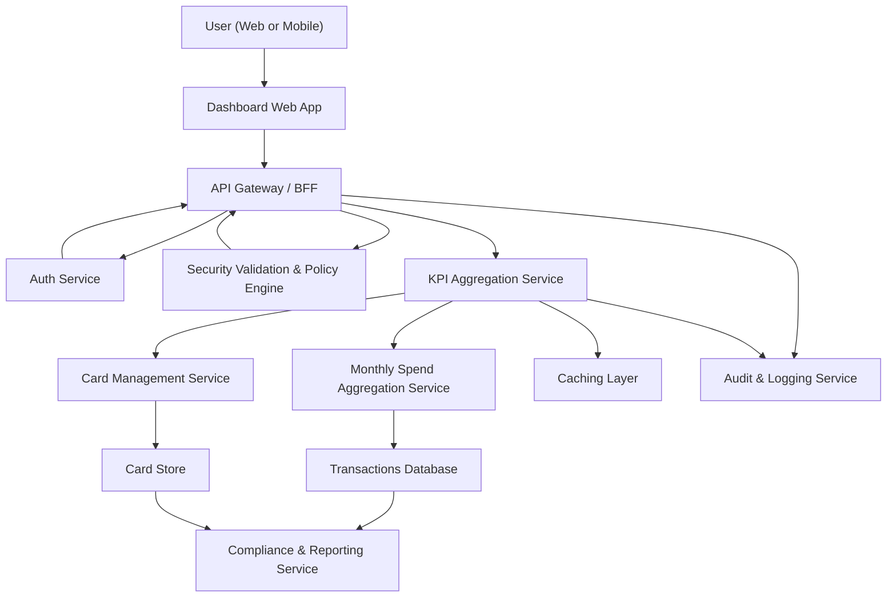

#### 1. High-Level Design

- Architecture Overview & Component Diagram:

- Component Descriptions:

  - **User (Web or Mobile Client)**: Consumer of dashboard KPIs.
  - **Dashboard Web App**: Presents an overview dashboard with key metrics across all cards and periods.
  - **API Gateway / BFF**: Exposes `/dashboard/kpis` endpoint aggregating data for one call.
  - **Auth Service**: Manages authentication.
  - **Security Validation & Policy Engine**: Validates token, enforces RBAC/ABAC for multi-card data.
  - **KPI Aggregation Service**: Central service that composes KPIs:
    - Monthly spend KPI.
    - Total credit limit KPI.
    - Available credit KPI.
    - Outstanding amount KPI.
  - **Card Management Service**: Provides card-level limits and balances.
  - **Monthly Spend Aggregation Service**: Provides monthly spend metrics built in QE-3821.
  - **Caching Layer**: Caches KPI aggregates for fast dashboard loads.
  - **Card Store & Transactions Database**: Underlying sources for card and transactional data.
  - **Audit & Logging Service**: Logs dashboard KPI access.
  - **Compliance & Reporting Service**: Supports compliance by tracking usage of aggregates and enforcing retention policies.

- Integration Points & Data Flow:

  1. **Dashboard KPI Load**:
     - Dashboard calls `/dashboard/kpis` when user opens the overview.
     - Security Validation ensures user authorization.
     - KPI Aggregation Service is invoked by API Gateway.

  2. **KPI Computation**:
     - KPI Aggregation Service checks cache for existing dashboard KPI values.
     - On cache miss:
       - Calls Card Management Service to get:
         - Total credit limit per card and per user.
         - Available credit per card.
         - Outstanding amount per card.
       - Calls Monthly Spend Aggregation Service for:
         - Current month’s total spend.
       - Aggregates across cards:
         - Total credit limit KPI: sum of per-card limits.
         - Available credit KPI: sum of per-card available credit.
         - Outstanding amount KPI: sum of per-card outstanding.
         - Monthly spend KPI: total monthly spend from Monthly Spend Aggregation Service.
     - Stores computed KPIs in cache with short TTL to balance freshness and performance.

  3. **Responsive Layout and Device Support**:
     - Dashboard Web App uses responsive layouts to arrange KPIs for desktop and mobile devices, ensuring legibility and adherence to NFRs.

  4. **Audit & Compliance**:
     - KPI Aggregation Service logs each KPI request with user, timestamp, and aggregated context.
     - Compliance & Reporting Service uses these logs to support reporting and data lineage.

- Security & Compliance Features:

  - **TLS 1.3** for all client and internal communications.
  - **AES-256 Encryption** for card and transaction data at rest supporting KPI computation.
  - **RBAC/ABAC**:
    - Single user’s KPIs are computed only from their own cards and transactions.
    - No cross-user aggregation in this use case; if organizational insights are ever added, they are controlled separately.
  - **Input Validation**:
    - For optional parameters (e.g., selected period), validate date inputs and allowed ranges.
  - **Output Filtering**:
    - Expose only high-level KPIs, not detailed per-card or per-transaction data via this endpoint.
  - **Audit Logging**:
    - Logs include which KPIs were requested, supporting lineage from KPI to data source.
  - **Secrets Management**:
    - As with other epics, credentials stored securely and rotated.

- Resiliency & Error Handling:

  - **Retries** for calls from KPI Aggregation Service to Card Management and Monthly Spend Aggregation services.
  - **Circuit Breakers**:
    - If Card Management Service is unavailable:
      - Use last-known KPI values from cache, with a “data as of” timestamp for transparency.
    - If Monthly Spend Aggregation Service is unavailable:
      - Show KPIs without monthly spend or display last-known value with a warning UI state.
  - **Graceful Degradation**:
    - Dashboard still loads with partial KPIs rather than failing entirely.
  - **Monitoring**:
    - Ensure dashboard loads within acceptable latency thresholds; monitor p95 and p99 response times.

#### 2. Validation Report

- Requirements Coverage:

  - Display monthly spend KPI:
    - Monthly Spend Aggregation Service and KPI Aggregation Service compute and expose this value.
  - Display total credit limit KPI:
    - Summed across cards from Card Management Service.
  - Display available credit KPI:
    - Summed across cards from Card Management Service.
  - Display outstanding amount KPI:
    - Summed across cards from Card Management Service.
  - Consolidated summary across all cards:
    - KPI Aggregation Service provides user-level consolidated metrics for the overview dashboard.
  - Responsive dashboard layouts:
    - Dashboard Web App is specified as responsive, with layout patterns that scale across desktop and mobile.

- Compliance Status:

  - Data Retention:
    - Pass; KPIs are derived from data subject to retention policies and can be recomputed as needed.
  - Privacy:
    - Pass; KPIs are aggregates that do not expose PII.
  - Encryption and Transport Security:
    - Pass; AES-256 at rest and TLS 1.3 in transit.
  - Consent & Lineage:
    - Pass; lineage links KPI calculations back to underlying datasets, and consent applies to their usage.

- Identified Ambiguities/Risks:

  - Ambiguity: Frequency of KPI recomputation and acceptable staleness.
    - Mitigation: Define TTLs (e.g., recompute on login and after N minutes) and indicate “last updated” time.
  - Risk: Inconsistent KPI views if card or transaction data is delayed or temporarily unavailable.
    - Mitigation: Implement monotonic update strategies and clear UX indicators when data is stale or partial.
  - Ambiguity: Handling of multiple currencies if introduced.
    - Mitigation: Define currency strategy (single base currency with conversion rates) and document assumptions.
