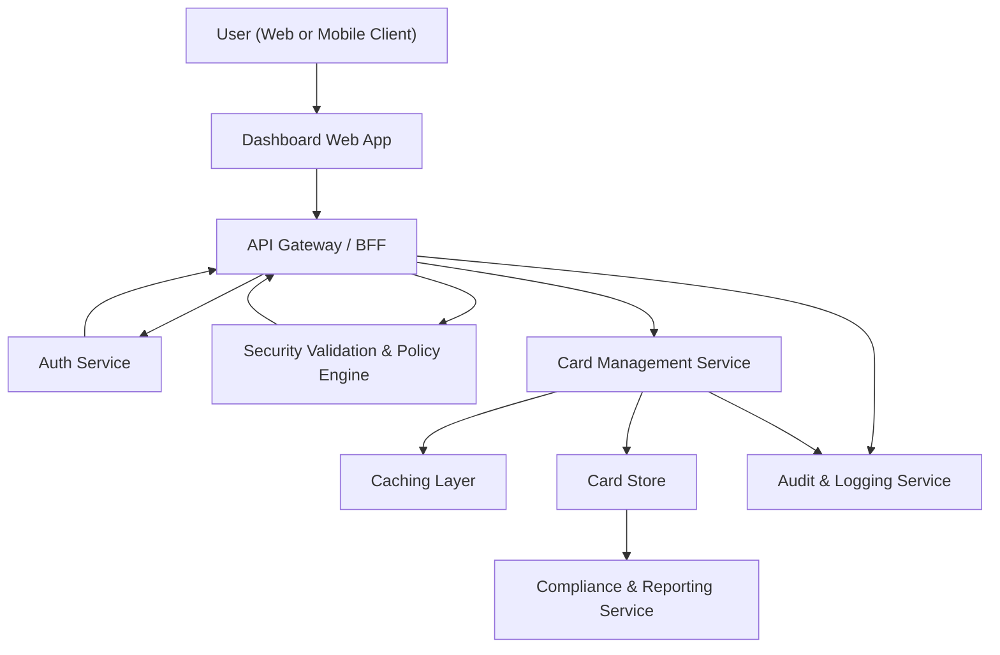

#### 1. High-Level Design

- Architecture Overview & Component Diagram:

- Component Descriptions:

  - **User (Web or Mobile Client)**: End users with one or multiple credit cards.
  - **Dashboard Web App**: UI module that lists cards and shows card-level metrics (limit, available, outstanding).
  - **API Gateway / BFF**: Provides card-related endpoints tailored for the dashboard, e.g., `/cards` and `/cards/{id}`.
  - **Auth Service**: Authenticates users.
  - **Security Validation & Policy Engine**: Ensures users only see their own cards; enforces multi-tenant separation.
  - **Card Management Service**: Aggregates card-level data and exposes endpoints for card lists and details.
  - **Card Store**: Persists card metadata, mock credit limits, outstanding balances, and status for each card.
  - **Caching Layer**: Stores frequently accessed card lists per user for faster responses.
  - **Audit & Logging Service**: Tracks card data access.
  - **Compliance & Reporting Service**: Oversees retention rules for card records and reports.

- Integration Points & Data Flow:

  1. **Card List Retrieval**:
     - Dashboard calls `/cards` endpoint.
     - Auth and Security Validation ensure the user is authorized.
     - Card Management Service:
       - Checks cache for card list.
       - On cache miss, queries Card Store by user identifier.
     - Card Management Service responds with a list including per-card:
       - Masked card identifier or display name.
       - Total credit limit.
       - Available credit.
       - Outstanding amount.
       - Optional status (active/inactive).

  2. **Card Selection and Detail View**:
     - Dashboard allows user to select a card; calls `/cards/{cardId}` for detailed view.
     - Security engine ensures the card belongs to the user.
     - Card Management Service returns card-specific metrics and passes them to other modules (e.g., monthly spend, category analytics).

  3. **Integration with Other Epics**:
     - Card identifiers in Card Store serve as keys to:
       - Transaction data (Epic QE-3821).
       - Category-wise analytics (Epic QE-3822).
       - KPI aggregation (Epic QE-3819).

- Security & Compliance Features:

  - **TLS 1.3** for communication.
  - **AES-256 encryption** for card metadata at rest in Card Store.
  - **RBAC/ABAC**:
    - Users access only cards mapped to their userId/tenantId.
    - Administrators or auditors have restricted views with masking.
  - **Input Validation**:
    - Card IDs passed as path parameters are validated for format, length, and authorization.
  - **Output Filtering**:
    - Only masked card identifiers and non-sensitive metadata are returned.
  - **Audit Logging**:
    - All card list and detail access is logged with user, card references, and timestamp.
  - **Secrets Management**:
    - DB credentials and any service tokens stored in a secrets manager.

- Resiliency & Error Handling:

  - **Retries** for Card Store read operations with limited attempts.
  - **Circuit Breakers** around Card Store:
    - If open, Card Management Service returns card data from cache if available.
    - Dashboard shows last-known card states or a graceful message.
  - **Performance Considerations**:
    - Card list retrieval optimized with indexing and caching to support “reasonable number of cards per user” without degradation.

#### 2. Validation Report

- Requirements Coverage:

  - List all configured credit cards:
    - `/cards` endpoint provides this list per user.
  - Show card-level total credit limit:
    - Card Store and Card Management Service provide this metric.
  - Show card-level available credit:
    - Derived as `limit - outstanding` or stored directly in Card Store.
  - Show card-level outstanding amount:
    - Stored or computed from transactions; exposed via card detail endpoint.
  - Support viewing and switching between multiple cards:
    - Dashboard Web App supports selection and navigation between cards using card identifiers.

- Compliance Status:

  - Data Retention:
    - Pass, with retention rules for card metadata (typically longer-lived than transactions, but governed by organizational policy).
  - Privacy:
    - Pass, given masking of card identifiers and lack of real PANs or real bank integration.
  - Encryption and Transport Security:
    - Pass via AES-256 and TLS 1.3.
  - Consent & Lineage:
    - Pass, as card data is internal/mocked and used solely for dashboard functionality.

- Identified Ambiguities/Risks:

  - Ambiguity: Exact definition of “reasonable number of cards per user.”
    - Mitigation: Define and test upper bounds (e.g., 20–50 cards) and ensure UI and performance remain acceptable.
  - Risk: Potential inconsistency between Card Store metrics and computed analytics from transactions.
    - Mitigation: Define authoritative source for card metrics and implement reconciliation jobs.
  - Ambiguity: Handling of closed or inactive cards in the UI.
    - Mitigation: Add card status field and UX rules (e.g., filter out closed cards by default).
