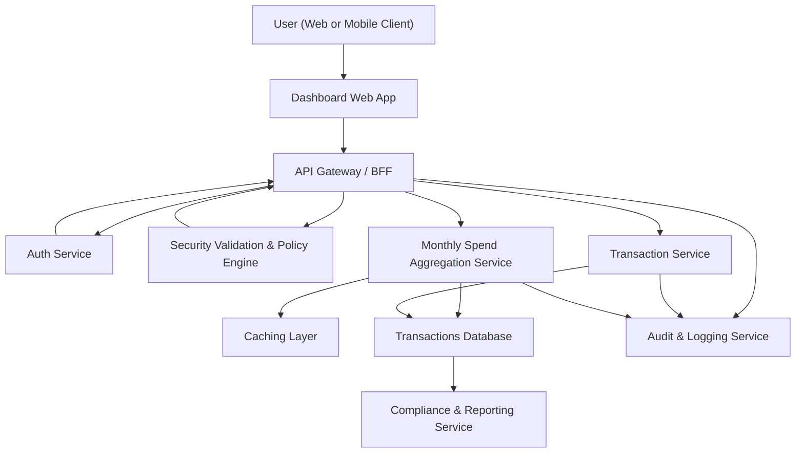

#### 1. High-Level Design

- Architecture Overview & Component Diagram:

- Component Descriptions:

  - **User (Web or Mobile Client)**: Consumer of monthly spend and transaction-level insights.
  - **Dashboard Web App**: Provides monthly spend KPIs and transaction lists with filters (e.g., by month, card).
  - **API Gateway / BFF**: Orchestrates calls to Transaction Service and Monthly Spend Aggregation Service, providing a tailored API for the dashboard.
  - **Auth Service**: Authenticates users and issues tokens.
  - **Security Validation & Policy Engine**: Enforces authorization, validates input, and ensures users only see their own transactions.
  - **Transaction Service**: Primary service for transaction retrieval, CRUD-like operations for internal/mocked data.
  - **Monthly Spend Aggregation Service**: Aggregates monthly spend from transaction data, computes trends, and aligns with dashboard KPIs.
  - **Caching Layer**: Stores monthly aggregates per user/card for performance.
  - **Transactions Database**: Stores all transaction records for users’ credit cards.
  - **Audit & Logging Service**: Captures access to sensitive transaction data.
  - **Compliance & Reporting Service**: Manages retention, privacy controls, and reporting for transaction data.

- Integration Points & Data Flow:

  1. **Monthly Spend Overview**:
     - Dashboard calls `/spend/monthly-summary?month={m}&year={y}` via API Gateway.
     - Auth and Security Validation ensure user is authorized.
     - API Gateway calls Monthly Spend Aggregation Service.
     - Monthly Spend Aggregation Service:
       - Checks cache for monthly aggregate.
       - On cache miss, queries Transactions Database (or via Transaction Service).
       - Aggregates total monthly spend per user and optionally per card.
       - Stores computed aggregate in cache.
     - API Gateway returns summary (total spend, trend vs prior month) to Dashboard.

  2. **Transaction-Level Views**:
     - Dashboard calls `/transactions?month={m}&year={y}&cardId={optional}`.
     - Security Validation ensures only transactions belonging to the user are returned.
     - Transaction Service queries Transactions Database and returns a paginated list.
     - Output filtering removes unnecessary PII and internal fields.

  3. **Dashboard Integration**:
     - Dashboard integrates:
       - Monthly spend KPI.
       - Transaction list view for the selected period.
       - Trend charts (optional) by calling Monthly Spend Aggregation Service for current and previous months.

  4. **Audit & Compliance**:
     - Each transactions query is logged by Audit & Logging Service.
     - Compliance & Reporting Service consumes logs and data for retention enforcement and lineage.

- Security & Compliance Features:

  - **TLS 1.3** for all communications between client and backend and between internal services.
  - **AES-256 Encryption** for:
    - Transaction data at rest.
    - Backups and any exported datasets.
  - **RBAC/ABAC**:
    - End users can access only their own transactions.
    - Support or audit roles see masked or aggregated data based on policy.
  - **Input Validation**:
    - Validate date filters, card identifiers, page sizes, and sorting options; block injection patterns.
  - **Output Filtering**:
    - Suppress or mask any sensitive attributes (e.g., merchant-specific PII if present).
    - Return only necessary fields (date, amount, category, masked card label).
  - **Audit Logging**:
    - Logs user, filters, and result sizes for transaction queries, enabling traceability.
  - **Secrets Management** similar to Epic QE-3822, ensuring no secrets in code.

- Resiliency & Error Handling:

  - **Retries** on read-only DB operations via Monthly Spend Aggregation and Transaction Service, with backoff and maximum limits.
  - **Circuit Breakers** around Transactions Database; on open:
    - Use cached monthly summaries.
    - Return partial data or “data unavailable” for transaction lists with clear UX messaging.
  - **Graceful Degradation**:
    - If trends cannot be computed, still show current month totals.
  - **Monitoring**:
    - Track query latency, DB health, and cache hit rates.

#### 2. Validation Report

- Requirements Coverage:

  - Present monthly spending:
    - Monthly Spend Aggregation Service and corresponding dashboard widgets cover this.
  - Show transaction-level views:
    - Transaction Service with `/transactions` endpoint provides paginated transaction lists.
  - Monitor recent usage and monthly changes:
    - Dashboard integrates monthly summary and trends; cross-month comparisons supported by repeated calls to aggregation service.
  - Accurate monthly spend from transactions:
    - Aggregation computed directly from transaction records with well-defined filters (month/year, inclusive boundaries).
  - Alignment with dashboard KPIs:
    - Monthly spend outputs feed dashboard KPIs and cross-epic KPI modules.

- Compliance Status:

  - Data Retention:
    - Pass, subject to configured retention policies for transactions and logs.
  - Privacy:
    - Pass, given use of masking, minimal outputs, and strict access controls.
  - Encryption and Transport Security:
    - Pass via AES-256 and TLS 1.3.
  - Consent & Lineage:
    - Pass if consent is checked prior to any analytics usage of transaction data and lineage metadata is captured.

- Identified Ambiguities/Risks:

  - Ambiguity: Exact definition of “monthly” boundaries (time zones, posting date vs transaction date).
    - Mitigation: Document and standardize date semantics (e.g., user-local time zone, posting date).
  - Risk: Performance degradation with large transaction volumes.
    - Mitigation: Use pagination, indexing on date and user, and pre-aggregation for heavy periods.
  - Ambiguity: Level of detail shown in transactions regarding merchant or location.
    - Mitigation: Align with privacy policies and mask or generalize sensitive details.
