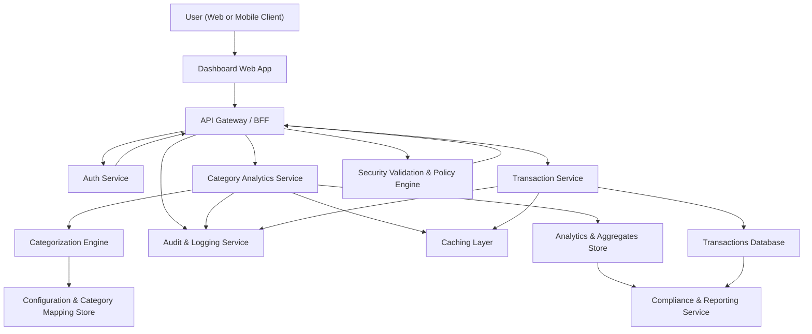

#### 1. High-Level Design

- Architecture Overview & Component Diagram:

- Component Descriptions:

  - **User (Web or Mobile Client)**: Browser or mobile app rendering the credit card analysis dashboard, including category-wise spend charts.
  - **Dashboard Web App**: Frontend UI (SPA or responsive web) that calls backend APIs to fetch category-wise spend data and renders visualizations (e.g., bar, donut charts).
  - **API Gateway / BFF**: Single entry point for frontend, handling routing, rate limiting, request normalization, and response aggregation.
  - **Auth Service**: Handles user authentication (OIDC/OAuth2), issues tokens, supports MFA where applicable.
  - **Security Validation & Policy Engine**: Applies input validation, output filtering, RBAC/ABAC checks, and data access policies per user.
  - **Category Analytics Service**: Backend domain service that aggregates spend by category from transaction data and prepares analytics responses for the dashboard.
  - **Transaction Service****: Provides access to transaction records per user and card, including category tags; here backed by mocked or internal data as per scope.
  - **Categorization Engine**: Encapsulates deterministic logic that maps raw transaction attributes (merchant, MCC, tags) to canonical categories (Food & Dining, Fuel, etc.).
  - **Configuration & Category Mapping Store**: Holds category definitions, mapping rules, and versioned configurations for deterministic categorization.
  - **Caching Layer**: Caches frequently accessed category aggregations per user and month to ensure responsive visualizations.
  - **Transactions Database**: Stores transaction-level data (mocked/simulated in this project) with card references, amounts, timestamps, and category attributes.
  - **Analytics & Aggregates Store**: Stores precomputed or materialized views of category-wise spend per user, card, and period.
  - **Audit & Logging Service**: Centralized, immutable logging of access, changes to mappings, and analytics queries for traceability.
  - **Compliance & Reporting Service**: Generates reports and feeds for compliance (data usage, lineage, retention enforcement, and consent evidence).

- Integration Points & Data Flow:

  1. **User Login and Access**:
     - User accesses the dashboard via web or mobile.
     - Dashboard Web App redirects to Auth Service for authentication (OIDC/OAuth2).
     - Auth Service issues a token; Dashboard stores it in a secure, HTTP-only context and uses it for subsequent API calls.

  2. **Category-wise Spend Retrieval**:
     - Dashboard calls the API Gateway endpoint `/analytics/category-spend?period={month}&cardId={optional}`.
     - API Gateway validates token via Auth Service and forwards the request to Security Validation & Policy Engine.
     - Security engine enforces RBAC/ABAC:
       - Ensures user is authorized to view the specified card(s).
       - Applies attribute-based checks (e.g., owner, tenant, environment).
     - API Gateway routes the request to the Category Analytics Service.

  3. **Aggregation Workflow**:
     - Category Analytics Service first checks the Caching Layer for precomputed aggregations for the requested user and period.
     - On cache miss:
       - Category Analytics Service calls Transaction Service for transactions:
         - `GET /transactions?userId={id}&period={month}` (or equivalent).
       - Transaction Service queries Transactions Database (filtered for the user and period).
       - For transactions missing category fields or where categorization must be (re)applied, Category Analytics Service calls Categorization Engine.
       - Categorization Engine loads rules from Configuration & Category Mapping Store and deterministically assigns categories.
       - Category Analytics Service aggregates amounts per category (Food & Dining, Fuel, etc.) and persists the aggregated result into Analytics & Aggregates Store.
       - Category Analytics Service updates the caching layer with these aggregates.

  4. **Response to Client**:
     - Category Analytics Service returns a normalized JSON response (e.g., array of `{category, totalAmount, currency}`) to API Gateway.
     - Output filtering is applied by Security Validation & Policy Engine (masking or removing any unnecessary PII).
     - API Gateway sends the sanitized response to Dashboard Web App.
     - Dashboard renders charts using client-side visualization components (e.g., bar charts, donut charts).

  5. **Audit & Compliance**:
     - All calls to Category Analytics and Transaction Service are logged via Audit & Logging Service (including user, card references, timestamp, and purpose).
     - Compliance & Reporting Service periodically scans Analytics & Aggregates Store and Transactions Database for data retention policies and lineage tracking.

- Security & Compliance Features:

  - **Transport Security (TLS 1.3)**:
    - All client-server communication is over HTTPS using TLS 1.3.
    - Strict TLS configurations: strong cipher suites, HSTS, and certificate pinning where applicable.

  - **Data Protection & Encryption (AES-256)**:
    - Transaction and analytics data at rest in Transactions Database and Analytics & Aggregates Store are encrypted with AES-256.
    - Keys are managed by a centralized KMS; key rotation policies are enforced.
    - Sensitive fields (e.g., truncated card identifiers) are stored in encrypted or tokenized form; full PAN and real bank data are out of scope and not present.

  - **Input Validation & Output Filtering**:
    - All user inputs (filters like period, cardId) are validated at API Gateway:
      - Type checking, whitelisting of allowed parameters, length constraints, and regex-based validation for identifiers.
    - Output is filtered to:
      - Return only aggregates and non-PII attributes.
      - Avoid leaking internal IDs, configurations, or debug info.
      - Only permitted categories and numeric amounts are exposed.

  - **RBAC/ABAC**:
    - RBAC defines roles (e.g., EndUser, SupportViewer, Auditor).
    - ABAC enforces ownership and tenant-level segregation:
      - User can only access category-wise analytics for cards bound to their userId/tenantId.
      - Support/Audit roles access only de-identified or aggregated data, based on policies.
    - Policies are centralized in the Security Validation & Policy Engine and evaluated on each request.

  - **Audit Logging**:
    - All analytics requests log:
      - User identifier (pseudonymized where required).
      - Card references (tokenized).
      - Accessed time period and categories.
      - Purpose (analytics visualization).
    - Logs are immutable and retained per the retention policies; access to logs is controlled via RBAC.

  - **Secrets Management**:
    - All service credentials (DB passwords, KMS keys, API secrets) are stored in a secrets manager.
    - No secrets in code, configs under version control, or logs.
    - Access to secrets is controlled via least-privilege IAM policies.

  - **Compliance (Data Retention, Consent, Data Lineage)**:
    - Data retention rules define:
      - How long transaction and analytics data is retained (e.g., N months/years).
      - Automated purging and archival workflows are executed by Compliance & Reporting Service.
    - Consent management:
      - Users’ consent for analytics is recorded (e.g., in user profile), and Category Analytics Service checks consent before processing.
      - If consent is revoked, future aggregation requests are denied or return limited data.
    - Data lineage:
      - Each aggregate record in Analytics & Aggregates Store has metadata linking back to source transaction IDs (or hashed identifiers).
      - This enables traceability of how a category-wise sum was derived.

- Resiliency & Error Handling:

  - **Retries & Timeouts**:
    - Category Analytics Service uses bounded retries with exponential backoff when calling Transaction Service, subject to idempotency.
    - Timeouts are configured per call to avoid cascading latency.
  - **Circuit Breaker Patterns**:
    - Circuit breakers around:
      - Transaction Service.
      - Transactions Database and Analytics & Aggregates Store.
    - When open, Category Analytics Service:
      - Returns cached or last-known aggregates if available.
      - Returns a partial or graceful degradation response to the client.
  - **Fallbacks**:
    - If categorization rules service (Configuration & Category Mapping Store) is temporarily unavailable:
      - Use last-known configuration from local cache.
      - Mark aggregates with configuration version for traceability.
  - **Error Classification**:
    - User errors (invalid input, unauthorized access) return 4xx responses with safe messages.
    - System errors (service unavailable, DB issues) return generic 5xx responses without internal details.
  - **Monitoring & Alerts**:
    - Metrics for request volume, latency, error rates, cache hit ratios.
    - Alerts for abnormal error spikes or failed retention/compliance jobs.

#### 2. Validation Report

- Requirements Coverage:

  - Category-wise spending visualization:
    - Implemented via Dashboard Web App and Category Analytics Service with chart-friendly API responses.
  - Support categories including Food & Dining, Fuel, Shopping, Travel, Entertainment, Utilities, Healthcare, Education, Miscellaneous:
    - Captured in Categorization Engine and Configuration & Category Mapping Store with canonical category set.
  - Aggregate spend per category:
    - Category Analytics Service aggregates per category and persists in Analytics & Aggregates Store.
  - Integration into dashboard experience:
    - Endpoint `/analytics/category-spend` integrated with dashboard view for the Credit Card Analysis Dashboard.
  - Basic interactions (view values per category):
    - Dashboard shows interactive charts and numeric values per category, with filters by period/card.
  - NFRs:
    - Deterministic categorization via Categorization Engine and rules store.
    - Performance and responsiveness supported by caching and precomputation.

- Compliance Status:

  - Data Retention:
    - Pass, assuming retention schedules configured per regulatory requirements and enforced by Compliance & Reporting Service.
  - Privacy & PII Handling:
    - Pass for current scope, as no real bank integration or PAN data is used.
    - Only aggregates and minimal identifiers returned to Dashboard.
  - Encryption & Transport Security:
    - Pass: AES-256 for data at rest; TLS 1.3 for data in transit.
  - Consent & Data Lineage:
    - Pass if consent checks and lineage metadata are implemented as described; these are explicit parts of the design.

- Identified Ambiguities/Rsks:

  - Ambiguity: Exact performance targets (e.g., p95 latency) for visualization rendering are not specified.
    - Mitigation: Define SLA targets (e.g., p95 < 500 ms for category analytics) during implementation and performance testing.
  - Ambiguity: Detailed consent flows and UX are not fully specified.
    - Mitigation: Align with organization-wide consent patterns and document exact behavior in UX specifications.
  - Risk: Category mapping rules may evolve, leading to inconsistent historical views if not versioned.
    - Mitigation: Version category mapping configurations and store configuration version with each aggregate; clearly define how historical data is recalculated, if at all.
  - Risk: The Epic is currently in “To Do”; no explicit mention of partial access scenarios (e.g., shared cards).
    - Mitigation: Extend ABAC policies to consider shared-access models if introduced; for this design we assume per-user ownership.
