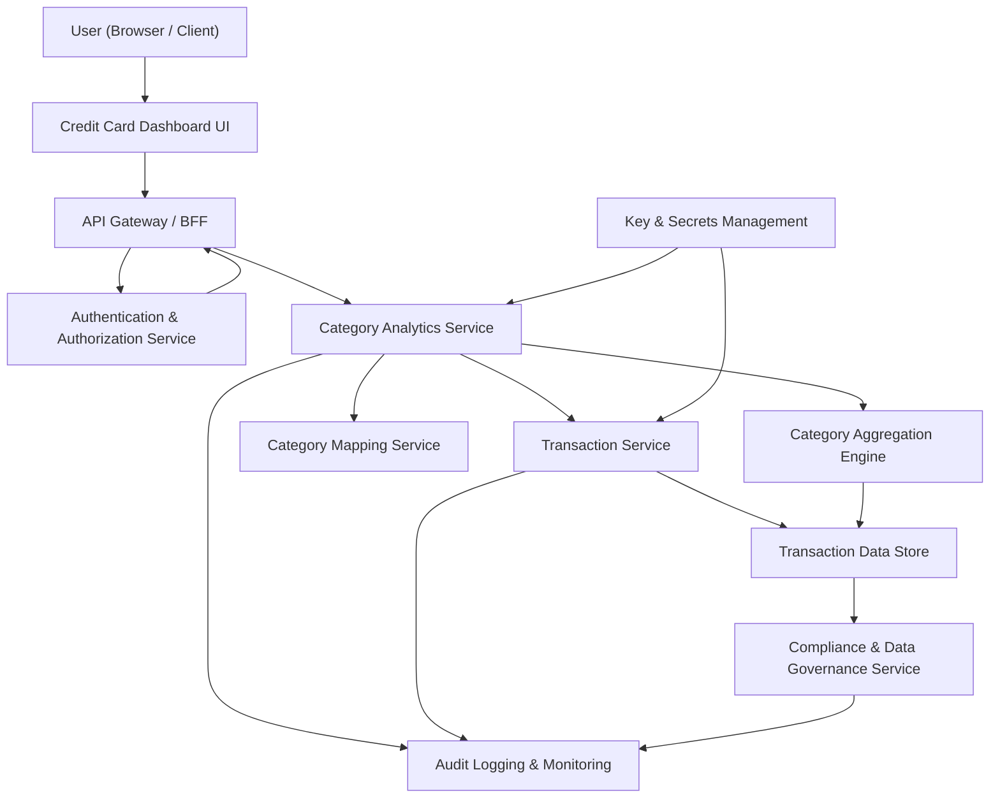

#### 1. High-Level Design

- Architecture Overview & Component Diagram:

- Component Descriptions:

  - Category Analytics Service:
    - Provides category-wise spending APIs:
      - GET /analytics/categories?from=&to=&cardId=
    - Orchestrates retrieval of transactions, mapping to categories, and aggregation logic.
  - Transaction Service:
    - Supplies raw transaction data for the requested period.
  - Category Mapping Service:
    - Enforces mapping to predefined categories:
      - Food & Dining, Fuel, Shopping, Travel, Entertainment, Utilities, Healthcare, Education, Miscellaneous.
    - Maintains mapping tables and rules.
  - Category Aggregation Engine:
    - Sums transaction amounts per category.
    - Supports filtering by card, date range, and other dimensions.
  - Dashboard UI:
    - Renders category charts (bar/pie/stacked) and tables.
    - Allows filtering on time range and cards.

- Integration Points & Data Flow:

  - UI → API Gateway:
    - Requests category-wise charts:
      - e.g., GET /ui/summary/categories?range=last3months.
  - API Gateway → Category Analytics Service:
    - Validates user identity and input parameters.
    - Forwards request with user context.
  - Category Analytics Service → Transaction Service:
    - Queries transactions within date ranges and optional card filters.
  - Category Analytics Service → Category Mapping Service:
    - Applies category mapping for each transaction.
    - Maintains mapping history for lineage and audit.
  - Category Aggregation Engine:
    - Aggregates amounts per category; optionally caches results.
  - Response:
    - Aggregated category totals returned to UI with category list and amounts.

- Security & Compliance Features:

  - Encryption:
    - TLS 1.3 for all calls.
    - AES-256 for DBTX secure storage, especially where vendor, merchant, or descriptive fields may include PII.
  - Input Validation:
    - Validate date ranges (min/max window).
    - Validate cardId belongs to the authenticated user.
    - Enforce maximum page size or limit to avoid abuse.
  - Output Filtering:
    - Only categories and amounts returned; no internal IDs or raw PII fields.
  - RBAC/ABAC:
    - Basic RBAC for end users vs support staff; support gets limited views (partial amounts, masked).
    - ABAC ensures user-resource mapping (userId attribute on transactions).
  - Audit Logging:
    - Category analytics queries logged for access auditing.
  - Compliance:
    - Category aggregates inherit retention and deletion schedules of underlying transactions.
    - Category mapping changes tracked for lineage; versioned results for compliance.

- Resiliency & Error Handling:

  - Circuit Breakers:
    - Between API Gateway and Category Analytics Service.
  - Retries:
    - Retry calls to Transaction Service on transient failures using exponential backoff.
  - Fallbacks:
    - Use last cached category aggregates when live computation fails, with clear freshness metadata.
  - Error Handling:
    - Graceful degradation by hiding charts and showing fallback messages without exposing system details.
  - Monitoring:
    - Specific metrics for category query latency, mapping errors, and aggregation exceptions.

#### 2. Validation Report

- Requirements Coverage:

  - Category-wise spending visualizations:
    - Covered via Category Analytics Service and UI charts.
  - Mapping transactions to categories:
    - Covered via Category Mapping Service with predefined categories.
  - Category totals and distribution charts:
    - Covered via Category Aggregation Engine and UI.
  - Predefined categories:
    - Explicitly implemented in mapping rules and UI legend.
  - Performance:
    - Covered via caching, aggregation engine, and optimized queries.

- Compliance Status:

  - Data retention:
    - Pass (aggregates tied to transaction retention policies).
  - Privacy:
    - Pass (no raw PII in chart responses; encryption and tokenization applied).
  - Data lineage:
    - Pass (mapping rules and transforms versioned and stored).

- Identified Ambiguities/Risks:

  - Category rule conflicts (same merchant mapping to different categories over time):
    - Mitigation: rule precedence and versioning; testing with sample data.
  - Handling uncategorized transactions:
    - Mitigation: define “Miscellaneous” fallback; log high ratio of uncategorized items.
  - Differences between regions (different category definitions):
    - Mitigation: ABAC policies and region-specific rule sets.
