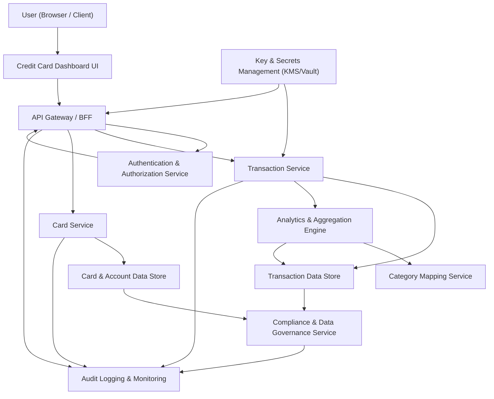
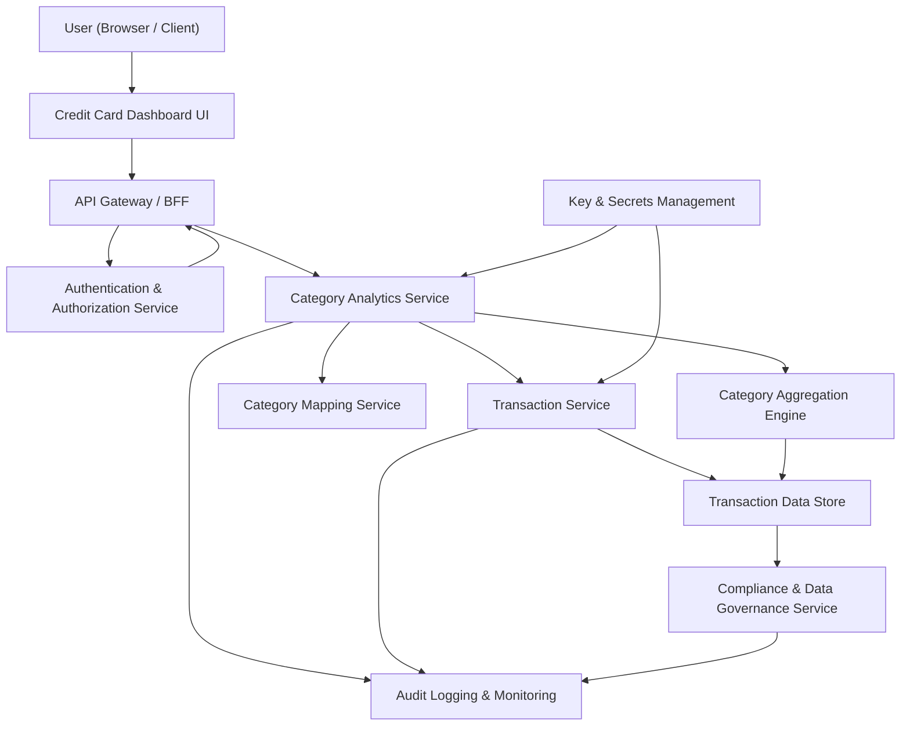

#### 1. High-Level Design

- Architecture Overview & Component Diagram:

- Component Descriptions:

  - User (Browser / Client): Front-end dashboard consuming APIs to display KPIs, trends, and detailed transaction data.
  - Credit Card Dashboard UI: Single-page application rendering KPIs, transaction tables, and analytics views; handles client-side filtering and basic input validation.
  - API Gateway / BFF: Single entry point for the UI; normalizes APIs, performs coarse-grained authorization checks, input validation, and response shaping for UI.
  - Authentication & Authorization Service: Provides OAuth2/OIDC-based authentication and issues JWTs; enforces RBAC/ABAC policies for data access.
  - Transaction Service:
    - Ingests, stores, and retrieves transaction records.
    - Exposes APIs for paginated transaction lists and time-bounded queries.
    - Ensures consistent transaction schema enabling monthly, card-wise, and category-wise aggregation.
  - Analytics & Aggregation Engine:
    - Implements aggregation logic: monthly spend, per-card spend, category-wise spend.
    - Pre-computes or dynamically computes aggregates based on NFRs.
    - Optimizes queries via indexes and/or materialized views.
  - Category Mapping Service:
    - Maps transactions to predefined categories.
    - Maintains mapping rules (MCC codes, merchant names, rule tables).
  - Card Service:
    - Manages card metadata (card id, issuer, limit, balance).
    - Provides card-to-transaction relationships for analytics.
  - Transaction Data Store (DBTX):
    - Relational or document database storing normalized transaction records.
    - Supports partitioning by user and time to meet performance NFRs.
  - Card & Account Data Store (DBCARD):
    - Stores card master data and derived balances.
  - Audit Logging & Monitoring:
    - Central pipeline collecting access logs, data changes, security events.
  - Key & Secrets Management:
    - Centralized encryption key management, API secrets, and database credentials.
  - Compliance & Data Governance Service:
    - Manages retention schedules, data lineage metadata, and consent/processing logs.

- Integration Points & Data Flow:

  - UI → API Gateway:
    - HTTPS (TLS 1.3) calls to fetch:
      - Transaction lists for a card/time window.
      - Aggregate metrics (monthly, card-wise, category-wise).
  - API Gateway → Transaction Service:
    - REST/JSON endpoints:
      - GET /transactions?userId=&cardId=&from=&to=
      - GET /transactions/aggregate/monthly
      - GET /transactions/aggregate/category
      - GET /transactions/aggregate/card
    - Requests are authenticated (JWT) and authorized (scopes/claims).
  - Transaction Service → DBTX:
    - CRUD operations persisted via ORM or query layer.
    - Aggregation engine queries DBTX directly or via Transaction Service.
  - Analytics & Aggregation Engine:
    - Consumes normalized transaction data from DBTX.
    - Uses Category Mapping Service to assign categories.
    - Returns pre-aggregated datasets to the Transaction Service/API Gateway.
  - Card Service Integration:
    - Card IDs and metadata used in joins for card-wise aggregations.
  - Compliance and Logging:
    - Every API and DB access generates audit records.
    - Compliance service receives metadata about data sets, retention, and access paths.

- Security & Compliance Features:

  - Encryption:
    - TLS 1.3 for all client-to-server and inter-service network communication.
    - AES-256 for encryption at rest:
      - DBTX: transaction amounts, merchant names, and PII fields encrypted.
      - DBCARD: card numbers tokenized and stored as surrogates (no PANs if possible).
    - Keys managed by central KMS; rotation policies enforced.
  - Input Validation & Output Filtering:
    - API Gateway enforces structural and semantic validation:
      - Date ranges, card IDs, pagination parameters, user IDs from claims.
    - Output filtering:
      - Only returns transactions belonging to the authenticated user.
      - Sensitive attributes (tokens, internal IDs) stripped from responses.
  - RBAC/ABAC:
    - RBAC:
      - Roles: end-user, support-analyst (read-only, masked data), admin (limited).
    - ABAC:
      - Access decisions based on attributes:
        - UserId matches data owner.
        - Region and data residency policies (e.g., EU users restricted to EU-hosted DB).
  - Audit Logging:
    - Logs:
      - Who (user, role), what (endpoint, resource), when, where (IP, region), outcome.
    - Immutable storage (WORM or append-only) with retention policies.
  - Compliance:
    - Data retention:
      - Transactions stored for defined period (e.g., 7 years) configurable per region.
      - Automated lifecycle policies (archive, delete).
    - Consent Management:
      - UI obtains consent for analytics storage/processing.
      - Consent flags stored with user profile and enforced in aggregation.
    - Data Lineage:
      - Each aggregate metric tagged with source tables and transformation logic.
      - Data governance catalog keeps lineage maps for audits.
    - Compliance Reporting:
      - Scheduled reports listing:
        - Access patterns.
        - Retention policy adherence.
        - Encryption/key-rotation status.

- Resiliency & Error Handling:

  - Circuit Breakers:
    - Between API Gateway and Transaction Service.
    - Between Transaction Service and Analytics Engine.
  - Retry Patterns:
    - Idempotent APIs (GET aggregate endpoints) allow limited backoff retries.
    - DB operations for reads retried on transient errors.
  - Fallbacks:
    - If analytics service unavailable:
      - Return cached aggregates (within allowed staleness window).
      - UI flags metrics as “partial” or “temporarily unavailable”.
  - Error Handling:
    - Unified error response format with correlation ID.
    - No sensitive information in error messages.
  - Observability:
    - Metrics: request latency, error rates, data-volume metrics.
    - Dashboards showing aggregation performance and SLA adherence.

#### 2. Validation Report

- Requirements Coverage:

  - Transaction data model:
    - Covered: DBTX with normalized schema, secure storage, encryption.
  - Transaction retrieval for dashboard:
    - Covered: Transaction Service APIs, API Gateway integration.
  - Aggregation logic:
    - Monthly spend across cards: Analytics Engine + dedicated endpoints.
    - Card-wise spend: Card Service integration and card-wise aggregates.
    - Category-wise spend: Category Mapping Service and category aggregation.
  - Performance:
    - Covered via indexes, pre-computed aggregates, partitioning, and caching.
  - Robustness to volumes:
    - Covered via partitioned storage, aggregation engine, resilience patterns.

- Compliance Status:

  - Data retention:
    - Pass (architected with configurable retention policies and lifecycle management).
  - Consent management:
    - Pass (consent stored and enforced for analytics).
  - Data lineage:
    - Pass (lineage metadata stored and used for compliance reporting).
  - Encryption & transport security:
    - Pass (AES-256 at rest, TLS 1.3 in transit).
  - Privacy constraints:
    - Pass (tokenization, output filtering, role-based masking).

- Identified Ambiguities/Risks:

  - Precise transaction volume and SLA targets:
    - Mitigation: make NFR parameters configurable and validate with load testing.
  - Exact category mapping logic:
    - Mitigation: design Category Mapping Service with pluggable rule engine; refine rules iteratively.
  - Real-time vs batch updates:
    - Mitigation: treat current scope as near-real-time (not real bank integration) and document update schedule.
  - Multi-region data residency:
    - Mitigation: ABAC policies and region-aware DB clusters; clarify per regulatory requirement before deployment.

---

#### 1. High-Level Design

- Architecture Overview & Component Diagram:

- Component Descriptions:

  - Category Analytics Service:
    - Provides category-wise spending APIs:
      - GET /analytics/categories?from=&to=&cardId=
    - Orchestrates retrieval of transactions, mapping to categories, and aggregation logic.
  - Transaction Service:
    - Supplies raw transaction data for the requested period.
  - Category Mapping Service:
    - Enforces mapping to predefined categories:
      - Food & Dining, Fuel, Shopping, Travel, Entertainment, Utilities, Healthcare, Education, Miscellaneous.
    - Maintains mapping tables and rules.
  - Category Aggregation Engine:
    - Sums transaction amounts per category.
    - Supports filtering by card, date range, and other dimensions.
  - Dashboard UI:
    - Renders category charts (bar/pie/stacked) and tables.
    - Allows filtering on time range and cards.

- Integration Points & Data Flow:

  - UI → API Gateway:
    - Requests category-wise charts:
      - e.g., GET /ui/summary/categories?range=last3months.
  - API Gateway → Category Analytics Service:
    - Validates user identity and input parameters.
    - Forwards request with user context.
  - Category Analytics Service → Transaction Service:
    - Queries transactions within date ranges and optional card filters.
  - Category Analytics Service → Category Mapping Service:
    - Applies category mapping for each transaction.
    - Maintains mapping history for lineage and audit.
  - Category Aggregation Engine:
    - Aggregates amounts per category; optionally caches results.
  - Response:
    - Aggregated category totals returned to UI with category list and amounts.

- Security & Compliance Features:

  - Encryption:
    - TLS 1.3 for all calls.
    - AES-256 for DBTX secure storage, especially where vendor, merchant, or descriptive fields may include PII.
  - Input Validation:
    - Validate date ranges (min/max window).
    - Validate cardId belongs to the authenticated user.
    - Enforce maximum page size or limit to avoid abuse.
  - Output Filtering:
    - Only categories and amounts returned; no internal IDs or raw PII fields.
  - RBAC/ABAC:
    - Basic RBAC for end users vs support staff; support gets limited views (partial amounts, masked).
    - ABAC ensures user-resource mapping (userId attribute on transactions).
  - Audit Logging:
    - Category analytics queries logged for access auditing.
  - Compliance:
    - Category aggregates inherit retention and deletion schedules of underlying transactions.
    - Category mapping changes tracked for lineage; versioned results for compliance.

- Resiliency & Error Handling:

  - Circuit Breakers:
    - Between API Gateway and Category Analytics Service.
  - Retries:
    - Retry calls to Transaction Service on transient failures using exponential backoff.
  - Fallbacks:
    - Use last cached category aggregates when live computation fails, with clear freshness metadata.
  - Error Handling:
    - Graceful degradation by hiding charts and showing fallback messages without exposing system details.
  - Monitoring:
    - Specific metrics for category query latency, mapping errors, and aggregation exceptions.

#### 2. Validation Report

- Requirements Coverage:

  - Category-wise spending visualizations:
    - Covered via Category Analytics Service and UI charts.
  - Mapping transactions to categories:
    - Covered via Category Mapping Service with predefined categories.
  - Category totals and distribution charts:
    - Covered via Category Aggregation Engine and UI.
  - Predefined categories:
    - Explicitly implemented in mapping rules and UI legend.
  - Performance:
    - Covered via caching, aggregation engine, and optimized queries.

- Compliance Status:

  - Data retention:
    - Pass (aggregates tied to transaction retention policies).
  - Privacy:
    - Pass (no raw PII in chart responses; encryption and tokenization applied).
  - Data lineage:
    - Pass (mapping rules and transforms versioned and stored).

- Identified Ambiguities/Risks:

  - Category rule conflicts (same merchant mapping to different categories over time):
    - Mitigation: rule precedence and versioning; testing with sample data.
  - Handling uncategorized transactions:
    - Mitigation: define “Miscellaneous” fallback; log high ratio of uncategorized items.
  - Differences between regions (different category definitions):
    - Mitigation: ABAC policies and region-specific rule sets.
