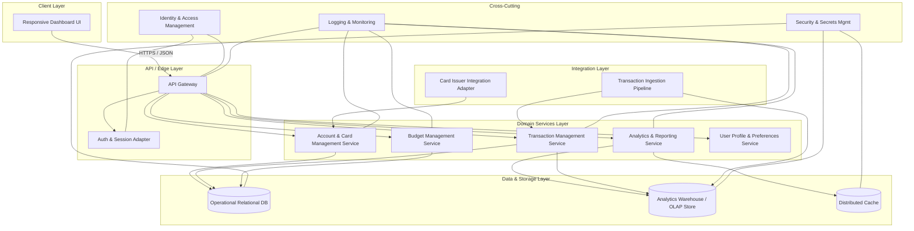

# High-Level Design (HLD) – QE-3853 – Monthly Spending Summary Dashboard

## 1. Architecture Overview

### 1.1 Context & Goals
The solution delivers an enterprise-grade, responsive dashboard providing users with consolidated visibility into credit card spending, credit utilization, transactions, and budgeting information. It must support interactive analytics (charts and trends), rich tabular browsing with filters/sorting, and responsive layouts for mobile, tablet, and desktop. 

Key goals:
- Aggregate credit card accounts and transaction data for a user.
- Provide summary KPIs (monthly spend, utilization, number of transactions, etc.).
- Offer interactive tables and visualizations (category, month, card, etc.).
- Support budget tracking with utilization indicators.
- Ensure secure access, strong data protection, and enterprise observability.

### 1.2 Logical Architecture
The architecture follows a layered, services-oriented model:

- **Client Layer**: Responsive web UI (SPA or modern web app) using a UI framework. Communicates with backend via REST/GraphQL APIs over HTTPS.
- **API / Edge Layer**: API Gateway and authentication front door handling routing, throttling, and security enforcement.
- **Domain Services Layer**: Backend microservices/domain services for:
  - Account & Card Management Service
  - Transaction Management Service
  - Analytics & Reporting Service
  - Budget Management Service
  - User Profile & Preferences Service
- **Data Layer**:
  - Relational DB (cards, accounts, budgets, transactions).
  - Analytics store (e.g., columnar warehouse or OLAP-optimized store) for aggregations and trends.
  - Caching layer for frequently accessed aggregates and reference data.
- **Integration Layer**:
  - Connectors/adapters to upstream card-issuer systems or transaction feeds.
  - ETL/stream ingestion pipelines into the analytics store.
- **Cross-Cutting Concerns**:
  - Identity & Access Management
  - Observability (logging, metrics, traces)
  - Security services (encryption, secrets management)
  - Config & feature flags.

### 1.3 High-Level Component Diagram (Mermaid)

## 2. Component Descriptions

### 2.1 Responsive Dashboard UI
- Single-page web application providing:
  - Dashboard summary cards for monthly spend, total credit limit, available credit, outstanding amount, utilization percentage, and number of transactions.
  - Credit card list view showing multiple cards with masked identifiers and key limits/billing dates.
  - Transaction table with pagination, sorting, and filters (merchant, category, bank, card, date range, amount).
  - Charting module for category-wise spending, monthly trends, and card-wise distribution.
  - Budget widgets showing monthly budget, current spend, remaining budget, and utilization progress bar.
  - Recent Transactions widget showing the latest subset of transactions.
- Implements responsive layouts for mobile, tablet, and desktop.
- Communicates only with the API Gateway over HTTPS using authenticated calls.

### 2.2 API Gateway
- Single entry point for all client API traffic.
- Responsibilities:
  - Request routing to appropriate domain services.
  - Rate limiting and basic throttling to protect backend services.
  - Enforcing authentication and authorization decisions based on IAM tokens.
  - Centralized logging of API calls, including correlation IDs.
  - Request/response validation for schema conformity.

### 2.3 Auth & Session Adapter
- Adapts organization-wide identity provider (IdP) for the dashboard.
- Validates tokens, sessions, and manages refresh/expiry logic.
- Enforces user-to-tenant mapping and ensures only the authenticated user’s card and transaction data is fetched.
- Provides user claims to downstream services (e.g., roles, permissions).

### 2.4 Account & Card Management Service
- Manages the user’s credit card portfolio representation within the system.
- Responsibilities:
  - Store and retrieve card metadata (card name, issuing bank, masked identifier, credit limit, billing date, due date, current outstanding, available credit).
  - Compute derived fields (e.g., available credit = limit - outstanding) where needed, or consume from upstream.
  - Expose APIs for:
    - ListCardsForUser
    - GetCardSummary
    - GetPortfolioSummary (aggregated limits and utilization across cards).
- Interacts with:
  - Operational DB for card/account records.
  - Card Issuer Integration Adapter for synchronization, if needed.

### 2.5 Transaction Management Service
- Central service for managing card transactions and transaction history.
- Responsibilities:
  - Persist transaction attributes: transaction date, merchant, category, card used, amount, payment status, remarks.
  - Provide APIs for paginated transaction retrieval with filters and sorting:
    - Filter by merchant, category, bank, card, date range.
    - Sorting by amount and date.
  - Maintain indexes or leverage appropriate database structures to support efficient filter/search.
  - Supply recent transactions subset optimized for the dashboard widget.
  - Feed aggregates into the analytics store and analytics service.

### 2.6 Analytics & Reporting Service
- Dedicated service for analytics, charts, and derived insights.
- Responsibilities:
  - Calculate category-wise spending (per period) and generate aggregates.
  - Provide monthly spending trend data per user and per card.
  - Compute card-wise spending distribution and category breakdown.
  - Coordinate data between operational DB and analytics warehouse; prefer pre-computed aggregates in the warehouse.
  - Expose APIs such as:
    - GetMonthlySpendingSummary
    - GetCategorySpendingBreakdown
    - GetCardDistribution
    - GetTransactionKPI (monthly spend, number of transactions, etc.).
  - Use cache for frequently accessed aggregates for recent periods.

### 2.7 Budget Management Service
- Manages user budgets and utilization metrics.
- Responsibilities:
  - Persist monthly budgets per user (and optionally per category or card if extended later).
  - Compute current spend vs. budget and remaining budget.
  - Calculate budget utilization percentage and supply values for progress bars.
  - Provide APIs:
    - GetBudgetOverview
    - UpsertBudgetConfig
  - Integrates with Analytics Service and Transaction Service for spend totals.

### 2.8 User Profile & Preferences Service
- Stores non-sensitive user preferences and configuration.
- Responsibilities:
  - Track default filters (e.g., default card, default date range).
  - Store UI personalization options where required.
  - Manage localization or currency-format preferences.
- Does not store secrets or payment credentials (explicitly out of scope).

### 2.9 Operational Relational DB (OLTPDB)
- Stores transactional and reference data needed for operational APIs.
- Structures:
  - Card/account tables (limits, outstanding, billing details).
  - Transaction tables with necessary indexing.
  - Budget configuration tables.
  - User preference tables (non-sensitive).
- Enforces referential integrity and access via service accounts only.

### 2.10 Analytics Warehouse / OLAP Store
- Columnar or warehouse store optimized for analytical queries.
- Receives data feeds from transaction ingestion pipelines.
- Stores pre-aggregated facts for spending analytics and trends.
- Supports rollups by user, card, category, time periods.

### 2.11 Distributed Cache
- In-memory cache for:
  - Frequently accessed KPIs on the dashboard (monthly spend, utilization, counts).
  - Reference data (categories, banks, etc.).
- Configurable TTLs and cache invalidation via events from domain services.

### 2.12 Card Issuer Integration Adapter
- Adapts external credit card issuer or core banking APIs into internal canonical models.
- Responsibilities:
  - Fetch or receive card metadata and transaction feeds.
  - Normalize data to internal schema.
  - Handle retries and idempotency when pulling from external systems.
- External payment processing or dispute management is **out of scope** for this Epic, and must be explicitly excluded from this adapter.

### 2.13 Transaction Ingestion Pipeline
- Batch or streaming pipeline that loads transactions from external feeds into the system.
- Responsibilities:
  - Validate incoming records and map categories.
  - Persist to OLTPDB and push facts into the analytics warehouse.
  - Emit events to notify downstream services or caches.

### 2.14 Identity & Access Management (IAM)
- Corporate identity provider (e.g., SSO provider) integrated via the Auth & Session Adapter.
- Issues tokens representing authenticated users.
- Supports role-based access (e.g., standard user, admin/operations).

### 2.15 Observability Platform
- Aggregates logs, metrics, and traces.
- Provides dashboards for service health, API performance, and error trends.

### 2.16 Security & Secrets Management Service
- Manages encryption keys, database credentials, and API keys for external adapters.
- Provides APIs or configuration for services to retrieve secrets securely at runtime.

## 3. Integration Points & Data Flow

### 3.1 Authentication & Session Flow
1. User accesses the Dashboard UI from browser.
2. UI redirects user to IAM for authentication (SSO flow).
3. Upon successful login, IAM issues a token to the UI.
4. UI attaches the token to subsequent API calls to API Gateway.
5. API Gateway validates the token via Auth & Session Adapter.
6. Auth & Session Adapter fetches user context (user ID, roles) and supplies it to downstream services.

### 3.2 Dashboard Summary KPIs Flow (Monthly Spend, Limits, Utilization, Counts)
1. UI requests `/summary/monthly` from API Gateway.
2. API Gateway routes request to Analytics & Reporting Service.
3. Analytics Service retrieves aggregated metrics from cache; on cache miss:
   - Queries analytics warehouse for monthly spend and transaction counts.
   - Calls Card Management Service for total credit limit and outstanding amounts from OLTPDB.
4. Analytics Service derives utilization percentage and available credit.
5. Analytics Service populates KPI response with:
   - Total monthly spend.
   - Total credit limit and available credit.
   - Outstanding amount.
   - Utilization percentage.
   - Number of transactions.
6. Response returns through API Gateway to the UI.

### 3.3 Credit Card Management Flow (Card Portfolio View)
1. UI requests `/cards` from API Gateway.
2. API Gateway routes to Card Management Service.
3. Card Management Service queries OLTPDB for all cards associated with the user.
4. Service returns:
   - Card name, issuing bank.
   - Masked card identifier.
   - Credit limit, available credit, current outstanding.
   - Billing date and due date.
5. Response is returned to the UI for rendering the card list.

### 3.4 Transaction Table Flow (Filters, Search, Sorting)
1. UI sends `/transactions` request with query parameters:
   - Merchant, category, bank, card, date range, sorting fields.
2. API Gateway routes request to Transaction Management Service.
3. Transaction Service validates filter parameters and builds query.
4. Transaction Service queries OLTPDB with appropriate indexes and pagination.
5. Result set is sorted by date or amount as requested.
6. Response includes transaction details required by the UI.
7. UI renders the responsive table and updates pagination/filters.

### 3.5 Spending Analytics & Charts Flow
1. UI requests endpoints for analytics (e.g., `/analytics/category`, `/analytics/monthlyTrend`, `/analytics/cardDistribution`).
2. API Gateway routes requests to Analytics & Reporting Service.
3. Analytics Service retrieves pre-aggregated measures from the analytics warehouse.
4. If needed, Analytics Service pulls additional reference data from Card Management or Transaction services.
5. Analytics Service formats data into chart-friendly structures (series, labels).
6. Response is returned and UI renders category-wise spending, monthly trends, and card-wise distribution charts.

### 3.6 Budget Tracking Flow
1. UI requests `/budget/overview` for current month.
2. API Gateway routes request to Budget Management Service.
3. Budget Service retrieves budget configuration for user from OLTPDB.
4. Budget Service calls Analytics & Reporting Service or Transaction Service to calculate current spend.
5. Budget Service computes remaining budget and utilization percentage.
6. Response carries monthly budget, current spend, remaining budget, and utilization.
7. UI displays progress bar and numeric values.

### 3.7 Recent Transactions Widget Flow
1. UI requests `/transactions/recent?limit=5`.
2. API Gateway routes request to Transaction Management Service.
3. Transaction Service queries OLTPDB for the most recent transactions limited by count.
4. Response is returned to UI for display in the widget.

### 3.8 Data Ingestion & Synchronization Flow
1. External card issuers or core banking systems send transaction feeds to Transaction Ingestion Pipeline.
2. Pipeline validates and normalizes data.
3. Validated transactions are written to OLTPDB via Transaction Management Service or direct ingestion component.
4. Pipeline publishes facts to analytics warehouse for aggregation.
5. Events may be emitted to trigger cache invalidation for affected users.

## 4. Security & Compliance Features

### 4.1 Transport Security
- All client-to-server and service-to-service communication uses TLS (HTTPS/mTLS where applicable).
- API Gateway enforces minimum TLS version and secure cipher suites.

### 4.2 Data Encryption
- At-rest encryption for:
  - OLTPDB (full-disk or transparent data encryption).
  - Analytics warehouse.
  - Cache (where supported) or rely on network-level controls and memory isolation.
- Sensitive identifiers are stored in masked or tokenized form where possible (e.g., partial card identifiers only, not full numbers).

### 4.3 Input Validation & Output Filtering
- API Gateway and domain services validate:
  - Types and ranges for filter parameters (date ranges, numeric constraints).
  - Allowed sorting and filter fields to prevent injection or abuse.
- Output filtering ensures only the authenticated user’s data is returned.
- Error messages exclude internal identifiers or implementation details.

### 4.4 Access Control (RBAC/ABAC)
- IAM issues tokens including user identity and roles.
- Domain services enforce row-level access controls by user ID/tenant.
- Administrative views (if any) require elevated roles and are out of scope for the standard dashboard user.

### 4.5 Audit Logging
- API Gateway logs request metadata (timestamp, user ID, endpoint, response code, latency).
- Domain services log important events:
  - Budget updates.
  - Card portfolio changes.
  - Authentication/authorization failures.
- Logs are centrally stored and protected; PII is limited to identifiers necessary for traceability.

### 4.6 Secrets Management
- All database credentials, external API keys, and encryption keys are stored in a centralized secrets vault.
- Services retrieve secrets at startup via secure channels; secrets are not stored in code or configuration files.

### 4.7 Compliance Mapping
- The dashboard works with card and transaction summaries but does not process payment authorizations.
- Design assumes:
  - PCI-sensitive operations (e.g., authorization, full card storage) remain in upstream systems and are **out of scope**.
  - This solution only stores masked identifiers and necessary metadata for analytics.
- Compliance posture:
  - Payment processing controls are inherited from upstream providers.
  - Strong transport security, logging, and access control reduce risk of exposure.

## 5. Resiliency & Error Handling

### 5.1 Retry Mechanisms
- Client:
  - UI avoids automatic retries on user actions except idempotent, read-only operations, with capped retries.
- Backend services:
  - Integration adapter and ingestion pipeline implement exponential backoff retries for external calls.
  - Internal service-to-service calls leverage client libraries with retry policies for transient errors only.

### 5.2 Circuit Breakers & Timeouts
- Service clients (including API Gateway to services) enforce:
  - Per-call timeouts appropriate to the operation.
  - Circuit breakers to prevent cascading failures if a downstream service is unhealthy.
- Degraded components surface fallback responses where feasible (e.g., stale cached KPIs) instead of failing hard.

### 5.3 Graceful Degradation
- If analytics warehouse is unavailable:
  - Analytics Service falls back to recent aggregates cached in memory or approximate values from OLTPDB.
  - Chart widgets may show limited time ranges or simplified views with appropriate messaging.
- If transaction filters produce errors, default views revert to safe baseline filters.

### 5.4 Error Handling & Response Semantics
- Standardized error model:
  - 400: Invalid request parameters (e.g., malformed filters or date range).
  - 401: Authentication failure (invalid/expired token).
  - 403: Authorization failure (accessing another user’s data).
  - 404: Resource not found (e.g., card not associated with user).
  - 429: Too many requests (rate limit exceeded).
  - 500: Unexpected server error.
- Each error response includes:
  - Machine-readable code.
  - Human-readable message that avoids leaking internal design details.
  - Correlation ID for support.

### 5.5 Observability
- Metrics:
  - API latency, throughput, error rates per endpoint.
  - Cache hit/miss ratio.
  - Ingestion pipeline lag and throughput.
- Traces:
  - End-to-end distributed traces capturing flows from UI through API Gateway to downstream services.
- Alerts:
  - Threshold-based alerts on error rates, latency, and ingestion failures.

## 6. Validation Report

### 6.1 Requirements Coverage
- **Dashboard Summary (Total Monthly Spend, Total Credit Limit, Available Credit, Outstanding Amount, Utilization Percentage, Number of Transactions)**
  - Components: Responsive Dashboard UI, Analytics & Reporting Service, Card Management Service, Transaction Management Service, OLTPDB, Analytics Warehouse, Cache.
  - Flows: 3.2 Dashboard Summary KPIs Flow, 3.8 Data Ingestion & Synchronization.

- **Credit Card Management (Multiple Cards: Name, Bank, Masked Number, Limit, Available Credit, Outstanding, Billing Date, Due Date)**
  - Components: Responsive Dashboard UI, Card Management Service, OLTPDB, Card Issuer Integration Adapter.
  - Flows: 3.3 Credit Card Management Flow, 3.8 Data Ingestion & Synchronization.

- **Transaction Management (Table with Date, Merchant, Category, Card, Amount, Status, Remarks)**
  - Components: Responsive Dashboard UI, Transaction Management Service, OLTPDB.
  - Flows: 3.4 Transaction Table Flow, 3.8 Data Ingestion & Synchronization.

- **Filters and Search (Merchant, Category, Bank, Card, Date Range; Sort by Amount and Date)**
  - Components: Responsive Dashboard UI, Transaction Management Service, OLTPDB.
  - Flows: 3.4 Transaction Table Flow.

- **Spending Analytics (Category-wise Spending, Monthly Spending Trend, Card-wise Distribution, Category Breakdown)**
  - Components: Responsive Dashboard UI, Analytics & Reporting Service, Transaction Management Service, Analytics Warehouse, Cache.
  - Flows: 3.5 Spending Analytics & Charts Flow, 3.8 Data Ingestion & Synchronization.

- **Category Model (Food & Dining, Fuel, Shopping, Travel, Entertainment, Utilities, Healthcare, Education, Miscellaneous)**
  - Components: Transaction Management Service, Analytics & Reporting Service, OLTPDB, Analytics Warehouse.
  - Flows: 3.5 Spending Analytics & Charts Flow, 3.8 Data Ingestion & Synchronization.

- **Budget Tracking (Monthly Budget, Current Spend, Remaining Budget, Budget Utilization %, Progress Bar)**
  - Components: Responsive Dashboard UI, Budget Management Service, Analytics & Reporting Service, OLTPDB, Analytics Warehouse.
  - Flows: 3.6 Budget Tracking Flow.

- **Recent Transactions Widget (Latest 5 Transactions)**
  - Components: Responsive Dashboard UI, Transaction Management Service, OLTPDB.
  - Flows: 3.7 Recent Transactions Widget Flow.

- **Responsive Design (Mobile, Tablet, Desktop)**
  - Components: Responsive Dashboard UI.
  - Flows: General client-side rendering and layout logic (no specific backend flow required).

### 6.2 Compliance Status
- **Transport Security**: Pass
  - All communication is over TLS with enforced minimum versions; internal mTLS recommended.

- **Data Encryption at Rest**: Pass-with-conditions
  - Requires configuration of TDE or equivalent for OLTPDB and warehouse; design assumes but does not implement provider-specific setup.

- **Access Control & Identity**: Pass
  - IAM-integrated authentication; services enforce user-level access to card and transaction data.

- **Audit Logging**: Pass
  - Comprehensive logging defined; ensure log retention and access control policies are applied during implementation.

- **Secrets Management**: Pass
  - Central secrets vault assumed; must adhere to organization’s standards for rotation and access control.

- **PCI Alignment**: Pass-with-conditions
  - Core PCI-scoped processing remains upstream; solution must not store full card numbers or sensitive authentication data. Verification during implementation is required.

### 6.3 Identified Ambiguities / Risks
- **Ambiguity/Risk 1: Source of Truth for Transactions and Cards**
  - Consequence: Inconsistent data between dashboard and issuer systems; incorrect KPIs or analytics.
  - Mitigation: Define a single system of record per data domain; document synchronization SLAs and conflict resolution rules.

- **Ambiguity/Risk 2: Budget Granularity (Per User vs. Per Category/Card)**
  - Consequence: Implemented budget model may not meet business expectations, causing rework.
  - Mitigation: Clarify whether budgets are per-user, per-category, or per-card before finalizing schema; design schema to allow future extension.

- **Ambiguity/Risk 3: Historical Data Retention Policy**
  - Consequence: Warehouse storage costs or performance issues if unbounded; inability to produce long-term trends if too aggressive pruning.
  - Mitigation: Define clear retention policies for transactions and aggregates, including archiving strategy.

- **Ambiguity/Risk 4: External Integrations Out-of-Scope Boundaries**
  - Consequence: Implementation may unintentionally expand scope into payment processing or disputes, adding compliance risk.
  - Mitigation: Explicitly document that payment authorization, settlement, and disputes remain in external systems; limit adapters to read-only or analytics feeds as per scope.
