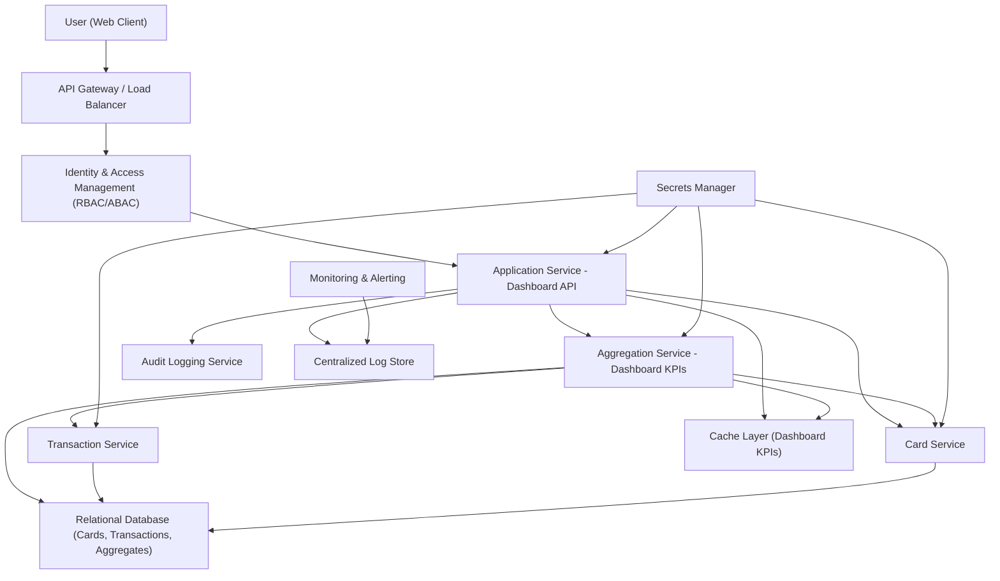

#### 1. High-Level Design

- Architecture Overview & Component Diagram:

- Component Descriptions:

  - Application Service - Dashboard API: Single endpoint providing consolidated KPIs for the user’s dashboard.
  - Aggregation Service - Dashboard KPIs: Computes:
    - Monthly Spend KPI.
    - Total Credit Limit KPI.
    - Available Credit KPI.
    - Outstanding Amount KPI.
  - Card Service & Transaction Service: Provide underlying data for the KPIs.
  - Relational Database and Cache Layer: Persist and serve KPI data efficiently.

- Integration Points & Data Flow:

  1. User loads dashboard; client app calls Dashboard API.
  2. Dashboard API authenticates via IAM and then:
     - Queries Aggregation Service for latest KPI values.
     - Aggregation Service:
       - Reads card limits and outstanding balances from Card Service and DB.
       - Reads aggregated monthly spend from the relevant tables.
       - Computes derived metrics (e.g., available credit).
       - Writes back to DS and CCH.
  3. Dashboard API responds with consolidated KPI JSON, enabling the UI to render the overview panel.
  4. For multi-device responsiveness, the client is designed with a responsive layout using a design system; no backend changes needed.

- Security & Compliance Features:

  - TLS 1.3 enforced end to end.
  - AES-256 encryption for all persisted KPI data.
  - Input validation:
    - Optional filters (e.g., selected card) checked for ownership and bounds.
  - RBAC/ABAC:
    - User-level roles and attributes ensure only personal KPIs are displayed.
  - Audit logging:
    - Access to dashboard KPIs logged for compliance and monitoring.
  - Compliance:
    - KPIs derived solely from in-scope data (dashboard, cards, transactions) and within permitted retention windows.
    - No out-of-scope operations introduced.

- Resiliency & Error Handling:

  - Circuit breakers for dependencies (Card Service, Transaction Service, Aggregation Service).
  - Retries and fallback to cached KPIs if real-time aggregation is delayed or fails.
  - Degraded mode:
    - If some KPIs cannot be computed, the dashboard may show partial KPIs with explanatory notices.
  - Monitoring & alerting:
    - Tracks KPI computation batch jobs, API latencies, and error rates.

#### 2. Validation Report

- Requirements Coverage:

  - Dashboard Overview:
    - [x] KPI coverage:
      - Monthly Spend.
      - Total Credit Limit.
      - Available Credit.
      - Outstanding Amount.
  - Consolidated View:
    - [x] KPIs are aggregated across all cards and surfaced in a single dashboard view.
  - Responsiveness:
    - [x] Design assumes responsive front-end implementation; backend APIs support any device form factor.
  - NFRs:
    - [x] Performance via caching and optimized queries.
    - [x] Data consistency with underlying card and transaction data.

- Compliance Status:

  - [Pass] All KPIs derived from in-scope data and adhere to retention and security policies.
  - [Pass] TLS 1.3 and AES-256, RBAC/ABAC, and audit logging embedded in design.
  - [Pass] Scope respects exclusions (no external bank or payment integration).

- Identified Ambiguities/Risks:

  - Ambiguity: Refresh frequency of KPIs (near-real-time vs scheduled).
    - Mitigation: Initially align with batch schedules that keep KPIs sufficiently fresh for dashboard use; document SLAs.
  - Risk: User confusion if KPIs differ slightly from statements due to timing differences.
    - Mitigation: Provide explanatory text in the UI and align calculation windows to policy.
  - Ambiguity: Handling multiple currencies if cards span regions.
    - Mitigation: Assume a base currency for now; treat multi-currency support as an extension with specific FX requirements.

