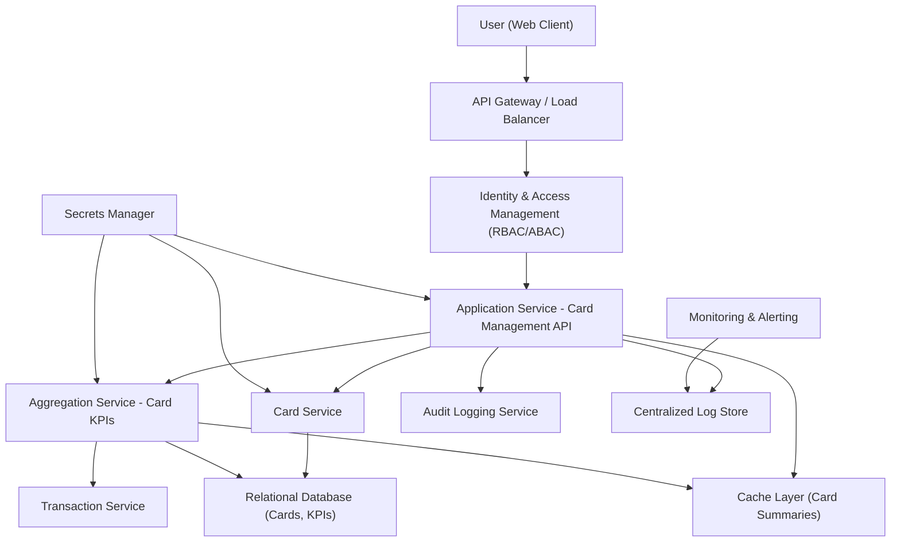

#### 1. High-Level Design

- Architecture Overview & Component Diagram:

- Component Descriptions:

  - Application Service - Card Management API: Provides endpoints to list cards, switch selected card, and retrieve card-level summaries for the dashboard.
  - Card Service: Manages card metadata and its association with users (e.g., card_id, masked_number, credit_limit).
  - Aggregation Service - Card KPIs: Computes per-card KPIs (e.g., outstanding balance, available credit).
  - Relational Database: Stores card entities, card-user relations, and aggregated KPIs.
  - Cache Layer: Serves frequently used card summaries for fast dashboard loads.

- Integration Points & Data Flow:

  1. User requests a multi-card dashboard view.
  2. API Gateway routes request to Card Management API after authentication.
  3. Card Management API:
     - Calls Card Service to retrieve list of cards for the user.
     - Calls Aggregation Service for card-level KPIs (limit, outstanding, available credit).
  4. Aggregation Service:
     - Uses transaction data and card metadata to compute outstanding balances and derived metrics.
     - Persists aggregates and populates cache.
  5. API assembles a unified response including:
     - List of cards with metadata.
     - Per-card KPIs and a flag for selected card.
  6. User can switch cards; API fetches or retrieves from cache minimal additional data needed for the selected card.

- Security & Compliance Features:

  - TLS 1.3 for all card-related operations.
  - AES-256 at rest for card tables and KPIs.
  - Strict masking of card numbers in all responses (e.g., last 4 digits only).
  - RBAC/ABAC to ensure users see only their cards; support/administrative views require special roles and masking policies.
  - Audit logging of:
    - Card list views.
    - Card selection changes.
  - Consent and retention rules inherited from overall solution; out-of-scope features (payments, external banks) excluded.

- Resiliency & Error Handling:

  - Circuit breakers around Card Service and Aggregation Service.
  - Retries for transient failures in reading card metadata or KPIs.
  - Fallback behavior:
    - If Aggregation Service is unavailable, show last cached KPIs with a note indicating potential staleness.
  - Monitoring of:
    - Card list retrieval latency.
    - KPI computation jobs and failures.

#### 2. Validation Report

- Requirements Coverage:

  - Multi-card Dashboard:
    - [x] Users can view multiple cards from a single interface, with key data per card.
  - Card-Level Summary:
    - [x] Card-level summary includes limit, available credit (computed as limit minus outstanding), and outstanding balance.
  - Consolidated Aggregated Metrics:
    - [x] Aggregation Service feeds consolidated metrics (e.g., total limits, outstanding) to the main dashboard.
  - NFRs:
    - [x] Multiple cards per user handled via efficient queries and caching.
    - [x] Security controls around card data enforced.

- Compliance Status:

  - [Pass] Card metadata stored with AES-256 encryption and masking.
  - [Pass] RBAC/ABAC enforce per-user data boundaries.
  - [Pass] Accesses logged for audit; retention and consent aligned with project scope.
  - [Pass] No forbidden features (bank integration, payments) included.

- Identified Ambiguities/Risks:

  - Ambiguity: Handling closed or inactive cards in the interface.
    - Mitigation: Introduce clear status field; default view to active cards while allowing filtered views of historical cards.
  - Risk: Misalignment between card balances and transaction-derived outstanding amounts.
    - Mitigation: Define authoritative source of truth; ensure reconciliation jobs; log discrepancies.
  - Ambiguity: Sorting and grouping behavior for multiple cards (e.g., by name, limit).
    - Mitigation: Start with deterministic default (e.g., by card nickname or last-used date); treat advanced sorting as future enhancements.

