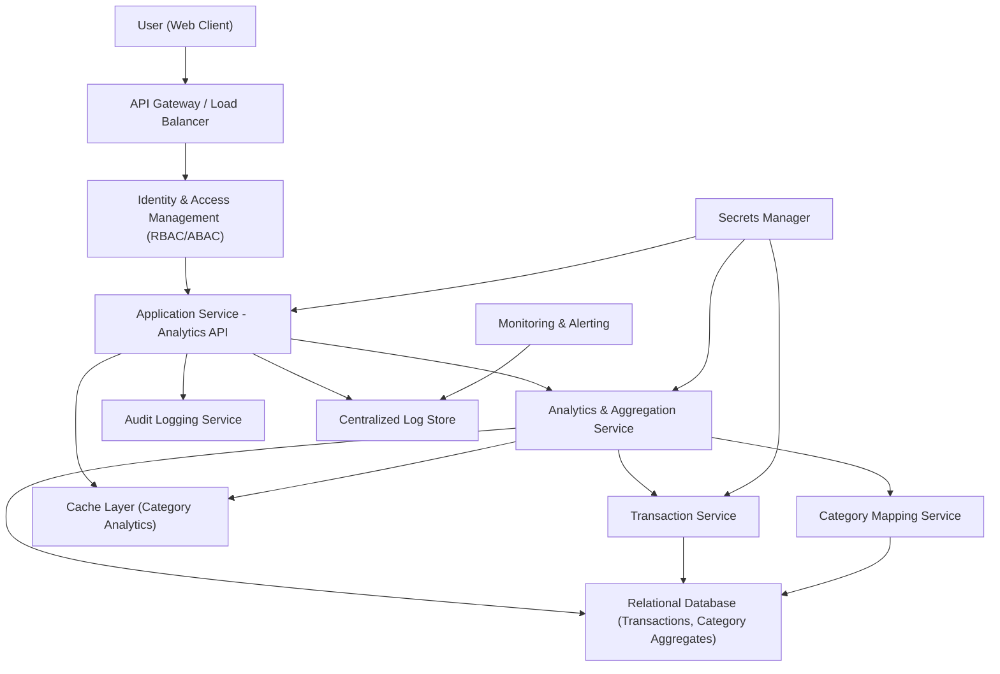

#### 1. High-Level Design

- Architecture Overview & Component Diagram:

- Component Descriptions:

  - User (Web Client): Dashboards that show category-wise spending charts and interactive filters.
  - Application Service - Analytics API: Exposes endpoints for analytics views, such as spend by category, over time, and filtered by card or time period.
  - Analytics & Aggregation Service: Aggregates transactions by category and time period; prepares data structures optimized for visualizations.
  - Transaction Service: Provides categorized transaction data or raw transactions with category codes.
  - Category Mapping Service: Maps raw transaction codes (e.g., MCC) to defined categories (Food & Dining, Fuel, etc.).
  - Relational Database: Stores categorized transactions and category-level aggregates.
  - Cache Layer: Caches category-wise analytics results to ensure snappy UI performance.
  - Identity & Access Management: Handles authentication and authorization for analytics endpoints.
  - Audit Logging and Centralized Log Store: Track analytic view access, filters used, and potential anomalies.
  - Secrets Manager and Monitoring & Alerting: Same responsibilities as in previous epic.

- Integration Points & Data Flow:

  1. User selects filters (card, time range) in the analytics dashboard and requests category-wise visualizations.
  2. Request goes through API Gateway and IAM; once authorized, it reaches Analytics API.
  3. Analytics API calls Analytics & Aggregation Service with the user’s filters.
  4. Analytics & Aggregation Service:
     - Retrieves relevant transactions from Transaction Service or DB.
     - Applies category mappings via Category Mapping Service.
     - Computes spend sums per category and period.
     - Stores or updates aggregates in DB and Cache Layer.
  5. Analytics API returns category-wise totals and time series to the client for chart rendering.

- Security & Compliance Features:

  - TLS 1.3 for all interactions.
  - AES-256 at rest for transaction and analytics tables.
  - Input validation for filters (category lists, card IDs, date ranges).
  - RBAC/ABAC:
    - ROLE_USER restricted to own data.
    - Attribute-based checks for tenant/region segregation.
  - Audit logs for:
    - Category analytics view access.
    - Administrative changes to category mappings.
  - Compliance:
    - Category definitions and mapping rules versioned for data lineage.
    - Retention and consent rules aligned with project scope.

- Resiliency & Error Handling:

  - Circuit breakers between Analytics API and Analytics & Aggregation Service.
  - Retries for transient category mapping or transaction retrieval failures.
  - Fallback to cached analytics when live computation fails.
  - Graceful degradation: if some categories fail, show partial results with clearly labelled limitations.
  - Monitoring and alerts for slow queries and anomalies in category distributions.

#### 2. Validation Report

- Requirements Coverage:

  - Category-Wise Spending:
    - [x] Design supports pre-defined categories: Food & Dining, Fuel, Shopping, Travel, Entertainment, Utilities, Healthcare, Education, Miscellaneous.
  - Visualizations:
    - [x] Supports category-based charts and filtered views (by card, timeframe).
  - NFRs:
    - [x] Performance optimized via caching and pre-aggregations.
    - [x] Data consistency ensured by using relational DB and category mapping service.

- Compliance Status:

  - [Pass] Data retention and consent follow same framework as for other analytics; no contradictions to project file.
  - [Pass] Security (TLS, AES-256, RBAC/ABAC, audit logging) applied consistently.
  - [Pass] Out-of-scope constraints maintained (no external payments or banks).

- Identified Ambiguities/Risks:

  - Ambiguity: Handling transactions without category mapping.
    - Mitigation: Map to “Miscellaneous” with a data-quality tag; track count to improve mapping rules.
  - Risk: Overly complex filters causing expensive queries.
    - Mitigation: Validate filters, enforce limits on time range and card count; index key fields.
  - Ambiguity: Level of interactivity (e.g., drill-down by merchant).
    - Mitigation: Keep initial scope to category-level breakdown; treat deeper drill-downs as future enhancements.

