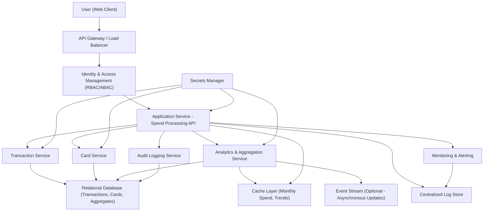

#### 1. High-Level Design

- Architecture Overview & Component Diagram:

- Component Descriptions:

  - User (Web Client): Responsive dashboard UI that displays monthly spend, trends, and card-wise spend views.
  - API Gateway / Load Balancer: Single entry point for client requests; enforces TLS 1.3, rate limiting, and routing.
  - Application Service - Spend Processing API: Orchestrates retrieval of transaction data, computes monthly spend and trends, and exposes APIs to the dashboard.
  - Transaction Service: Provides access to internal transaction data (amount, timestamp, card id, category reference).
  - Card Service: Provides card metadata (card id, user association, status) to support card-wise aggregations.
  - Analytics & Aggregation Service: Performs aggregations for monthly spend, card-wise spend, and trend calculations; materializes and caches results.
  - Relational Database: Stores transaction records, card data, aggregate tables (e.g., monthly_spend_per_card, monthly_spend_total).
  - Cache Layer: Caches frequently accessed aggregates (e.g., current month spend per card, last 12 months trend).
  - Event Stream: Optional channel (e.g., internal events) for asynchronous transaction updates and aggregate recomputation.
  - Identity & Access Management: Provides authentication and authorization with RBAC/ABAC for dashboard access.
  - Audit Logging Service: Captures security and compliance events (logins, data access, configuration changes).
  - Secrets Manager: Manages credentials for databases, internal services, and encryption keys.
  - Monitoring & Alerting: Collects metrics, health checks, and raises alerts for failures or performance degradation.
  - Centralized Log Store: Aggregates logs for observability, troubleshooting, and compliance evidence.

- Integration Points & Data Flow:

  1. The User (Web Client) calls the dashboard endpoint via the API Gateway over HTTPS (TLS 1.3).
  2. API Gateway authenticates the request and forwards it to the Application Service.
  3. Application Service queries:
     - Transaction Service for raw transactions for the user and selected timeframe.
     - Card Service for card metadata linked to the user.
     - Analytics & Aggregation Service for precomputed monthly spend and trends.
  4. Transaction and card data are stored in the Relational Database; the Analytics & Aggregation Service reads these and computes:
     - Monthly spend per month (e.g., per calendar month).
     - Card-wise spend totals per month.
     - Trend lines (e.g., last 6–12 months).
  5. The Aggregation Service stores results in aggregate tables and optionally pushes frequently used aggregates to the Cache Layer.
  6. The Application Service reads from the cache (and falls back to DB if needed), composes the response, and returns JSON to the client over TLS 1.3.
  7. Audit Logging Service records access events (e.g., user X viewed monthly spend for time period Y).
  8. Monitoring & Alerting track latency, error rates, cache hit ratios, and DB performance.

- Security & Compliance Features:

  - Transport Security:
    - All client-server and service-service communication enforced over TLS 1.3.
    - Strong cipher suites and certificate rotation managed centrally.

  - Data Security & Encryption:
    - AES-256 encryption at rest for transaction and card tables.
    - Transparent column-level encryption for sensitive fields (e.g., card identifiers, user identifiers).
    - Encryption keys managed by Secrets Manager / KMS; no keys stored in code or configuration repositories.

  - Input Validation & Output Filtering:
    - Server-side validation of all request parameters:
      - User identifiers validated against authenticated principal.
      - Date ranges constrained to allowed windows and validated for format.
      - Pagination and sorting inputs bounded and sanitized.
    - Output filtering ensures the user only receives:
      - Transactions and aggregates belonging to their own cards.
      - No raw PAN or full card numbers; only masked or internal IDs.
      - No internal IDs or debug fields that could expose implementation details.

  - RBAC/ABAC:
    - RBAC roles:
      - ROLE_USER: Can view own card and spend data.
      - ROLE_SUPPORT_READONLY: Limited support role for troubleshooting, with strict masking and approvals.
      - ROLE_ADMIN: Admin for configuration and operational tasks, no default access to raw user transactions.
    - ABAC policies:
      - User can only access resources where user_id matches authenticated subject.
      - Additional attributes (e.g., region, tenant) enforced for multi-tenant isolation.

  - Audit Logging:
    - Events captured:
      - Login and logout.
      - Access to spend dashboards (epic-specific view logged with timestamp, card context, and filters).
      - Configuration changes to aggregation rules.
      - Administrative reads or escalations.
    - Logs include: anonymized user identifiers, time, action, outcome, and originating IP.
    - Logs shipped to Centralized Log Store and retained according to policy.

  - Compliance (Data Retention, Consent, Data Lineage, Reporting):
    - Data Retention:
      - Transaction retention period defined (e.g., N years, per policy).
      - Aggregate tables retain necessary metrics for the same or shorter retention windows.
      - Automated jobs purge and/or anonymize aged data, with audit trails.
    - Consent Management:
      - Dashboard access contingent on user consent to analytics and dashboard processing.
      - Consent preferences stored and enforced; if consent revoked, analytics views are disabled or minimized.
    - Data Lineage:
      - Metadata tracks lineage from source transaction to aggregated monthly spend (e.g., lineage tables describing which transaction batches fed which aggregate computations).
    - Compliance Reporting:
      - Periodic export of usage and access logs.
      - Ability to generate reports showing which roles accessed financial data, aggregated by month/region.

- Resiliency & Error Handling:

  - Circuit Breakers:
    - Between Application Service and Transaction Service.
    - Between Application Service and Analytics & Aggregation Service.
    - Fail fast when downstream services are unhealthy, returning a user-friendly error and avoiding cascading failures.

  - Retries:
    - Idempotent read operations retried with exponential backoff when transient network or service errors occur.
    - Retry limits and timeouts tuned to avoid user-facing delays.

  - Fallback Patterns:
    - Cache Fallback:
      - If Aggregation Service is unavailable, Application Service serves last known aggregates from Cache Layer when available.
    - Partial Degradation:
      - If trends cannot be loaded, the dashboard may show current month spend only with a banner indicating limited data.
    - Graceful Errors:
      - Clear user-facing messages when specific sections of the dashboard are unavailable.

  - Logging & Monitoring:
    - Structured logging for every API call, including correlation IDs, latency, response codes, and failure causes.
    - Metrics for:
      - Transaction query latency.
      - Aggregation job success/failure.
      - Cache hit/miss ratios.
    - Alerts on error-rate thresholds, significant delays in monthly spend updates, and data anomalies (e.g., zero sums when data exists).

#### 2. Validation Report

- Requirements Coverage:

  - Completeness vs Epic & Project Document:
    - Transactions to Monthly Spend:
      - Design supports ingestion of transaction data via Transaction Service, aligned with “Transactions” in scope.
      - Monthly spend aggregates are computed per card and overall, covering “Monthly Spend” dashboard KPI.
    - Monthly Spend Trends:
      - Aggregation Service maintains historical aggregates for trend visualization (e.g., last 6–12 months).
    - Card-wise Spend Analysis:
      - Aggregations per card, aligned with multi-card requirements from the project file.
    - Integration with Dashboard KPIs:
      - Monthly spend and trends provided as APIs to the dashboard, consistent with “Dashboard KPIs” list.
    - Non-functional Requirements:
      - Performance: Caching and optimized aggregation queries address timely updates and handling of typical consumer volumes.
      - Data accuracy: Relational storage and well-defined lineage for transaction-to-aggregate flows.

  - Checklist:
    - [x] Ingestion or presentation of transaction data within application’s scope.
    - [x] Computation of monthly spend from transactions.
    - [x] Monthly spend trends visualization support.
    - [x] Card-wise spend analysis views.
    - [x] Alignment of transaction-derived metrics with dashboard KPIs.
    - [x] NFRs for performance and data accuracy considered.
    - [x] Dependencies on internal transaction data, analytics, and dashboard components covered.

- Compliance Status:

  - Data Retention:
    - [Pass] Retention windows and purge/anonymization strategies defined for transactions and aggregates.
  - Consent Management:
    - [Pass] Design includes consent-based access to analytics and dashboards.
  - Data Lineage:
    - [Pass] Lineage tracking for aggregate calculations specified.
  - Security (AES-256/TLS 1.3, RBAC/ABAC, Audit):
    - [Pass] TLS 1.3 enforced; AES-256 at rest; RBAC and ABAC policies defined; audit logging specified.
  - Out-of-Scope Controls:
    - [Pass] No real bank integration or payment capabilities introduced, consistent with epic and project out-of-scope statements.

- Identified Ambiguities/Risks:

  - Ambiguity: Exact definition of “monthly” (calendar vs billing cycle).
    - Mitigation: Configure a policy-driven period definition to support both; default to calendar month unless requirements specify billing cycle logic.
  - Ambiguity: Timezones for transaction timestamps.
    - Mitigation: Normalize timestamps to UTC and apply user-specific timezone for presentation; document standardization.
  - Risk: Heavy aggregation load for users with long history and multiple cards.
    - Mitigation: Incremental aggregations (e.g., daily jobs) and caching; consider partitioning strategies in DB.
  - Ambiguity: Level of detail for trends (e.g., daily vs monthly).
    - Mitigation: Start with monthly resolution as per epic; extend to finer granularity via separate user stories if requested.
  - Risk: Data quality issues from source transaction feed (missing categories or card IDs).
    - Mitigation: Validation at Transaction Service ingress, error-handling workflows, and data quality metrics with alerts.

