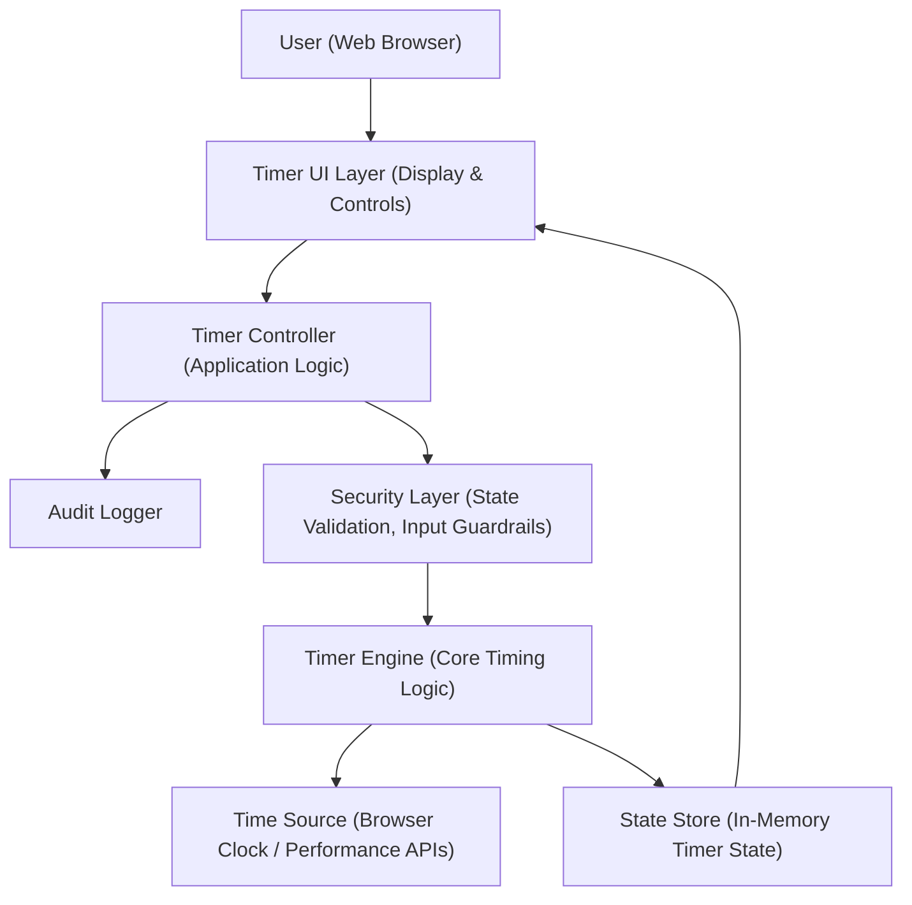

#### 1. High-Level Design

- Architecture Overview & Component Diagram:

- Component Descriptions:

  - User (Web Browser): Initiates timer actions by interacting with the UI.
  - Timer UI Layer (Display & Controls): Renders the current elapsed time and exposes Start, Pause, and Stop controls.
  - Timer Controller (Application Logic):
    - Orchestrates actions based on user events.
    - Enforces business rules such as "only one timer can run at a time."
    - Delegates to Timer Engine for actual time tracking.
  - Timer Engine (Core Timing Logic):
    - Calculates elapsed time using a reliable time source.
    - Handles start, pause, resume, and stop/reset operations.
    - Ensures accuracy to the second and smooth visual updates.
  - Time Source (Browser Clock / Performance APIs):
    - Uses browser timing APIs (e.g., `performance.now()` or `Date.now()`) for high-resolution, monotonic time measurement.
  - State Store (In-Memory Timer State):
    - Holds:
      - `status` (idle, running, paused)
      - `startTimestamp`
      - `pausedDuration`
      - `elapsedSeconds`
    - Drives the formatted HH:MM:SS display.
  - Audit Logger:
    - Logs lifecycle events (start, pause, resume, stop, errors) with timestamps.
  - Security Layer (State Validation, Input Guardrails):
    - Ensures transitions are valid (e.g., cannot pause when already idle).
    - Prevents undefined or inconsistent states.

- Integration Points & Data Flow:

  1. Initialization:
     - On page load, Timer Controller initializes State Store:
       - `status = "idle"`
       - `elapsedSeconds = 0`
     - UI Layer displays `00:00:00`.
  2. Start:
     - User clicks Start.
     - Timer Controller consults Security Layer to ensure:
       - No other timer is running.
       - Current status is `idle` or `paused`.
     - If status is `idle`:
       - Timer Engine sets `startTimestamp` from Time Source and `pausedDuration = 0`.
     - If status is `paused`:
       - Timer Engine updates `startTimestamp` to account for previously elapsed time and resumed time.
     - Timer Engine begins a periodic update (e.g., using `setInterval` or `requestAnimationFrame`) to compute `elapsedSeconds`.
     - UI Layer is notified of each update and re-renders the formatted HH:MM:SS string.
     - Audit Logger logs a "start" event.
  3. Pause:
     - User clicks Pause.
     - Security Layer ensures status is `running`.
     - Timer Engine captures current elapsed value and updates State Store:
       - `status = "paused"`
       - Records total elapsed time up to pause.
     - Periodic updates are stopped or suspended.
     - UI Layer retains the paused time display.
     - Audit Logger logs a "pause" event.
  4. Resume:
     - Implemented as another Start from the `paused` state.
     - Security Layer allows this transition only from `paused`.
     - Timer Engine recalculates `startTimestamp` so elapsed time continues from paused value.
     - Periodic updates resume; display continues incrementing.
     - Audit Logger logs a "resume" event.
  5. Stop & Reset:
     - User clicks Stop.
     - Security Layer allows Stop from any state but normalizes outputs.
     - Timer Engine clears periodic updates and resets State Store:
       - `status = "idle"`
       - `elapsedSeconds = 0`
     - UI Layer displays `00:00:00`.
     - Audit Logger logs a "stop" event.
  6. Single Active Timer Enforcement:
     - Timer Controller and Security Layer ensure:
       - Only one Timer Engine instance is active.
       - Additional Start commands when status is `running` are ignored or produce a controlled no-op.

- Security & Compliance Features:

  - Input Validation:
    - No user-entered numeric or text input; controls are fixed.
    - Security Layer ensures button events align with allowed state transitions (e.g., Start cannot transition from running to running).
  - Output Filtering:
    - Display values are constructed programmatically from integers; no untrusted content is rendered.
  - Encryption (AES-256/TLS 1.3):
    - No backend or storage is required for core functionality.
    - If extended to sync with a backend, all calls must:
      - Use HTTPS with TLS 1.3.
      - Ensure any persisted timer logs are encrypted at rest using AES-256 or equivalent.
  - RBAC/ABAC:
    - Current Epic does not require user roles or identity.
    - Architecture anticipates a future identity layer where:
      - Timer operations could be associated with user sessions.
      - Policies (ABAC) could restrict actions per user or context (e.g., device, location).
  - Audit Logging:
    - Audit Logger records events such as:
      - `EVENT_TYPE`: start, pause, resume, stop, error
      - `TIMESTAMP`: ISO time (from Time Source)
      - `STATE_BEFORE` and `STATE_AFTER`
    - Logs can be directed to browser console for development and to a remote logging service in regulated environments.
  - Compliance Mapping:
    - No personal or identifying data is processed.
    - Timer state is transient and resides only in memory.
    - Future enhancements should maintain clear separation between timer logic and any user-specific storage.

- Resiliency & Error Handling:

  - Error Classes:
    - Timer Initialization Errors:
      - E.g., failure to access Time Source; the system falls back to a lower-precision clock.
    - State Transition Errors:
      - E.g., invalid state transitions; Security Layer enforces consistent transitions and logs violations.
    - Runtime Errors:
      - E.g., timer callback exceptions; caught and handled in Timer Controller.
  - Retry Mechanisms:
    - Time Source access:
      - If retrieving timestamps fails, a small number of retries (e.g., three attempts with short delays) can be implemented.
      - If still failing, Timer Engine signals a terminal error, and the UI notifies the user.
  - Circuit Breaker Patterns:
    - For core functionality:
      - Since all logic is local, a logical circuit breaker is used for repeated failures in timer callbacks:
        - After a threshold of consecutive errors, Timer Engine is halted.
        - UI displays an error message and prevents further operations until page reload.
  - Fallback Patterns:
    - If `performance.now()` is unavailable, fallback to `Date.now()` with documented precision differences.
    - If even that fails, timer functionality is disabled gracefully, and the UI informs the user.
  - Logging:
    - Audit Logger and error logger capture:
      - Error type and category.
      - Time and state.
      - Whether fallback was applied.

#### 2. Validation Report

- Requirements Coverage:

  - Initialize timer at `00:00:00` on load:
    - Covered: State Store starts with `elapsedSeconds = 0` and UI displays `00:00:00`.
  - Start timer:
    - Covered: User Start triggers Timer Engine, which begins periodic updates and changes status to `running`.
  - Pause timer:
    - Covered: Pause stops periodic updates, captures elapsed time, and sets status to `paused`.
  - Resume timer after pause:
    - Covered: Start from `paused` resumes from stored elapsed time, not from zero.
  - Stop and reset timer to `00:00:00`:
    - Covered: Stop clears state and updates UI back to `00:00:00`.
  - Enforce single active timer instance:
    - Covered: Timer Controller and Security Layer prevent multiple Start operations from creating multiple Engine instances; subsequent Start requests while running are ignored or logged.
  - Display elapsed time in HH:MM:SS format:
    - Covered: Time formatting utility converts `elapsedSeconds` into HH:MM:SS (zero-padded hours, minutes, seconds).
  - NFR: Timer should update at a visually smooth rate without noticeable lag:
    - Covered: Periodic updates occur at least once per second and can use high-resolution APIs; UI update logic is lightweight to avoid lag.
  - NFR: Time tracking must be accurate to the second:
    - Covered: Time Source uses monotonic clocks (`performance.now()`), and elapsed time is calculated based on actual elapsed milliseconds rather than only relying on interval counts.
  - NFR: Application must function correctly in modern web browsers:
    - Covered: Timer Engine design relies on widely supported browser APIs.

- Compliance Status:

  - Data Retention:
    - Pass: Timer state is ephemeral and not stored beyond session; no persistence means no retention obligations for this Epic.
  - Consent Management:
    - Pass: The Epic’s scope does not include capturing user information; user consent is not necessary under typical privacy regulations for this functionality alone.
  - Data Lineage:
    - Pass: Computed elapsed time is derived solely from system time; no external data sources are involved.
  - Compliance Reporting:
    - Pass: Audit logs contain technical events only; when integrated with enterprise logging, logs can be aligned with organizational logging and monitoring policies.
  - Security Controls:
    - Pass (conditional): When deployed via HTTPS with TLS 1.3 and, if persistence or remote logging is added, using AES-256 for data at rest.

- Identified Ambiguities/Risks:

  - Timer Accuracy Expectations:
    - Risk: NFR states "accurate to the second" but does not specify tolerance (e.g., +/- 200 ms).
    - Mitigation: Define acceptance for drift (e.g., over 1 hour, drift must not exceed 1 second). Implement tests to verify this using Time Source APIs.
  - Single Timer Scope:
    - Risk: Requirements state "Only one timer can run at a time" at application level; not explicitly scoped to per-page vs. per-user.
    - Mitigation: Clarify:
      - For this implementation, enforcement is per-browser session and per-page instance.
      - Future enhancement can enforce per-user at backend if needed.
  - Browser Performance and Background Tabs:
    - Risk: Browser throttling of background tabs may affect perceived timer accuracy.
    - Mitigation: Use elapsed time calculation based on Time Source differences (not on interval counts), reduce dependency on exact interval timing.
  - Future Integration:
    - Risk: Adding server-side synchronization or multi-session features later will introduce additional security and compliance requirements not currently addressed.
    - Mitigation: Maintain clear separation between Timer Engine and external integration interfaces to allow secure, compliant extension without refactoring core logic.

