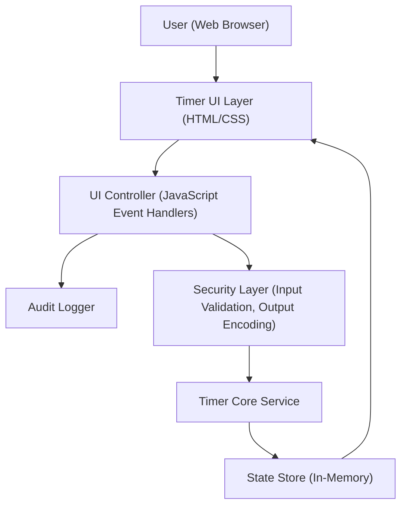

#### 1. High-Level Design

- Architecture Overview & Component Diagram:

- Component Descriptions:

  - User (Web Browser): End user interacting via a modern web browser (Chrome, Edge, Firefox, Safari).
  - Timer UI Layer (HTML/CSS): Presents the white background, elapsed time display (HH:MM:SS), and Start/Pause/Stop buttons with clean, minimal styling.
  - UI Controller (JavaScript Event Handlers): Listens to user actions (clicks) on Start, Pause, Stop and propagates commands to the Timer Core Service, updating the UI accordingly.
  - Timer Core Service: Encapsulates timer logic (start, pause, resume, stop/reset, single active timer enforcement) and exposes APIs to the UI Controller. For this Epic, the focus is that UI correctly renders and binds to these APIs.
  - State Store (In-Memory): Holds current display value and status (e.g., "idle", "running", "paused") used by UI rendering.
  - Audit Logger: Records significant UI events (e.g., load, start, pause, stop) in a structured way suitable for console logging or future server-side integration.
  - Security Layer (Input Validation, Output Encoding): Validates event inputs (e.g., button identity, allowed states) and ensures outputs (rendered text) are safe from injection (even though content is simple).

- Integration Points & Data Flow:

  1. Page Load:
     - Browser loads HTML/CSS/JS.
     - UI Layer renders a white background with the timer display initialized to `00:00:00` and controls for Start, Pause, and Stop.
     - UI Controller initializes event handlers and retrieves initial timer state from State Store.
  2. Start Button Click:
     - UI Controller captures the click event and validates it via the Security Layer.
     - UI Controller calls Timer Core Service (`start()`).
     - Timer Core Service updates State Store and triggers periodic updates.
     - State Store changes drive re-rendering of the time display in the UI Layer.
     - Audit Logger records a "start" event.
  3. Pause Button Click:
     - Similar flow: event handled by UI Controller, validated, then forwarded to Timer Core Service (`pause()`).
     - State Store updates (status becomes "paused"); UI Layer reflects new state.
     - Audit Logger records a "pause" event.
  4. Stop Button Click:
     - UI Controller validates event and calls Timer Core Service (`stopAndReset()`).
     - State Store resets to `00:00:00` and "idle" status; UI Layer updates accordingly.
     - Audit Logger records a "stop" event.
  5. Layout Responsiveness:
     - UI Layer uses responsive CSS to ensure controls and text remain legible and usable across typical desktop and laptop sizes.

- Security & Compliance Features:

  - Input Validation:
    - UI Controller validates events to ensure they originate from expected elements (Start, Pause, Stop buttons) and in allowable states (e.g., Start not triggering multiple concurrent timers).
    - No free-form user input; controls are fixed, minimizing injection risk.
  - Output Filtering/Encoding:
    - Timer display content is generated from numeric values converted to a strictly formatted HH:MM:SS string.
    - No untrusted content is inserted into the DOM as HTML; text nodes are used to prevent script injection.
  - Encryption (AES-256/TLS 1.3):
    - For a purely client-side web page, no data is sent to servers by default.
    - If deployed via HTTPS, TLS 1.3 is enforced at the web server level for all traffic, ensuring encrypted transport.
    - No at-rest data is stored; AES-256 at-rest encryption is not required for this purely in-memory UI Epic.
  - RBAC/ABAC:
    - Single-user, unauthenticated use is in scope; however, design is compatible with future RBAC/ABAC:
      - UI actions can later be gated by session roles (e.g., only authenticated users can access certain timer modes).
  - Audit Logging:
    - UI Controller logs key user actions (load, start, pause, stop) to the console or a pluggable logging interface.
    - Logs include timestamps and event type; no personal data is collected.
  - Compliance Mapping:
    - No personal data or user-identifiable data is collected, minimizing privacy risk.
    - The design supports privacy-by-design by avoiding unnecessary data capture.

- Resiliency & Error Handling:

  - UI-Level Error Handling:
    - UI Controller wraps timer operations in try/catch; on failure, a safe default is rendered (e.g., resetting display to `00:00:00`).
    - Error conditions (e.g., missing Timer Core Service) result in a user-friendly message on the UI (e.g., "Timer unavailable") without exposing internal details.
  - Circuit Breaker Patterns:
    - For this Epic, no external services are called from the UI. However, the UI Controller is designed with an abstraction for backend calls; if introduced, a client-side circuit breaker can disable repeated failing operations.
  - Retry Mechanisms:
    - Not required for pure front-end operations; any failures (e.g., rendering failures) are handled by resetting to a safe state.
  - Graceful Degradation:
    - If advanced CSS or JavaScript features fail or are unsupported, basic HTML structure still renders the timer and controls in a usable form on modern browsers.

#### 2. Validation Report

- Requirements Coverage:

  - White background layout:
    - Covered: UI Layer renders a white background as the default page style.
  - Elapsed time display visibility:
    - Covered: Time display control is centrally visible with sufficient font size and contrast against white background.
  - Placement and styling of Start/Pause/Stop controls:
    - Covered: Controls are clearly labeled, grouped near the display, and styled for easy clicking.
  - Basic responsive behavior in modern browsers:
    - Covered: CSS uses relative units and simple responsive patterns to maintain readability on typical desktops and laptops.
  - NFR: UI must render correctly in modern web browsers:
    - Covered: Uses standard HTML5/CSS3 features supported across modern browsers.
  - NFR: Controls must remain legible and usable:
    - Covered: Design specifies minimum font sizes and spacing, ensuring click targets are large enough for typical users.
  - Dependencies: Use of standard web technologies:
    - Covered: Architecture relies exclusively on HTML/CSS/JavaScript with no exotic frameworks required.

- Compliance Status:

  - Data Retention:
    - Pass: No persistent data is stored; timer state exists only in memory while the page is loaded.
  - Consent Management:
    - Pass: No personal data collection; consent is not required under typical privacy regulations for this Epic as specified.
  - Data Lineage:
    - Pass: No user data is captured; UI only displays computed elapsed time derived from system clock.
  - Compliance Reporting:
    - Pass: Audit logs are limited to technical events without personal data; they can be optionally disabled or redirected to a compliant logging system.
  - Transport and Storage Security:
    - Pass (conditional): When deployed over HTTPS with TLS 1.3; this must be enforced via deployment configuration.

- Identified Ambiguities/Risks:

  - Accessibility:
    - Risk: Requirements do not explicitly address accessibility (contrast ratios, keyboard navigation, ARIA labels).
    - Mitigation: Use high-contrast text on white background and ensure controls are keyboard-focusable; further accessibility requirements should be added if regulatory scope (e.g., WCAG) applies.
  - Browser Support Definition:
    - Risk: "Modern web browsers" is not explicitly enumerated.
    - Mitigation: Assume recent versions of major browsers (e.g., last two versions of Chrome, Edge, Firefox, Safari); project documentation should formalize this.
  - Future Security Enhancements:
    - Risk: The Epic does not specify authentication or data protection policies; if future enhancements introduce user data, security requirements must be revisited.
    - Mitigation: Architecture leaves clear layers for introducing RBAC/ABAC and secure storage without redesigning UI.

- Resiliency & Error Handling:

  - UI-Level Error Handling:
    - UI Controller wraps timer operations in try/catch; on failure, a safe default is rendered (e.g., resetting display to `00:00:00`).
    - Error conditions (e.g., missing Timer Core Service) result in a user-friendly message on the UI (e.g., "Timer unavailable") without exposing internal details.
  - Circuit Breaker Patterns:
    - For this Epic, no external services are called from the UI. However, the UI Controller is designed with an abstraction for backend calls; if introduced, a client-side circuit breaker can disable repeated failing operations.
  - Retry Mechanisms:
    - Not required for pure front-end operations; any failures (e.g., rendering failures) are handled by resetting to a safe state.
  - Graceful Degradation:
    - If advanced CSS or JavaScript features fail or are unsupported, basic HTML structure still renders the timer and controls in a usable form on modern browsers.

