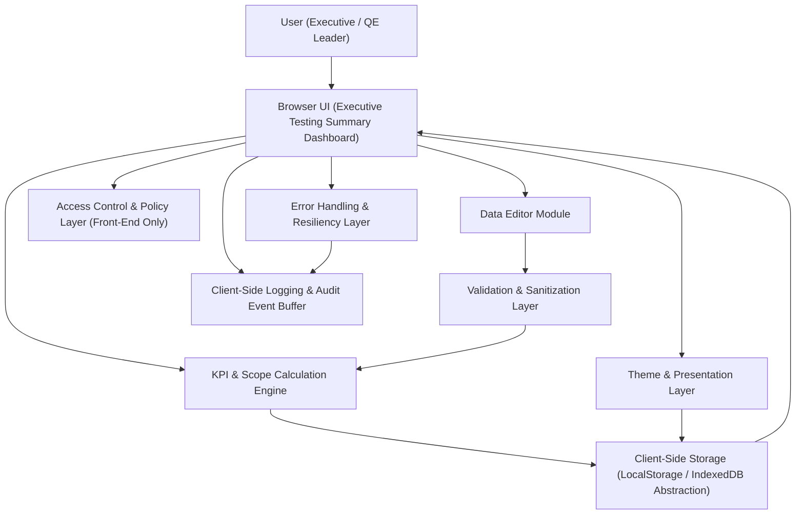

#### 1. High-Level Design

- Architecture Overview & Component Diagram:

- Component Descriptions:

  - **Browser UI (Executive Testing Summary Dashboard)**  
    Single-page dashboard rendering all testing scopes (Sprint, Regression, API, UI, Performance, Deployment, Roll Back, Backward Compatibility, Integration, Usability, Contract, Guardrail), progress bars, counts, and readiness groupings (In Progress, Design in Progress). Presents tiles optimized for executive readability and responsive layouts.

  - **Data Editor Module**  
    Inline or modal-based editor that allows non-technical users to update:
    - Per-scope use case completion and pending counts.  
    - Per-scope agentification progress values and indicators.  
    - Readiness statuses (In Progress, Design in Progress).  
    It enforces structured input controls (numeric fields, dropdowns) to reduce data entry errors.

  - **KPI & Scope Calculation Engine**  
    Front-end logic that:
    - Computes completion percentages for each testing scope.  
    - Aligns scope-level metrics with executive KPI tiles (e.g., total use cases completed vs pending).  
    - Recalculates progress bars immediately upon data changes, ensuring consistency between detail views and top-level KPIs.

  - **Client-Side Storage (LocalStorage / IndexedDB Abstraction)**  
    Abstraction layer encapsulating browser storage:
    - Stores per-scope counts, statuses, and derived KPIs.  
    - Implements versioned schemas to avoid corruption and to support future changes.  
    - Handles serialization/deserialization and integrity checks to ensure readable data after refresh.

  - **Theme & Presentation Layer**  
    Controls application of colors and themes to:
    - Scope tiles by type and readiness status.  
    - Progress bars and readiness groupings.  
    - Overall dashboard background and typography classes.  
    Ensures accessibility contrast and harmonizes with the global theme editor (from other APPMRN39 epics).

  - **Access Control & Policy Layer (Front-End Only)**  
    Implements front-end RBAC/ABAC constraints (within the limitations of a pure front-end solution):
    - Enables “view-only” vs “edit” modes based on user role attributes (configured via environment or integration with a future identity provider).  
    - Hides or disables editing controls when not permitted.

  - **Validation & Sanitization Layer**  
    Centralized input validation:
    - Numeric range checks (e.g., completed ≤ total, no negative counts).  
    - Strict type validation for counts, statuses (enum values), and scope identifiers.  
    - Output encoding and sanitization for any text fields to prevent injection in the DOM.

  - **Client-Side Logging & Audit Event Buffer**  
    Captures:
    - Data edit events (old vs new values, scope, timestamp).  
    - Calculation anomalies (e.g., inconsistent totals).  
    - Storage errors (quota exceeded, serialization failures).  
    Supports future export of logs to enterprise logging systems.

  - **Error Handling & Resiliency Layer**  
    Provides:
    - Graceful degradation when storage is unavailable or quota is exceeded.  
    - Safe fallbacks (use last-known-good snapshot, disable editing when consistency is at risk).  
    - User-friendly error notifications without exposing internal details.

- Integration Points & Data Flow:

  1. **User Interaction & Editing**  
     - User opens the dashboard in the browser.  
     - On load, the UI requests persisted scope data from Client-Side Storage.  
     - If data is valid, KPI & Scope Calculation Engine computes per-scope and aggregated KPIs and renders tiles.  
     - When the user edits counts or statuses via the Data Editor Module, the input is sent through the Validation & Sanitization Layer.

  2. **Data Validation & Calculation**  
     - Validated inputs are passed to the KPI & Scope Calculation Engine.  
     - The engine recalculates:
       - Completed vs pending counts per scope.  
       - Percentages for progress bars.  
       - Grouping of scopes into In Progress vs Design in Progress.  
     - Outputs are rendered immediately for near real-time visual updates.

  3. **Persistence & Reload**  
     - After successful recalculation, the updated scope dataset is stored using the Client-Side Storage abstraction (with schema version and integrity hash).  
     - On subsequent loads, the dashboard hydrates from storage and recomputes KPIs to maintain the ≤2 second load target where feasible.

  4. **Theme & Presentation Application**  
     - The Theme & Presentation Layer receives theme configuration (colors, styles) from global theme persistence.  
     - It applies consistent styles to scope tiles and readiness groups, ensuring readability and alignment with global KPIs.

  5. **Logging & Monitoring**  
     - Each edit and storage operation generates a log entry in the Client-Side Logging & Audit Event Buffer.  
     - Non-critical errors (e.g., storage warning, validation failure) are logged and surfaced to users via non-blocking notifications.

- Security & Compliance Features:

  - **Input Validation & Output Filtering**  
    - All editable numeric fields use constrained controls and validation (min=0, completed ≤ total).  
    - Status fields use restricted dropdowns (e.g., In Progress, Design in Progress, Completed).  
    - Any free-text entries (e.g., scope notes) are sanitized and output encoded to avoid XSS and DOM injection.

  - **Encryption & Transport Security (TLS 1.3 / AES-256)**  
    - While the current scope excludes a backend database, the dashboard must be deployed only over HTTPS with TLS 1.3.  
    - If future backend endpoints are introduced, they must require TLS 1.3 and store any persisted data encrypted at rest with AES-256.  
    - Secrets (e.g., potential API keys) must not be stored in browser storage; they remain in secure backend or deployment configuration.

  - **RBAC/ABAC (Front-End)**  
    - Roles (e.g., Viewer, Editor) are enforced at the UI level:
      - Viewer: read-only scope tiles and KPIs.  
      - Editor: can adjust counts and statuses.  
    - ABAC attributes (such as “program ownership” or “project affiliation”) can further constrain editing for particular scopes in future enhancements.

  - **Audit Logging**  
    - Logs contain:
      - Scope identifier (e.g., “UI Automation”).  
      - Field name (e.g., “Completed Use Cases”).  
      - Previous value, new value (where permitted by privacy rules).  
      - Timestamp and logical user identifier (if available).  
    - Logs are designed for periodic export to an enterprise log pipeline when integrated.

  - **Compliance Mapping**  
    - Compliance with internal governance is supported by:
      - Strong input control to reduce accidental misreporting.  
      - Audit buffer capturing change history for executive KPIs and scope metrics.  
      - Mechanisms to clear data (data retention) described below.

- Resiliency & Error Handling:

  - **Circuit Breaker Patterns (Front-End Adaptation)**  
    - For operations that may later call backend APIs (e.g., log export, future integrations), client-side circuit breakers:
      - Track repeated failures and temporarily disable calls.  
      - Fall back to local operation only, keeping the dashboard functional.

  - **Retries & Fallbacks**  
    - Storage write failures:
      - Retry a small, bounded number of times (e.g., 2–3).  
      - If still failing (e.g., quota exceeded), the system:
        - Notifies the user with a clear message.  
        - Retains an in-memory representation until the session ends.  
    - Data load failures:
      - If stored data is corrupt or incompatible with the current schema:
        - Use last-known-good backup (if available).  
        - Otherwise reset to default configuration with a warning.

  - **Logging & Error Categorization**  
    - Validation errors: logged at “warning” level and displayed inline next to the field.  
    - Critical data integrity issues: logged at “error” level and prompt the user to reload or reset the dashboard.  
    - Performance monitoring:
      - Track load times to ensure adherence to the ≤2 second target for scope and KPI rendering.

#### 2. Validation Report

- Requirements Coverage:

  - **Display of All Testing Scopes**  
    - Architecture ensures each defined testing scope (Sprint, Regression, API, UI, Performance, Deployment, Roll Back, Backward Compatibility, Integration, Usability, Contract, Guardrail) is represented as a first-class entity in the UI and persists via client-side storage.

  - **Per-Scope Use Case Completion and Pending Counts**  
    - Data Editor Module and KPI & Scope Calculation Engine explicitly handle per-scope counts and recalculate completion percentages.

  - **Per-Scope Agentification Progress Display**  
    - Scopes include fields for agentification progress, integrated with the global agentification epics and displayed in tiles and KPIs.

  - **Use Case Readiness Indicators by Scope**  
    - Readiness indicators (e.g., In Progress, Design in Progress) are derived and displayed per scope, with consistent visual grouping.

  - **Visual Grouping of Scopes by Status**  
    - The Theme & Presentation Layer renders separate tiles or sections for In Progress and Design in Progress, matching the ExeSummary requirements.

  - **Progress Bars for Testing Scopes**  
    - The calculation engine drives progress bar values for each scope using computed percentages.

  - **Alignment with Executive KPI Summary**  
    - Scope-level data is aggregated into executive KPIs by the calculation engine, ensuring consistency between detailed tiles and top-level executive tiles.

  - **Persistence & Performance NFRs**  
    - Client-Side Storage abstraction plus performance-focused loading and recalculation pipeline addresses:
      - Persistence of scope data across refresh.  
      - Target dashboard load time of ≤2 seconds under normal conditions.

- Compliance Status:

  - **Data Retention & Persistence**  
    - The design uses browser storage and includes:
      - Versioning and schema management to maintain data integrity.  
      - Controls to clear or reset stored scope data, supporting internal data retention policies (e.g., periodic reset for specific releases or test cycles).

  - **Consent Management**  
    - Stored data is program status, not personal data; however:
      - Banner or notice can indicate that configuration and status data are stored locally in the browser, aligning with internal transparency policies.  
      - Future extensions can integrate with broader consent management if required.

  - **Data Lineage**  
    - Audit buffer captures:
      - Source (manual entry via editor).  
      - Timestamps and context for each data change.  
    - Enables reconstruction of how KPIs were derived for a given time window when logs are exported to enterprise repositories.

  - **Compliance Reporting**  
    - Design supports future export of scope metrics and audit logs in structured formats (e.g., JSON or CSV) which can feed compliance reporting platforms.  
    - No backend data storage reduces regulatory exposure while still enabling governance over executive reporting.

  - **Overall Status**  
    - Data retention: **Pass**, with clear reset mechanics and reliance on local storage.  
    - Privacy & security: **Pass**, given non-personal data focus, strong validation/sanitization, and mandated TLS 1.3 deployment.

- Identified Ambiguities/Risks:

  - **Risk 1: Manual Data Mismatch Between Scope and KPIs**  
    - Existing requirement acknowledges risk of mismatch.  
    - Mitigation:
      - Single source of truth for data: All executive KPIs are derived from the same per-scope data structure.  
      - Validation checks ensure completed counts per scope cannot exceed total counts, reducing inconsistencies.

  - **Risk 2: Browser Storage Limitations and Corruption**  
    - As noted in ExeSummary, local storage limits may be hit or data may become inconsistent.  
    - Mitigation:
      - Storage abstraction implements integrity checks and schemas.  
      - Graceful fallbacks and user-facing warnings when storage fails or data is corrupted.  
      - Optional “Reset to defaults” control to recover quickly.

  - **Risk 3: Theme/Color Impact on Readability**  
    - Color/customization capabilities may produce low-contrast combinations.  
    - Mitigation:
      - Theme & Presentation Layer enforces minimum contrast ratios for key tiles and progress bars where possible.  
      - Pre-defined theme sets that are known to meet accessibility guidelines.  
      - Validation of custom colors with warnings when contrast constraints are not met.

  - **Risk 4: Lack of Backend Authentication / Governance**  
    - Current scope excludes backend and authentication; editing controls rely solely on front-end enforcement.  
    - Mitigation:
      - Clear documentation that this is an internal executive dashboard with restricted deployment context.  
      - Logical role-based view/edit modes can be wired to future identity services without architectural change.  

  - **Risk 5: Ambiguity Around Historical Trend Reporting**  
    - ExeSummary labels historical trends as “nice to have,” not in scope for initial release.  
    - Mitigation:
      - Design isolates current-snapshot scope metrics from any future trend or historical modules, preserving extensibility without overcomplicating v1.
