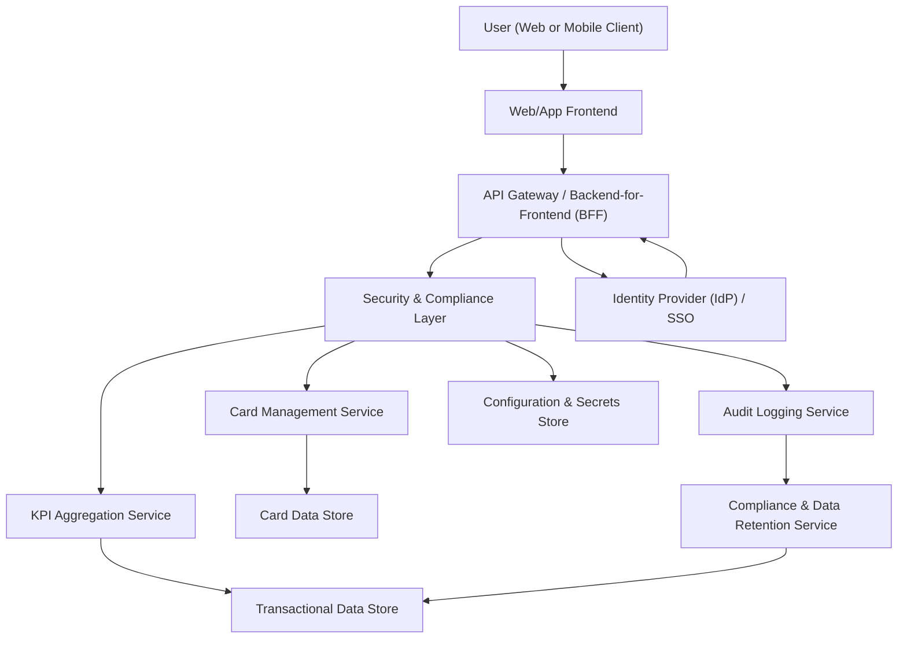

#### 1. High-Level Design

- Architecture Overview & Component Diagram:

- Component Descriptions:

  - User (Web or Mobile Client):
    - Accesses consolidated dashboard.
  - Web/App Frontend:
    - Renders dashboard overview with:
      - Monthly spend KPI.
      - Total credit limit KPI.
      - Available credit KPI.
      - Outstanding amount KPI.
      - Responsive layout for various devices.
  - API Gateway / BFF:
    - Provides consolidated endpoints such as `/dashboard/overview`.
  - Card Management Service:
    - Provides card data for dashboard (list of cards, limits).
  - KPI Aggregation Service:
    - Computes:
      - Monthly spend across all cards.
      - Total credit limit across cards.
      - Available credit.
      - Outstanding amount.
  - Security & Compliance Layer:
    - Responsible for securing the overall dashboard APIs.
  - Audit Logging Service:
    - Captures dashboard access events.
  - Identity Provider:
    - Manages authentication.
  - Configuration & Secrets Store:
    - Stores configuration and secrets for services.
  - Card Data Store:
    - Holds card metadata and credit limits.
  - Transactional Data Store:
    - Holds transactions from which monthly spend and outstanding amounts are computed.
  - Compliance & Data Retention Service:
    - Enforces rules on KPI-related data usage.

- Integration Points & Data Flow:

  1. Authentication:
     - User authenticates via IdP; obtains tokens for dashboard access.

  2. Dashboard Loading:
     - Web/App Frontend calls `/dashboard/overview`.
     - Security & Compliance Layer authenticates and authorizes.
     - Card Management Service:
       - Retrieves card list and limits from Card Data Store.
     - KPI Aggregation Service:
       - Reads transaction and balance data from Transactional Data Store.
       - Computes:
         - Monthly spend for selected period.
         - Total credit limit across cards.
         - Total outstanding amount and available credit.

  3. Presentation:
     - Frontend:
       - Renders KPI cards and basic summaries.
       - Provides responsive layout:
         - Adapts to screen size (desktop, tablet, mobile).

  4. Audit & Compliance:
     - Security & Compliance Layer:
       - Logs dashboard access events (user, timestamp).
     - Compliance & Data Retention Service:
       - Ensures KPI data aligns with retention and privacy rules.

- Security & Compliance Features:

  - Encryption:
    - All dashboard calls over TLS 1.3.
    - AES-256 encryption at rest for card and transactional data.
  - Input Validation:
    - Validates filters (e.g., date ranges for monthly spend).
  - Output Filtering:
    - Limits output to aggregated KPIs and masked card data.
  - RBAC/ABAC:
    - Users only see their dashboard; admin/support roles are controlled and audited.
  - Audit Logging:
    - Dashboard access events stored for compliance.
  - Secrets Management:
    - Config and secrets in Configuration & Secrets Store.
  - Compliance:
    - Data Retention:
      - KPI display uses live or near-real-time data; stored aggregates governed by defined policies.
    - Consent Management:
      - Dashboard analytics rely on consents where applicable.
    - Data Lineage:
      - KPI calculations traceable to underlying sources.
    - Compliance Reporting:
      - Reports on dashboard usage and KPI access.

- Resiliency & Error Handling:

  - Circuit Breakers:
    - Between API Gateway and Card Management/KPI Aggregation Services.
  - Retries:
    - Retried reads for KPI calculations when safe.
  - Timeouts:
    - Ensures quick dashboard load; if some metrics time out, partial data still returned.
  - Logging:
    - Extensive logging of KPI calculation times and failures.
  - Graceful Degradation:
    - If full dashboard fails, minimal essential KPIs may still be displayed; or a clear message indicates limited availability.

#### 2. Validation Report

- Requirements Coverage:

  - Single consolidated dashboard view:
    - `/dashboard/overview` endpoint and Frontend components provide consolidated view.
  - Display of multiple credit cards:
    - Card Management Service supplies card list; UI displays.
  - Monthly spend KPI:
    - KPI Aggregation Service computes monthly spend values for dashboard.
  - Total credit limit KPI:
    - Aggregated from Card Data Store.
  - Available credit KPI:
    - Calculated as total limit minus outstanding amounts.
  - Outstanding amount KPI:
    - Computed from Transactional Data Store via KPI Aggregation Service.
  - Responsive layout:
    - Frontend implements responsive design for modern devices.
  - NFRs:
    - Dashboard load times targeted to be under a few seconds:
      - Aggregated queries, caching, and optimized service calls.

- Compliance Status:

  - Data Retention:
    - Live KPIs rely on in-scope data; retention policies enforced on stored aggregates.
    - PASS with compliance oversight.
  - Privacy:
    - Aggregated KPIs with masked card identifiers; minimal PII exposure.
    - PASS.

- Identified Ambiguities/Risks:

  - Ambiguity: Definition of “near real-time” for KPI updates.
    - Mitigation: Define SLAs for update frequency (e.g., within N minutes).
  - Risk: Overload of KPI Aggregation Service under heavy traffic.
    - Mitigation: Caching strategies, scaling, and rate limiting.
  - Risk: Misalignment between dashboard KPIs and underlying analytics in other epics.
    - Mitigation: Standardized calculation rules shared between services and centralized validation tests.
