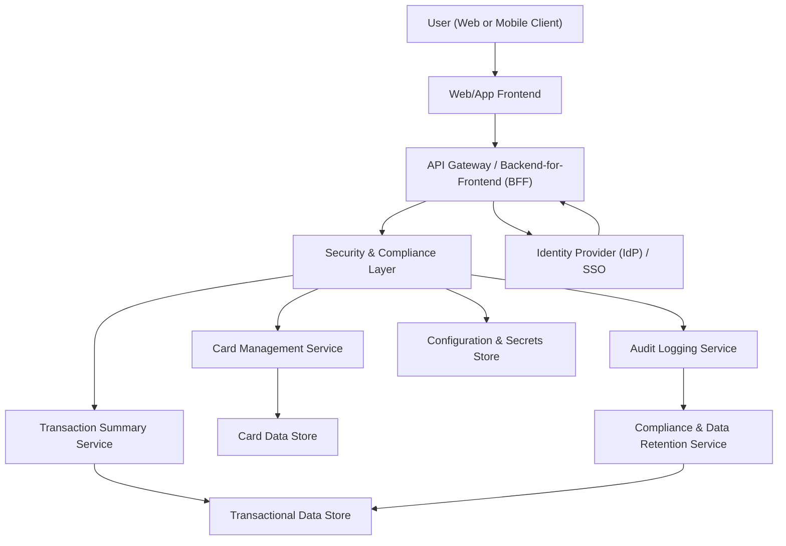

#### 1. High-Level Design

- Architecture Overview & Component Diagram:

- Component Descriptions:

  - User (Web or Mobile Client):
    - Manages and views multiple credit cards.
  - Web/App Frontend:
    - Displays card list and per-card details (limit, available credit, outstanding amount).
    - Enables selection and navigation across cards.
  - API Gateway / BFF:
    - Provides endpoints like `/cards`, `/cards/{id}/summary`.
  - Card Management Service:
    - Manages card metadata:
      - Card identifiers (masked), issuer, limit, status.
      - Consolidation logic across cards.
  - Transaction Summary Service:
    - Provides per-card aggregated metrics (spend, outstanding, utilization).
  - Security & Compliance Layer:
    - Central enforcement point for auth, encryption, and compliance.
  - Audit Logging Service:
    - Captures access to card lists and details.
  - Identity Provider:
    - Manages authentication and tokens.
  - Configuration & Secrets Store:
    - Houses configuration and secrets.
  - Card Data Store:
    - Stores card metadata and limits (without full PANs).
  - Transactional Data Store:
    - Stores transactions used to compute per-card metrics.
  - Compliance & Data Retention Service:
    - Ensures data usage and retention align with policy.

- Integration Points & Data Flow:

  1. Authentication:
     - User logs in; token obtained from IdP as in other epics.

  2. Card Listing:
     - Web/App Frontend calls `/cards`.
     - Security & Compliance Layer validates token, ensures user can only see their cards.
     - Card Management Service fetches card list from Card Data Store.
     - Response includes masked card identifiers and key attributes.

  3. Card Summary:
     - For each card:
       - Transaction Summary Service pulls recent summaries from Transactional Data Store.
       - Computes:
         - Current outstanding amount.
         - Available credit (limit minus outstanding).
         - Utilization metrics as needed.
     - Card Management Service merges metadata and summary into a per-card view.

  4. Consolidated View:
     - Card Management Service:
       - Aggregates across cards (total limits, total outstanding).
     - Frontend:
       - Renders consolidated KPIs and per-card list.

  5. Audit & Compliance:
     - Security & Compliance Layer sends events to Audit Logging Service for:
       - Card list viewed.
       - Card details accessed.
     - Compliance & Data Retention Service:
       - Enforces retention policies, especially for log and summary data.

- Security & Compliance Features:

  - Encryption:
    - TLS 1.3 for all interactions.
    - Card Data Store and Transactional Data Store encrypted at rest with AES-256.
  - Input Validation:
    - Validates card IDs and user identifiers; prevents cross-user access.
  - Output Filtering:
    - Only masked card identifiers and non-sensitive metadata displayed.
    - No raw PANs, CVV, or full identities.
  - RBAC/ABAC:
    - Enforces rules so that:
      - Each user sees only their cards.
      - Admin/support roles scoped to tenants or regions if required.
  - Audit Logging:
    - Logs card list access and specific card detail views.
  - Secrets Management:
    - Credentials and tokens stored in Configuration & Secrets Store.
  - Compliance:
    - Data Retention:
      - Card metadata retained as required; transaction summaries governed separately.
    - Consent Management:
      - Visibility features only active for users who have valid consent to view such data through the dashboard.
    - Data Lineage:
      - Metadata for each card record includes origin system and last sync times.
    - Compliance Reporting:
      - Reports on card data access and usage.

- Resiliency & Error Handling:

  - Circuit Breakers:
    - Between API Gateway and Card Management/Transaction Summary Services.
  - Retries:
    - Retried reads when fetching card summaries or metadata.
  - Timeouts:
    - Avoid long-running queries; fallback to partial data (e.g., card list without some metrics).
  - Logging:
    - Error logs and metrics for card list retrieval and summary calculation.
  - Graceful Degradation:
    - If Transaction Summary Service fails:
      - Show card list with limited metrics, with a message that some KPIs are unavailable.

#### 2. Validation Report

- Requirements Coverage:

  - Support for viewing multiple credit cards:
    - Card Management Service and Card Data Store provide multi-card views.
  - Per-card summary display:
    - Limit, available credit, outstanding amount computed by Transaction Summary Service and exposed via APIs.
  - Card list and selection mechanisms:
    - Frontend supports listing and selecting cards.
  - Per-card KPI visualization:
    - UI shows per-card KPIs sourced from Transaction Summary Service.
  - Consolidation logic:
    - Card Management Service computes totals across cards.
  - NFRs:
    - Performance:
      - Designed for typical consumer scenarios; aggregation optimized.
    - Security:
      - Masked card data, RBAC/ABAC, encryption, audit logging.

- Compliance Status:

  - Data Retention:
    - Card metadata and summaries governed by enterprise-wide retention; PASS given configuration.
  - Privacy:
    - No full card PANs or excessive PII exposed; PASS.

- Identified Ambiguities/Risks:

  - Ambiguity: Handling closed or inactive cards.
    - Mitigation: Business rules to include/exclude such cards from dashboards; flagged for product decision.
  - Risk: Incorrect mapping of cards to users in integrated systems.
    - Mitigation: Strong identity mapping and reconciliation processes.
  - Risk: Exposure of card ownership in shared devices or sessions.
    - Mitigation: Enforced session management and logout policies; secure session storage.
