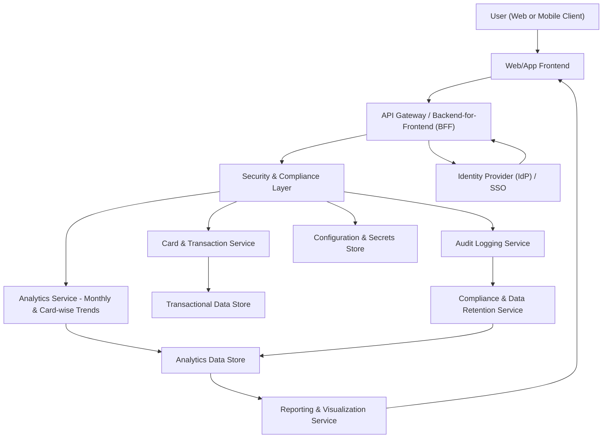

#### 1. High-Level Design

- Architecture Overview & Component Diagram:

- Component Descriptions:

  - User (Web or Mobile Client):
    - End-user viewing monthly spending trends and card-wise analysis.
  - Web/App Frontend:
    - Renders monthly trend charts and per-card spend visualizations.
    - Provides controls for time range selection, card filters, and drill-downs.
  - API Gateway / BFF:
    - Exposes endpoints such as `/analytics/monthly-spend` and `/analytics/card-spend`.
    - Applies basic validation and rate limiting.
  - Analytics Service - Monthly & Card-wise Trends:
    - Computes monthly totals across all cards.
    - Generates per-card time series for spend and outstanding amounts.
    - Supports drill-downs from total to card-level views.
  - Card & Transaction Service:
    - Supplies transaction histories for each card.
    - Ensures data integrity and consistent summarization.
  - Reporting & Visualization Service:
    - Formats time series data for charts (line charts, stacked bars).
    - Handles down-sampling or aggregation for long time ranges.
  - Security & Compliance Layer:
    - Enforces security and compliance for analytics endpoints.
  - Audit Logging Service:
    - Captures access to trend and card-wise analysis data.
  - Identity Provider:
    - Manages authentication and tokens.
  - Configuration & Secrets Store:
    - Stores configs and secrets required by services.
  - Transactional Data Store:
    - Source of truth for transactions and card balances.
  - Analytics Data Store:
    - Holds precomputed monthly and card-wise aggregates.
  - Compliance & Data Retention Service:
    - Manages retention and ensures compliance reporting.

- Integration Points & Data Flow:

  1. Authentication:
     - Same flow as previous epic via IdP and tokens.

  2. Data Aggregation:
     - Card & Transaction Service fetches historical transactions from DBT for requested time frame.
     - Analytics Service:
       - Aggregates monthly spend per user and per card.
       - Computes metrics like monthly outstanding amounts or usage indicators.
       - Writes time series results to the Analytics Data Store for repeated access.

  3. Trend Analytics:
     - Monthly Spend Trends:
       - Monthly totals aggregated across all cards.
       - Data stored by month (e.g., YYYY-MM) and user.
     - Card-wise Spend Analysis:
       - For each card, monthly spend totals and outstanding amounts recorded.
       - Supporting drill-down from overall monthly total to card-level contributions.

  4. Visualization:
     - Reporting & Visualization Service:
       - Consolidates data into structures optimized for line charts and card comparison charts.
     - Web/App Frontend:
       - Renders monthly total trend lines, card comparison charts, and tooltips highlighting key metrics.

  5. Audit & Compliance:
     - Security & Compliance Layer:
       - Logs each analytics request to Audit Logging Service.
       - Ensures only authorized users access their trends.
     - Compliance & Data Retention Service:
       - Ensures old analytics records are handled per retention rules.

- Security & Compliance Features:

  - Encryption:
    - TLS 1.3 for all client-server and service-service traffic.
    - AES-256 encryption of transactional and analytics stores.
  - Input Validation:
    - Validates:
      - Date ranges (min/max allowed).
      - Card identifiers (must belong to the authenticated user).
      - Pagination and sort parameters.
  - Output Filtering:
    - Output restricted to:
      - Aggregated values (monthly totals, per-card metrics).
      - Masked card IDs.
    - Avoids exposure of transaction-level PII unless explicitly required and allowed.
  - RBAC/ABAC:
    - Enforces that:
      - Users can only see their own monthly and card-wise trends.
      - Admin or support roles have controlled, logged access with stricter filters.
  - Audit Logging:
    - Stores events for:
      - Viewing monthly trends.
      - Viewing card-wise analysis.
      - Access from support/admin roles.
  - Secrets Management:
    - Managed by Configuration & Secrets Store as previously described.
  - Compliance:
    - Data Retention:
      - Time series data for monthly trends retained per defined policy.
    - Consent Management:
      - Only users with consent for analytics will have trends computed/displayed.
    - Data Lineage:
      - Monthly aggregates reference source datasets for traceability.
    - Compliance Reporting:
      - Standard queries on monthly analytics access and usage.

- Resiliency & Error Handling:

  - Circuit Breakers:
    - Applied between API Gateway and Analytics Service/Card & Transaction Service.
  - Retries:
    - Idempotent read queries retried with backoff.
  - Timeouts:
    - Enforced on queries to prevent long-running requests from impacting the system.
  - Fallbacks:
    - When analytics store unavailable:
      - Frontend shows primary KPIs while informing user that trend data is unavailable.
  - Logging:
    - Detailed logging of query performance, including latency by endpoint.
  - Graceful Degradation:
    - If time-series generation fails, static summaries (e.g., latest month) may still be provided.

#### 2. Validation Report

- Requirements Coverage:

  - Monthly spend trend visualization:
    - Analytics Service generates monthly totals; Reporting & Visualization renders trends.
  - Card-wise spend trend charts:
    - Per-card time series for spend and outstanding amounts.
  - Aggregation of monthly spending across cards:
    - Analytics Service aggregates across all cards for user-level monthly totals.
  - Drill-down views from total to card-level:
    - API and UI support navigation from total monthly spend to per-card breakdown.
  - Display of monthly outstanding amounts or usage indicators per card:
    - Card-wise metrics include outstanding amounts/usage indicators.
  - NFRs:
    - Efficient rendering:
      - Aggregations precomputed and stored; front-end retrieves ready-to-plot data.
    - Accurate calculations:
      - Using consistent rules and reconciliation processes.
    - Responsive UI:
      - Down-sampling when needed for long histories.

- Compliance Status:

  - Data Retention:
    - Analytics Data Store governed by retention policies; PASS with correct configuration.
  - Privacy:
    - Only user-specific aggregated data returned; PII minimized.
    - Logs and metrics adhere to privacy constraints; PASS.

- Identified Ambiguities/Risks:

  - Ambiguity: Definition of “typical time ranges” for trend charts.
    - Mitigation: Define supported default ranges (e.g., 12–24 months) and maximum allowed.
  - Ambiguity: Treatment of partial months or future-dated transactions.
    - Mitigation: Business rules to ignore future-dated entries and handle partial months consistently.
  - Risk: Heavy load when recomputing long-range trends.
    - Mitigation: Incremental aggregation and caching strategies, plus scheduled batch calculations.
  - Risk: Misinterpretation of outstanding amounts versus spend.
    - Mitigation: Clear labeling and documentation; tooltips and user help content.
